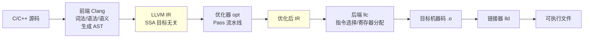
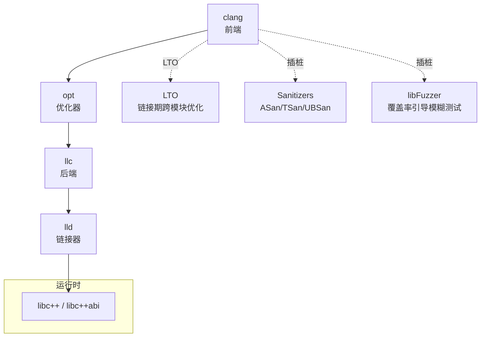

# 编译优化与 LLVM/Clang/GCC

> 现代编译器是一条**前端 → 优化器 → 后端**的三段式流水线，中间用一层**目标无关的 IR**解耦。LLVM 把这条流水线彻底**库化、模块化**，这正是它能催生 Clang、Rust、Swift、Julia、MLIR 一整个生态的根因，也是它与"单体" GCC 的历史分野。

## 场景问题

写 C++ 游戏服务端/客户端，绕不开的问题：

- 为什么同一段代码 `-O0` 和 `-O2` 性能差几倍？编译器到底做了什么优化？
- Clang 和 GCC 该用哪个？报错更友好、编译更快、生成代码更优——各自强在哪？
- 想做静态分析、Sanitizer 排查内存问题、模糊测试、PGO 性能优化，这些工具是怎么串起来的？
- 为什么这么多新语言（Rust/Swift/Julia）都基于 LLVM，而不是自己从头写后端？

理解编译三段式与 LLVM 工具链，是回答这些问题的钥匙。

## 实现方案

### 三段式架构与 LLVM IR



- **前端（Clang）**：负责语言相关的部分——词法分析、语法分析生成 AST、语义检查，最终降级（lower）成 LLVM IR。语言换了只换前端。
- **优化器（opt）**：在 **LLVM IR** 上跑一串与语言/目标都无关的优化 Pass。这是三段式的核心价值——优化只写一次，所有前端、所有后端共享。
- **后端（llc）**：把优化后的 IR 做指令选择、指令调度、**寄存器分配**，生成具体目标架构（x86-64 / ARM64）的机器码。目标平台换了只换后端。

中间的 **LLVM IR** 是黏合剂：它是 **SSA 形式**（Static Single Assignment，每个变量只赋值一次，用带编号的虚拟寄存器 `%1 %2 ...`，极大简化数据流分析）、**强类型**、**目标无关**的中间表示。

### C → LLVM IR 示例

一段简单 C 函数：

```c
int add_square(int a, int b) {
    int s = a + b;
    return s * s;
}
```

`clang -S -emit-llvm -O0 add.c` 产生的 IR（简化，`-O0` 保留栈变量）：

```llvm
define i32 @add_square(i32 %a, i32 %b) {
entry:
  %s = add nsw i32 %a, %b        ; s = a + b
  %r = mul nsw i32 %s, %s        ; r = s * s
  ret i32 %r
}
```

注意 `%s`、`%r` 是 SSA 虚拟寄存器，`nsw` = no signed wrap（帮优化器假设无有符号溢出）。经 `opt -O2` 后，若调用点参数是常量，`add_square(2,3)` 会被**常量折叠**直接算成 `25`。

### 常见优化

| 优化 | 作用 |
|---|---|
| 常量折叠 Constant Folding | 编译期算出 `2+3` → `5` |
| 内联 Inlining | 把小函数体嵌入调用点，省调用开销、暴露更多优化机会 |
| 循环展开 / 向量化 | 展开循环体、用 SIMD 一条指令处理多个元素 |
| 死代码消除 DCE | 删掉结果未被使用的计算 |
| 逃逸分析 | 判断对象是否逃出作用域，可栈上分配免堆 |
| PGO Profile-Guided Optimization | 用真实运行采样指导内联/分支布局 |

### LLVM 工具链全景



- **clang / opt / llc / lld**：前端 / 优化器 / 后端 / 链接器（lld 比 GNU ld 快数倍）。
- **libc++**：LLVM 自己的 C++ 标准库实现。
- **LTO（Link-Time Optimization）**：把优化推迟到链接期，跨编译单元做内联/DCE，突破"单文件编译"的优化边界。
- **Sanitizers**：ASan（内存越界/UAF）、TSan（数据竞争）、UBSan（未定义行为）——编译期插桩，运行时抓 bug，游戏服务端排查内存/并发问题利器。
- **libFuzzer**：覆盖率引导的进程内模糊测试，与 Sanitizer 配合挖漏洞。

## 为什么这么做

- **三段式 + IR 解耦**：`M` 种语言 × `N` 种架构，若两两直接对接要写 `M×N` 个编译器；引入统一 IR 后只需 `M` 个前端 + `N` 个后端 = `M+N`。优化器写一次全复用。
- **SSA 让优化简单**：每个变量只定义一次，数据流/使用-定义链一目了然，常量传播、DCE、寄存器分配都因此变得直接高效。
- **模块化库化是 LLVM 的灵魂**：LLVM 把编译器拆成一堆可链接的库（前端、优化、代码生成都是库），别人可以只取所需——Rust/Swift/Julia 直接复用 LLVM 后端与优化器，只写自己的前端，几年就有工业级性能。这是 LLVM 生态爆发的根因。

## 为什么别的选择不行

- **单体编译器（历史上的 GCC）**：GCC 早期是**单体**设计，内部表示不对外开放（部分出于阻止专有插件的许可证考量），想复用它的中端/后端做工具（IDE 补全、静态分析）极难。这正是 Apple 资助 Chris Lattner 做 Clang/LLVM 的直接动因——要一个**可作为库嵌入**的编译器。
- **自己从头写后端**：写一个能与 GCC/LLVM 竞争的优化器 + 多架构后端是数百人年工程，新语言直接站在 LLVM 肩上是唯一现实选择。
- **不用 IR 直接 AST 生成机器码**：优化和跨平台都无从谈起，只适合玩具编译器。

## 沉淀结论

::: tip Clang vs GCC 历史与差异
| 维度 | Clang / LLVM | GCC |
|---|---|---|
| 架构 | **模块化、库化**，可嵌入 | 传统**单体**（近年也在改进） |
| 许可证 | **Apache 2.0**（宽松，可商用嵌入） | **GPL**（传染性强） |
| 诊断信息 | 报错**友好精确**、带修复建议、彩色定位 | 历史上较简略（新版已大幅改善） |
| IDE 集成 | **libclang / clangd** 天然支持补全、跳转、重构 | 历史上弱（gccjit/后期补齐） |
| 编译速度 | 通常**更快**（尤其增量、并行） | 大项目下部分场景更快 |
| 生成代码质量 | 大多数场景相当，各有胜负 | 某些高优化场景略优，架构支持更老更全 |
| 生态 | 催生 Rust/Swift/Julia/MLIR/Sanitizers | 主导 Linux 内核、老平台 |
:::

要点回顾：
- 编译 = **前端 Clang → 优化器 opt → 后端 llc**，中间靠 **SSA 形式、目标无关的 LLVM IR** 解耦。
- 工具链：**clang / opt / llc / lld / libc++ / LTO / Sanitizers / libFuzzer**。
- 优化：常量折叠、内联、循环展开/向量化、DCE、逃逸分析、PGO。
- **Clang 之于 GCC**：模块化库化 vs 单体、Apache vs GPL、诊断与 IDE 集成更强——这套可复用的库化设计，才是 LLVM 成为现代语言基础设施的原因。

## 内容来源

- LLVM 官方文档：LLVM Language Reference（IR/SSA）、"The Architecture of Open Source Applications: LLVM"（Chris Lattner）
- Clang 官方文档：诊断、libclang/clangd、Sanitizers、libFuzzer
- GCC 与 LLVM 许可证与设计历史公开资料
- 《Engineering a Compiler》三段式与 SSA 章节；作者在 C++ 服务端用 Sanitizer/PGO 的实践
