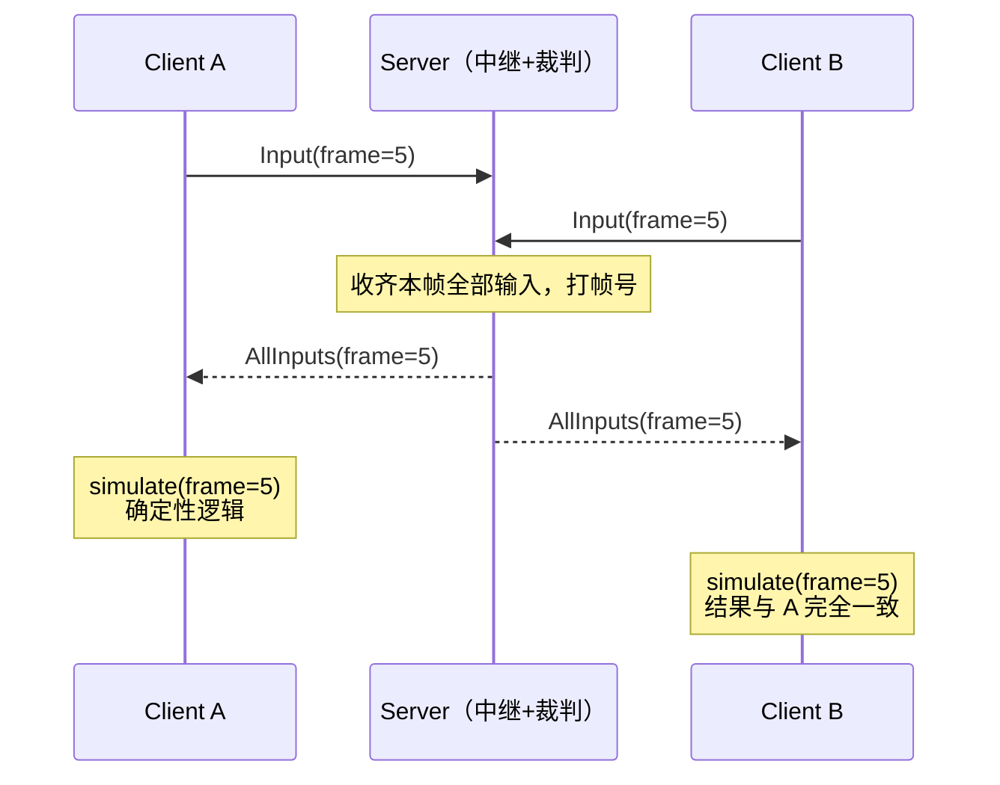
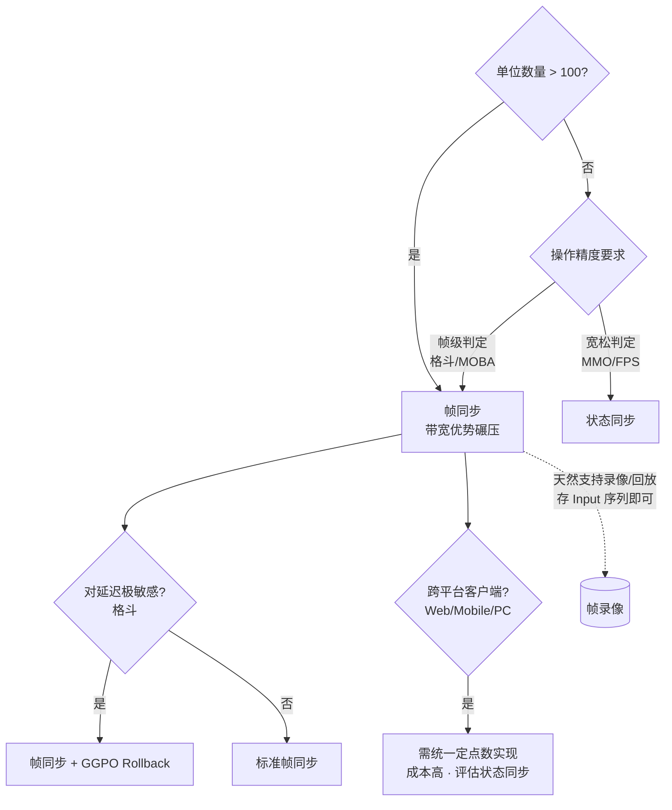

# 帧同步（Lockstep）

> 帧同步是多人实时游戏中保持所有客户端**游戏状态完全一致**的核心同步机制。
> 原理 → 为什么用 → 实现细节 → 与状态同步对比 → C++ 核心代码。

---

## 1. 是什么

帧同步（Lockstep Synchronization）的核心思想：

> **所有客户端运行完全相同的确定性逻辑，只同步操作输入，不同步状态。**

每个逻辑帧（Game Frame）：
1. 收集本机玩家本帧的**操作指令**（Input）
2. 上传到服务器，服务器广播所有玩家的指令
3. 所有客户端收到全量指令后，在**相同逻辑帧**执行**完全相同的计算**
4. 结果：所有客户端状态完全一致，无需同步状态数据



---

## 2. 为什么用帧同步

### 与状态同步（State Sync）的根本差异

| 维度 | 帧同步 | 状态同步 |
|------|--------|----------|
| 同步内容 | 操作指令（Input） | 游戏状态（Position/HP 等） |
| 带宽 | 极低（只传指令） | 较高（全量/增量状态） |
| 客户端计算 | 重（完整逻辑） | 轻（接收并渲染） |
| 一致性 | 强一致（完全相同） | 最终一致（插值/预测） |
| 断线重连 | 需回放所有帧 | 直接同步当前状态 |
| 反作弊 | 易（服务端可验证） | 难（客户端权威问题） |
| 录像/回放 | 天然支持（存指令序列） | 复杂（需快照） |

### 适合帧同步的场景

- **RTS（实时战略）**：单位数量多，状态同步代价极高（《星际争霸》《魔兽争霸》经典帧同步）
- **MOBA**：英雄技能碰撞判定强一致（《王者荣耀》早期帧同步）
- **格斗游戏**：帧级别精度的判定必须完全一致
- **物理模拟**：大量刚体，状态同步带宽不可接受

---

## 3. 核心原理

### 3.1 确定性（Determinism）

**帧同步的生死线**：相同输入 → 相同输出，永远。

破坏确定性的常见原因：

| 原因 | 说明 | 解决 |
|------|------|------|
| 浮点数 | IEEE 754 不同平台/编译器结果可能不同 | 用定点数（Fixed-Point）替代 |
| 随机数 | `rand()` 状态不同步 | 所有端共享同一个伪随机数生成器，用相同种子 |
| 容器遍历顺序 | `unordered_map` 遍历顺序未定义 | 改用有序容器或排序后处理 |
| 多线程 | 并发执行顺序不确定 | 逻辑帧单线程执行 |
| 时间戳 | 用系统时间做逻辑判断 | 用帧号代替时间戳 |
| 平台差异 | `int` 大小、字节序 | 明确类型宽度（`int32_t`） |

### 3.2 帧号与时钟

```
逻辑帧率：固定（如 15fps、20fps、30fps）
渲染帧率：自由（如 60fps、120fps）

逻辑帧间隔 = 1000ms / 逻辑帧率
```

逻辑帧与渲染帧解耦：逻辑帧推进游戏状态，渲染帧在逻辑帧之间做插值表现。

### 3.3 等帧策略（Wait vs. Predict）

**严格帧同步（Hard Lockstep）**：
- 必须收到所有玩家本帧指令才能推进
- 任何一个玩家卡顿 → 所有人卡顿
- 经典 RTS 做法

**乐观帧同步（Optimistic Lockstep / 预测推进）**：
- 超时未收到某玩家指令 → 用上一帧指令补帧（Hold Input）
- 收到延迟指令后回滚重算（Rollback）
- 现代格斗/MOBA 做法

### 3.4 延迟补偿（Input Delay）

人为给所有输入增加固定延迟（如 3 帧），确保网络抖动时仍能在 deadline 前收到所有端指令：

```
本地输入帧 N → 实际执行帧 N+InputDelay
```

InputDelay 越大，容忍网络抖动越强，但操作手感越差（需根据实际 RTT 动态调整）。

---

## 4. 实现架构

### 4.1 整体流程

```mermaid
flowchart TB
  subgraph Logic["逻辑帧循环（单线程 · 确定性）"]
    direction TB
    L1[采集本地 Input] --> L2[发送 Input 到服务器]
    L2 --> L3{等待所有玩家 Input}
    L3 -->|收齐| L4[确定性 Simulate&#40;allInputs&#41;]
    L3 -->|超时| L5[补帧 HoldInput] --> L4
    L4 --> L6[帧号 +1]
    L6 --> L1
  end
  subgraph Render["渲染线程（并行 · 自由帧率）"]
    R1[读取最新逻辑状态] --> R2[帧间插值渲染] --> R1
  end
  L4 -.状态快照.-> R1
```



### 4.2 服务端职责

服务端是**中继 + 裁判**：
- 收集所有玩家当前帧 Input
- 打上服务端帧号，广播给所有玩家
- 可选：执行同一份逻辑做校验（反作弊）
- 不做游戏逻辑运算（逻辑在客户端）

### 4.3 断线重连

存储所有帧的 Input 序列（帧录像）：
```
frame[0] = {p1: input, p2: input, ...}
frame[1] = {p1: input, p2: input, ...}
...
```
重连时从 frame[0] 开始快速回放（追帧），或使用**快照 + 局部回放**减少追帧时间。

---

## 5. C++ 核心实现

### 5.1 定点数（Fixed-Point）

```cpp
#include <cstdint>

// Q16.16 定点数：高 16 位整数部分，低 16 位小数部分
struct Fixed {
    int32_t raw;

    static Fixed fromInt(int32_t v)   { return {v << 16}; }
    static Fixed fromFloat(float v)   { return {(int32_t)(v * 65536.0f)}; }

    float toFloat() const { return raw / 65536.0f; }

    Fixed operator+(const Fixed& o) const { return {raw + o.raw}; }
    Fixed operator-(const Fixed& o) const { return {raw - o.raw}; }
    Fixed operator*(const Fixed& o) const {
        return {(int32_t)(((int64_t)raw * o.raw) >> 16)};
    }
    Fixed operator/(const Fixed& o) const {
        return {(int32_t)(((int64_t)raw << 16) / o.raw)};
    }
    bool operator<(const Fixed& o) const { return raw < o.raw; }
    bool operator==(const Fixed& o) const { return raw == o.raw; }
};
```

### 5.2 确定性随机数（LCG）

```cpp
#include <cstdint>

struct DeterministicRng {
    uint64_t state;

    explicit DeterministicRng(uint64_t seed) : state(seed) {}

    uint32_t next() {
        // LCG: Numerical Recipes 参数
        state = state * 6364136223846793005ULL + 1442695040888963407ULL;
        return (uint32_t)(state >> 33);
    }

    int32_t nextRange(int32_t lo, int32_t hi) {
        return lo + (int32_t)(next() % (uint32_t)(hi - lo));
    }
};
```

### 5.3 输入结构

```cpp
#include <cstdint>
#include <array>
#include <unordered_map>

// 每帧每个玩家的操作指令
struct PlayerInput {
    uint32_t frameNo;   // 帧号
    uint8_t  playerId;
    uint16_t buttons;   // bit flags: MOVE_UP=1, MOVE_DOWN=2, ATTACK=4...
    int8_t   moveX;     // 方向输入 [-100, 100]
    int8_t   moveY;

    // 序列化（网络传输）
    void serialize(uint8_t* buf) const {
        memcpy(buf, this, sizeof(PlayerInput));
    }
    static PlayerInput deserialize(const uint8_t* buf) {
        PlayerInput inp;
        memcpy(&inp, buf, sizeof(PlayerInput));
        return inp;
    }
};

// 一帧所有玩家的输入集合
struct FrameInputs {
    uint32_t frameNo;
    std::array<PlayerInput, 4> inputs;  // 最多 4 人
    uint8_t  playerCount;
};
```

### 5.4 帧缓冲区（Input Buffer）

```cpp
#include <vector>
#include <mutex>
#include <optional>

class InputBuffer {
public:
    explicit InputBuffer(uint32_t capacity = 256)
        : buffer_(capacity), capacity_(capacity) {}

    // 网络线程写入
    void push(const FrameInputs& fi) {
        std::lock_guard<std::mutex> lk(mu_);
        buffer_[fi.frameNo % capacity_] = fi;
    }

    // 逻辑线程读取
    std::optional<FrameInputs> get(uint32_t frameNo) const {
        std::lock_guard<std::mutex> lk(mu_);
        const auto& slot = buffer_[frameNo % capacity_];
        if (slot.frameNo == frameNo) return slot;
        return std::nullopt;
    }

private:
    mutable std::mutex mu_;
    std::vector<FrameInputs> buffer_;
    uint32_t capacity_;
};
```

### 5.5 帧同步主循环

```cpp
#include <chrono>
#include <thread>

class LockstepSimulator {
public:
    static constexpr int  LOGIC_FPS       = 20;           // 逻辑帧率
    static constexpr int  FRAME_MS        = 1000 / LOGIC_FPS;  // 50ms/帧
    static constexpr int  INPUT_DELAY     = 2;            // 输入延迟帧数
    static constexpr int  WAIT_TIMEOUT_MS = 200;          // 等帧超时

    void run() {
        using Clock = std::chrono::steady_clock;
        auto nextTick = Clock::now();

        while (!gameOver_) {
            // 1. 采集本地输入，打上延迟帧号
            PlayerInput localInput = collectLocalInput();
            localInput.frameNo = currentFrame_ + INPUT_DELAY;
            network_->sendInput(localInput);

            // 2. 等待当前帧所有玩家输入（含超时补帧）
            FrameInputs fi = waitForInputs(currentFrame_);

            // 3. 确定性模拟
            simulate(fi);
            currentFrame_++;

            // 4. 定时推进（固定帧率）
            nextTick += std::chrono::milliseconds(FRAME_MS);
            std::this_thread::sleep_until(nextTick);
        }
    }

private:
    FrameInputs waitForInputs(uint32_t frameNo) {
        auto deadline = std::chrono::steady_clock::now()
                      + std::chrono::milliseconds(WAIT_TIMEOUT_MS);

        while (true) {
            auto fi = inputBuffer_.get(frameNo);
            if (fi && fi->playerCount == expectedPlayers_) {
                return *fi;
            }
            if (std::chrono::steady_clock::now() >= deadline) {
                // 超时：补帧（复用上一帧输入）
                return holdInputs(frameNo);
            }
            std::this_thread::sleep_for(std::chrono::milliseconds(1));
        }
    }

    FrameInputs holdInputs(uint32_t frameNo) {
        FrameInputs fi = lastInputs_;
        fi.frameNo = frameNo;
        return fi;
    }

    void simulate(const FrameInputs& fi) {
        // 按确定性顺序处理（玩家 ID 排序保证顺序）
        for (uint8_t i = 0; i < fi.playerCount; ++i) {
            applyInput(fi.inputs[i]);
        }
        world_.step(Fixed::fromFloat(FRAME_MS / 1000.0f));
        lastInputs_ = fi;
    }

    PlayerInput   collectLocalInput();
    void          applyInput(const PlayerInput&);

    uint32_t      currentFrame_    = 0;
    uint8_t       expectedPlayers_ = 2;
    bool          gameOver_        = false;
    FrameInputs   lastInputs_      = {};
    InputBuffer   inputBuffer_;
    World         world_;      // 游戏世界（确定性）
    Network*      network_;
};
```

### 5.6 校验码（Checksum）反作弊

```cpp
#include <cstdint>

// 每 N 帧对关键状态做 hash，上报服务端比对
uint32_t computeChecksum(const World& world) {
    uint32_t h = 2166136261u;  // FNV-1a
    for (const auto& unit : world.units()) {
        auto x = unit.pos.x.raw;
        auto y = unit.pos.y.raw;
        auto hp = unit.hp;
        h ^= (uint32_t)x;  h *= 16777619u;
        h ^= (uint32_t)y;  h *= 16777619u;
        h ^= (uint32_t)hp; h *= 16777619u;
    }
    return h;
}

// 每 5 帧上报一次
if (currentFrame_ % 5 == 0) {
    network_->sendChecksum(currentFrame_, computeChecksum(world_));
}
```

---

## 6. 关键挑战与解法

| 挑战 | 现象 | 解法 |
|------|------|------|
| 浮点不一致 | 不同机器/平台同帧结果不同，逐渐分叉 | 全局替换为定点数 |
| 网络抖动 | 等帧卡顿，影响操作流畅 | InputDelay + 超时补帧 |
| 高延迟断线 | 重连追帧时间长 | 定期保存快照，从最近快照追帧 |
| 作弊 | 修改本地逻辑得到不同结果 | 服务端运行同一份逻辑 + Checksum 校验 |
| 追帧太慢 | 断线后回放全程耗时 | 追帧期间跳过渲染，纯逻辑加速 |
| 单位寻路 | A* 结果依赖遍历顺序 | 固定遍历顺序，确保确定性 |

---

## 7. 与状态同步选型



---

## 参考

- [GGPO Rollback Networking SDK](https://github.com/pond3r/ggpo)：格斗游戏帧同步回滚标准库
- 《游戏编程精粹》帧同步章节
- [Riot Games: Development Postmortem of League of Legends Networking](https://technology.riotgames.com/news/development-postmortem-catastrophic-lockstep-failure)
- 王者荣耀技术团队：帧同步在 MOBA 中的实践（KM）
