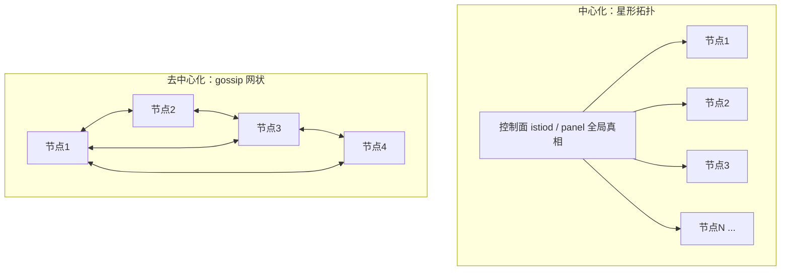
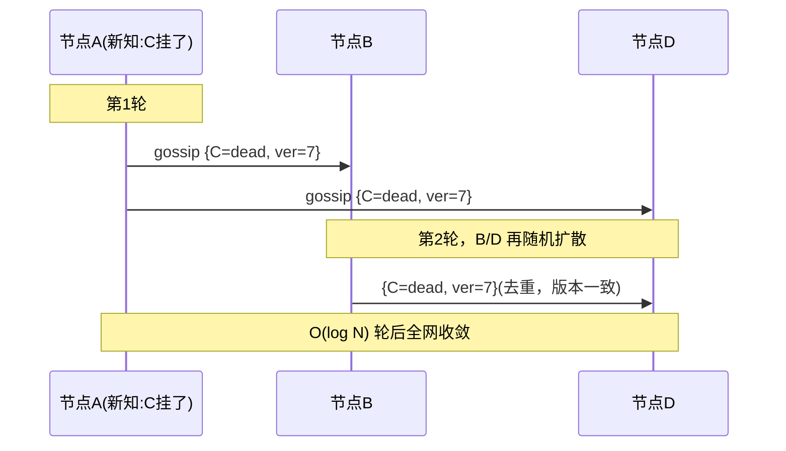
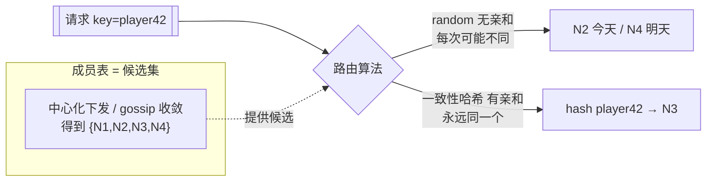

# 服务网格：中心化 vs 去中心化

集中式控制面 vs 节点间 gossip · 一致性 vs 可用性 · 规模上限 · 单向连接降连接数

::: tip 一句话结论
成员探测用 gossip 最终一致、关键路由元数据用 Raft 强一致，大规模靠单向连接降连接数。
:::

## 场景问题

服务网格要解决一个共同问题：**每个节点如何知道"集群里有哪些成员、路由表长什么样、谁健康谁挂了"**。围绕这个问题有两种截然相反的架构：

- **中心化**：一个集中式**控制面 / 注册中心**掌握全局真相，统一算好路由再**下发**给所有数据面节点（如 [Istio istiod](/game-infra/mesh-istio-cilium.md)、Consul server、自研 panel）。
- **去中心化**：**没有中心**，节点之间通过 **gossip（流言传播）** 周期性交换成员与状态，信息像病毒一样扩散，最终大家收敛到一致（如 Serf、Redis Cluster、Cassandra）。

对**万级节点的游戏集群**，这个选择尤其致命：中心化控制面可能被海量节点的连接数与推送压垮；去中心化则要面对 gossip 收敛速度与流量放大。这就是为什么自研大规模游戏网格常走**去中心化 + 单向连接算法降连接数**。

> **打个比方**：中心化像公司只设一个**总调度室**——所有人有事都问它、它统一拍板下发（口径绝对一致，但调度室会被海量来电打爆，还是个单点）。去中心化像**街坊邻居互相打听**——没有总调度，大家口口相传，谁挂了、路由变了慢慢就传开了（抗压、无单点，但消息传得慢、某一刻各家知道的可能还不一样）。而"**单向连接降连接数**"是去中心化里的省钱妙招：N 个人两两都建双向连接要 N²/2 条线，爆炸；于是约定"每一对人里，只由固定的一方负责拨号"（用两边 IP 末位 bit 异或来判定谁拨谁接），连接数直接砍半、且全网算得出同一套规则、绝不重复建线。**类比失效边界**：这招只是把 O(N²) 的常数系数砍小，量级仍是全连接——真捅到十万、百万节点，连接数照样撑不住，届时只能再往上叠"分区 / 分层 gossip"，牺牲一点收敛速度换规模。



## 实现方案

### 中心化：控制面统一下发

- 控制面持有全局成员表与路由策略（常自身用 [Raft](/game-infra/raft-gossip.md) 保证控制面数据强一致）。
- 每个数据面节点与控制面**建立长连接**，控制面通过 push/watch（如 xDS、long-poll）把变更下发。
- **强一致视角**：所有节点看到的是控制面这一份权威真相，路由收敛快、一致。

### 去中心化：gossip 传播成员与路由

节点周期性随机挑几个 peer，交换各自已知的成员状态（SI / SIR 传染模型：Susceptible→Infected→Removed），几轮之后信息扩散到全网，**收敛期望约 O(log N) 轮**：

```text
每隔 T：
  peers = 随机选 fanout 个邻居
  for p in peers:
      发送我已知的 {node -> {状态, 版本号/incarnation}} 摘要
      合并对端回来的摘要：版本号更大者胜（LWW / 反熵）
  本地检测超时未刷新的节点 -> 标记 suspect -> dead（SWIM 式故障探测）
```



### 大规模游戏网格：单向连接算法降连接数

全网状 gossip / 全连接的痛点是**连接数爆炸**：N 个节点两两互连是 `N(N-1)/2` ≈ **O(N²)** 条连接，万级节点即上亿条，句柄/内存/心跳全部撑爆。自研游戏网格用**单向连接**降数量级：

```text
全双向连接:  A<->B  两条方向、两端各记一条          总连接 ~ N(N-1)
单向连接:    A -> B  只由一端发起并维护一条方向        总连接减半，且用
             规则（如按 ID 大小定向：小 ID 连大 ID）
             避免 A、B 各建一条重复连接
配合“选固定数量 peer 广播/探测”(见蓄水池抽样)，把每节点连接数从 O(N) 压到常数
```

> 即：**用寻址规则决定连接方向 + 每节点只维护常数个 peer**，把 O(N²) 压到接近 O(N) 甚至线性可控。相关做法见 [自研 Mesh × K8s](/game-infra/self-mesh-k8s.md) 与 [蓄水池抽样选节点](/game-infra/reservoir-sampling.md)。

### 路由层：拿到成员表后，一个请求怎么选目标节点（random vs 一致性哈希）

上面解决的是"**成员表怎么来**"（中心化下发 or gossip 传播）。但成员表只是**候选集**——真正发一个请求时，还要在候选集里**选一个具体目标**。这是**另一层、正交的问题**：中心化/去中心化决定"我知道有哪些节点"，路由算法决定"这次请求打给哪个节点"。两条主流选法：

- **随机路由（random / 轮询 / 加权随机 / P2C）**：每个请求在健康节点里随机挑一个，**不看请求内容**。同一个 key 两次请求可能落到不同节点——**无亲和性**。
- **一致性哈希路由**：按请求里的 key（`playerId` / `roomId` / 分片键）`hash` 到一个**稳定**节点，同一个 key 永远落到同一节点——**有亲和性**（会话粘滞、缓存命中、分片归属）。算法细节见 [一致性哈希三算法](/game-infra/consistent-hash-impl.md)。



**两种路由各自的取舍：**

| 维度 | 随机路由 | 一致性哈希路由 |
|---|---|---|
| 亲和性 | 无，同 key 可打到任意节点 | 有，同 key 稳定落同一节点 |
| 适用服务 | **无状态**逻辑服 / API 网关 | **有状态**：战斗服、缓存分片、DB 分片 |
| 节点增删影响 | 无映射可破坏，新请求重新均摊即可 | 只 ~1/N 的 key 迁移（相对 `%N` 全量重映射） |
| 是否依赖"全网视图一致" | **否**——知道任意几个健康节点就能路由 | **是**——所有路由方必须看到同一份 ring，否则同 key 分叉 |
| 分布均匀性 | 天然均匀 | 靠 vnode / 表大小保证近似均匀 |

**和中心化 / 去中心化怎么组合（关键在最后一行"是否依赖视图一致"）：**

| 成员发现 ＼ 路由算法 | 随机路由 | 一致性哈希路由 |
|---|---|---|
| **中心化**（控制面唯一权威成员表） | 可用：控制面给候选，本地随机均摊 | **黄金搭配**：控制面保证全网唯一权威 ring，任意节点对同 key 算出的目标**必然一致**，分片归属不会打架 |
| **去中心化**（gossip 最终一致） | **黄金搭配**：随机路由**不要求视图一致**，各节点用本地已知的健康节点随机即可，gossip 收敛延迟基本无害 | **有坑**：收敛窗口内不同节点的 ring 可能不同 → 同一个 key 被不同节点路由到**不同目标** → 短暂双主 / 缓存穿透 / 一个分片两个 owner |

## 为什么这么做

- **为什么成员发现倾向去中心化**：成员变更（上下线、故障）频繁且只要**最终一致**即可，用 gossip 无单点、抗故障、水平扩展好——挂几个节点信息照样扩散。而中心化控制面是**单点瓶颈**：所有节点连它、变更全从它推，节点一多就成天花板。
- **为什么元数据/配置倾向中心化强一致**：分片路由表、全局配置版本这类数据要求**强一致**（不能两个节点看到不同分片归属），用 [Raft](/game-infra/raft-gossip.md) 多数派提交保证，牺牲一点可用性换正确性。
- **为什么大规模游戏走去中心化 + 降连接**：万级战斗节点，中心化控制面扛不住连接数与推送风暴；去中心化 + 单向连接算法把连接数压到可控，同时无单点。
- **为什么"路由算法"要看它对视图一致性的敏感度**：随机路由**不敏感**——路由方只要知道几个健康节点就能均摊，所以能容忍 gossip 收敛延迟，和去中心化天然契合；一致性哈希**敏感**——它靠"全网算出同一个目标"才有意义，一旦不同路由方 ring 不一致，同 key 就会分叉到两个节点。这正好解释了本文的核心结论：**成员探测（对分叉不敏感）用 gossip 最终一致就够；而分片归属 / 路由 ring 这种一致性哈希依赖的关键元数据，必须用 [Raft](/game-infra/raft-gossip.md) 强一致**，否则收敛窗口里就会出现"一个分片两个 owner"。

::: tip 一句话记忆
**成员/故障探测 → gossip（AP，最终一致，抗故障）；元数据/路由分片归属 → Raft（CP，强一致，防错乱）**。大规模自研网格常是"gossip 传成员 + 强一致组件管关键元数据"的混合。
:::

## 为什么别的选择不行

::: warning 两种架构的规模天花板
| 维度 | 中心化（控制面下发） | 去中心化（gossip） |
|---|---|---|
| 一致性 | **强一致**，路由权威 | **最终一致**，有传播延迟 |
| 时效性 | 变更即时下发 | O(log N) 轮才收敛 |
| 单点 | **有**：控制面挂 = 全局失明 | **无**：任意节点挂不影响扩散 |
| 规模瓶颈 | **控制面连接数 / 推送带宽**（N 个长连接 + 全量推送） | **gossip 流量放大**（fanout×N，收敛与带宽权衡） |
| 排障 | 集中，看控制面即知全局 | 分散，状态散在各节点，难拼全貌 |
:::

::: danger 极端选择的失败模式
- **纯中心化上万级节点**：控制面成为单点瓶颈，长连接与推送把它压垮；它一挂，全网路由僵死。
- **纯全网状 gossip 无优化**：O(N²) 连接数 + fanout 流量放大，万级节点带宽/句柄爆炸，收敛也变慢。
- 所以大规模必须**优化拓扑**（单向连接、分层 gossip、固定 peer 数），或**分域**（每域内中心化、域间去中心化）。
:::

## 沉淀结论

::: tip 结论
- **中心化**：控制面/注册中心持全局真相统一下发，**强一致、时效高、排障集中**，但**有单点、受控制面连接数与推送带宽限制**（[istiod](/game-infra/mesh-istio-cilium.md) / 自研 panel）。
- **去中心化**：节点 gossip 传播，**无单点、抗故障、水平扩展**，但**最终一致、O(log N) 收敛、受流量放大限制、排障分散**（Serf / Redis Cluster / Cassandra）。
- **CP vs AP** 的经典取舍：关键元数据用 [Raft](/game-infra/raft-gossip.md) 强一致，成员/故障探测用 gossip 最终一致。
- **成员发现和路由选择是正交两层**：前者（中心化/去中心化）决定"知道有哪些节点"，后者（[一致性哈希](/game-infra/consistent-hash-impl.md) / 随机）决定"这次打给谁"。**随机不依赖视图一致 → 配去中心化；一致性哈希依赖唯一权威 ring → 配中心化 / Raft 强一致，否则收敛窗口里同 key 分叉双主。**
- **大规模游戏集群选去中心化 + 单向连接算法降连接数**，把 O(N²) 连接压到线性可控，兼顾无单点与可扩展。
:::

**相关专题**：[Raft 与 Gossip 协议](/game-infra/raft-gossip.md) · [Istio 与 Cilium 服务网格](/game-infra/mesh-istio-cilium.md) · [自研 Mesh × K8s 部署](/game-infra/self-mesh-k8s.md) · [蓄水池抽样](/game-infra/reservoir-sampling.md)

### 记忆口诀

**中心化**：控制面唯一真相 / 强一致 / 排障集中 / 单点+连接数天花板
**去中心化**：gossip 传播 / 最终一致 O(log N) / 无单点 / 流量放大
**两层正交**：成员发现（有哪些节点）/ 路由算法（这次打给谁）
**配对**：随机路由配 gossip（不依赖视图一致）/ 一致性哈希配 Raft（依赖唯一 ring）

## 内容来源

综合整理。参考方向：Istio istiod / xDS 中心化控制面模型、HashiCorp Serf / SWIM 论文（gossip 成员管理与故障探测）、Redis Cluster 与 Cassandra 的 gossip 实现、Raft 论文（强一致控制面）、CAP / CP-vs-AP 取舍、大规模自研游戏网格公开分享中"单向连接 / 降连接数"的拓扑优化思想。

## 自测：合上资料能说清楚吗？

中心化控制面和去中心化 gossip，各自的规模瓶颈是什么？

<details><summary>参考答案</summary>

中心化瓶颈在**控制面**：N 个长连接 + 全量推送，连接数与带宽把它压垮，且是**单点**，挂了全网失明。去中心化瓶颈在**流量放大**：fanout×N 的 gossip 消息，全网状还有 **O(N²) 连接数**，收敛需 O(log N) 轮。

</details>

为什么"成员发现"和"路由选择"是正交的两层？各自解决什么？

<details><summary>参考答案</summary>

**成员发现**（中心化下发 / gossip 传播）决定"**知道集群里有哪些节点**"，产出候选集。**路由选择**（随机 / 一致性哈希）决定"**这次请求打给候选里的哪一个**"。两者独立组合，前者管视图，后者管落点。

</details>

为什么随机路由配去中心化是黄金搭配，而一致性哈希配去中心化有坑？

<details><summary>参考答案</summary>

**随机路由不依赖视图一致**——知道任意几个健康节点就能均摊，gossip 收敛延迟无害。**一致性哈希依赖唯一权威 ring**——靠"全网算出同一目标"才有意义；gossip 收敛窗口内各节点 ring 不同，同 key 会**分叉到不同节点**，出现双主 / 缓存穿透 / 一分片两 owner。

</details>

大规模游戏网格为什么走"去中心化 + 单向连接"，单向连接怎么降连接数？

<details><summary>参考答案</summary>

万级节点下中心化控制面扛不住连接与推送风暴，故选**无单点、可扩展**的去中心化。全网状是 **O(N²)** 连接，**单向连接**用寻址规则（如小 ID 连大 ID）定向、只一端维护一条，配合每节点只连**常数个 peer**，把连接数压到接近线性。

</details>

什么数据该用 gossip 最终一致，什么该用 Raft 强一致？为什么？

<details><summary>参考答案</summary>

**成员/故障探测**用 gossip：变更频繁、只要最终一致、无单点抗故障，对分叉不敏感。**分片路由表 / 全局配置 / 一致性哈希 ring** 用 **Raft 强一致**：要求全网唯一权威，否则会"一个分片两个 owner"，牺牲一点可用性换正确性。

</details>
