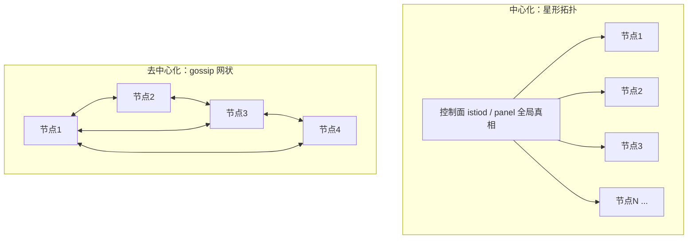
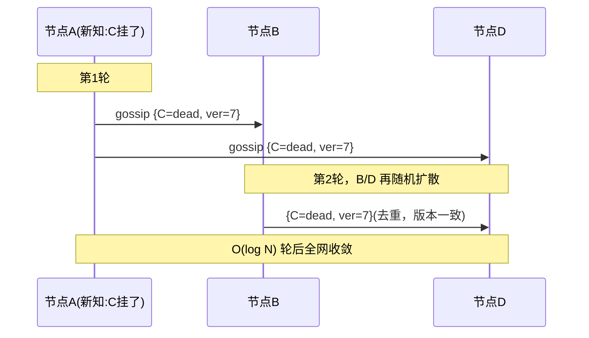

# 服务网格：中心化 vs 去中心化

集中式控制面 vs 节点间 gossip · 一致性 vs 可用性 · 规模上限 · 单向连接降连接数

## 场景问题

服务网格要解决一个共同问题：**每个节点如何知道"集群里有哪些成员、路由表长什么样、谁健康谁挂了"**。围绕这个问题有两种截然相反的架构：

- **中心化**：一个集中式**控制面 / 注册中心**掌握全局真相，统一算好路由再**下发**给所有数据面节点（如 [Istio istiod](/game-infra/mesh-istio-cilium.md)、Consul server、自研 panel）。
- **去中心化**：**没有中心**，节点之间通过 **gossip（流言传播）** 周期性交换成员与状态，信息像病毒一样扩散，最终大家收敛到一致（如 Serf、Redis Cluster、Cassandra）。

对**万级节点的游戏集群**，这个选择尤其致命：中心化控制面可能被海量节点的连接数与推送压垮；去中心化则要面对 gossip 收敛速度与流量放大。这就是为什么自研大规模游戏网格常走**去中心化 + 单向连接算法降连接数**。



## 实现方案

### 中心化：控制面统一下发

- 控制面持有全局成员表与路由策略（常自身用 [Raft](/game-infra/raft-gossip.md) 保证控制面数据强一致）。
- 每个数据面节点与控制面**建立长连接**，控制面通过 push/watch（如 xDS、long-poll）把变更下发。
- **强一致视角**：所有节点看到的是控制面这一份权威真相，路由收敛快、一致。

### 去中心化：gossip 传播成员与路由

节点周期性随机挑几个 peer，交换各自已知的成员状态（SI / SIR 传染模型：Susceptible→Infected→Removed），几轮之后信息扩散到全网，**收敛期望约 O(log N) 轮**：

```text
每隔 T：
  peers = 随机选 fanout 个邻居
  for p in peers:
      发送我已知的 {node -> {状态, 版本号/incarnation}} 摘要
      合并对端回来的摘要：版本号更大者胜（LWW / 反熵）
  本地检测超时未刷新的节点 -> 标记 suspect -> dead（SWIM 式故障探测）
```



### 大规模游戏网格：单向连接算法降连接数

全网状 gossip / 全连接的痛点是**连接数爆炸**：N 个节点两两互连是 `N(N-1)/2` ≈ **O(N²)** 条连接，万级节点即上亿条，句柄/内存/心跳全部撑爆。自研游戏网格用**单向连接**降数量级：

```text
全双向连接:  A<->B  两条方向、两端各记一条          总连接 ~ N(N-1)
单向连接:    A -> B  只由一端发起并维护一条方向        总连接减半，且用
             规则（如按 ID 大小定向：小 ID 连大 ID）
             避免 A、B 各建一条重复连接
配合“选固定数量 peer 广播/探测”(见蓄水池抽样)，把每节点连接数从 O(N) 压到常数
```

> 即：**用寻址规则决定连接方向 + 每节点只维护常数个 peer**，把 O(N²) 压到接近 O(N) 甚至线性可控。相关做法见 [自研 Mesh × K8s](/game-infra/nzmesh-k8s.md) 与 [蓄水池抽样选节点](/game-infra/reservoir-sampling.md)。

## 为什么这么做

- **为什么成员发现倾向去中心化**：成员变更（上下线、故障）频繁且只要**最终一致**即可，用 gossip 无单点、抗故障、水平扩展好——挂几个节点信息照样扩散。而中心化控制面是**单点瓶颈**：所有节点连它、变更全从它推，节点一多就成天花板。
- **为什么元数据/配置倾向中心化强一致**：分片路由表、全局配置版本这类数据要求**强一致**（不能两个节点看到不同分片归属），用 [Raft](/game-infra/raft-gossip.md) 多数派提交保证，牺牲一点可用性换正确性。
- **为什么大规模游戏走去中心化 + 降连接**：万级战斗节点，中心化控制面扛不住连接数与推送风暴；去中心化 + 单向连接算法把连接数压到可控，同时无单点。

::: tip 一句话记忆
**成员/故障探测 → gossip（AP，最终一致，抗故障）；元数据/路由分片归属 → Raft（CP，强一致，防错乱）**。大规模自研网格常是"gossip 传成员 + 强一致组件管关键元数据"的混合。
:::

## 为什么别的选择不行

::: warning 两种架构的规模天花板
| 维度 | 中心化（控制面下发） | 去中心化（gossip） |
|---|---|---|
| 一致性 | **强一致**，路由权威 | **最终一致**，有传播延迟 |
| 时效性 | 变更即时下发 | O(log N) 轮才收敛 |
| 单点 | **有**：控制面挂 = 全局失明 | **无**：任意节点挂不影响扩散 |
| 规模瓶颈 | **控制面连接数 / 推送带宽**（N 个长连接 + 全量推送） | **gossip 流量放大**（fanout×N，收敛与带宽权衡） |
| 排障 | 集中，看控制面即知全局 | 分散，状态散在各节点，难拼全貌 |
:::

::: danger 极端选择的失败模式
- **纯中心化上万级节点**：控制面成为单点瓶颈，长连接与推送把它压垮；它一挂，全网路由僵死。
- **纯全网状 gossip 无优化**：O(N²) 连接数 + fanout 流量放大，万级节点带宽/句柄爆炸，收敛也变慢。
- 所以大规模必须**优化拓扑**（单向连接、分层 gossip、固定 peer 数），或**分域**（每域内中心化、域间去中心化）。
:::

## 沉淀结论

::: tip 结论
- **中心化**：控制面/注册中心持全局真相统一下发，**强一致、时效高、排障集中**，但**有单点、受控制面连接数与推送带宽限制**（[istiod](/game-infra/mesh-istio-cilium.md) / 自研 panel）。
- **去中心化**：节点 gossip 传播，**无单点、抗故障、水平扩展**，但**最终一致、O(log N) 收敛、受流量放大限制、排障分散**（Serf / Redis Cluster / Cassandra）。
- **CP vs AP** 的经典取舍：关键元数据用 [Raft](/game-infra/raft-gossip.md) 强一致，成员/故障探测用 gossip 最终一致。
- **大规模游戏集群选去中心化 + 单向连接算法降连接数**，把 O(N²) 连接压到线性可控，兼顾无单点与可扩展。
:::

**相关专题**：[Raft 与 Gossip 协议](/game-infra/raft-gossip.md) · [Istio 与 Cilium 服务网格](/game-infra/mesh-istio-cilium.md) · [自研 Mesh × K8s 部署](/game-infra/nzmesh-k8s.md) · [蓄水池抽样](/game-infra/reservoir-sampling.md)

## 内容来源

综合整理。参考方向：Istio istiod / xDS 中心化控制面模型、HashiCorp Serf / SWIM 论文（gossip 成员管理与故障探测）、Redis Cluster 与 Cassandra 的 gossip 实现、Raft 论文（强一致控制面）、CAP / CP-vs-AP 取舍、大规模自研游戏网格公开分享中"单向连接 / 降连接数"的拓扑优化思想。
