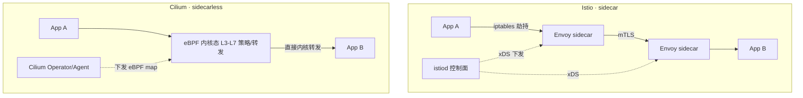
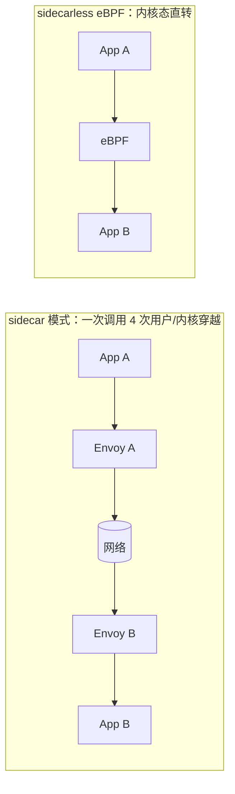

# Istio 与 Cilium 服务网格

Envoy sidecar 数据面 · eBPF sidecarless 数据面 · xDS / mTLS · Hubble 可观测

::: tip 一句话结论
Istio 靠 Envoy sidecar 治理最全，Cilium 靠 eBPF 内核态省掉横跳，成熟 vs 性能之争。
:::

## 场景问题

微服务多了以后，一堆横切需求要统一解决：**服务间 mTLS 加密**、**灰度/金丝雀路由**、**重试/超时/熔断**、**流量镜像**、**全链路可观测**。如果每个服务自己在代码里塞这些逻辑，语言各异、版本不一、改一次全量发版，维护地狱。

**服务网格（Service Mesh）** 的思路是：把这些能力从业务代码**下沉到基础设施**，业务无感知。但"下沉到哪里"有两条路线之争：

- **Istio**：给每个 Pod 塞一个 **Envoy sidecar 代理**，所有进出流量被劫持到 sidecar，由它执行策略。
- **Cilium**：用 **eBPF** 把能力做进**内核数据面**，**不需要 sidecar**（sidecarless）。

这两条路线在**延迟、资源、可运维性**上的取舍，正是本专题要讲清的。



## 实现方案

### Istio：Envoy sidecar + istiod 控制面

- **数据面**：每 Pod 注入一个 **Envoy** 容器（sidecar）。通过 **iptables 规则**（由 init 容器 `istio-init` 写入）把 Pod 的所有入/出流量**重定向**到 Envoy 端口，业务代码零改动。
- **控制面 istiod**：把用户写的路由/策略 CRD 翻译成 Envoy 配置，通过 **xDS 协议**（LDS/RDS/CDS/EDS）动态下发给所有 sidecar。
- **mTLS**：istiod 签发工作负载证书，sidecar 之间自动 mTLS，业务明文、网络密文。

```yaml
# Istio 灰度：90% 打 v1，10% 打 v2（金丝雀）
apiVersion: networking.istio.io/v1beta1
kind: VirtualService
metadata:
  name: reviews
spec:
  hosts: [reviews]
  http:
    - route:
        - destination: { host: reviews, subset: v1 }
          weight: 90
        - destination: { host: reviews, subset: v2 }
          weight: 10
      retries:                      # 治理能力下沉到网格
        attempts: 3
        perTryTimeout: 2s
---
apiVersion: networking.istio.io/v1beta1
kind: DestinationRule
metadata:
  name: reviews
spec:
  host: reviews
  trafficPolicy:
    tls: { mode: ISTIO_MUTUAL }     # 自动 mTLS
  subsets:
    - name: v1
      labels: { version: v1 }
    - name: v2
      labels: { version: v2 }
```

### Cilium：eBPF 数据面（无 sidecar）

- 每节点一个 **Cilium agent**，把 L3-L7 策略、负载均衡、加密编译成 **eBPF 程序**挂到内核挂载点（tc/XDP/socket）。
- 流量在**内核态**被直接处理与转发，**不经过每 Pod 的用户态代理**。可替代 kube-proxy 的 iptables（O(1) map 查找）。
- **Hubble** 基于 eBPF 事件提供 L3-L7 流量的实时可观测（谁访问谁、被哪条策略拒了），无需 sidecar 埋点。

```yaml
# Cilium L7 策略：只允许 GET /public，其余拒绝（策略在内核 eBPF 执行）
apiVersion: cilium.io/v2
kind: CiliumNetworkPolicy
metadata:
  name: allow-public-get
spec:
  endpointSelector:
    matchLabels: { app: web }
  ingress:
    - fromEndpoints:
        - matchLabels: { app: frontend }
      toPorts:
        - ports:
            - { port: "80", protocol: TCP }
          rules:
            http:
              - method: "GET"
                path: "/public"
```

### sidecar 流量劫持的开销



sidecar 模式里，一次 A→B 调用要经过 **App A → Envoy A → Envoy B → App B**，每次进出 sidecar 都是一次 **iptables 重定向 + socket 收发 + 用户态代理处理**——"反复横跳"，多两跳代理与多份内存/CPU。

## 为什么这么做

- **为什么把能力下沉到网格**：mTLS/灰度/重试/可观测是跨服务共性，下沉后**业务零改动、统一策略、集中运维**，改治理不改业务代码。
- **为什么 eBPF 能省掉 sidecar 反复横跳**：eBPF 程序运行在**内核态**，流量到达内核时就地做策略与转发，不必**上送到每个 Pod 的用户态代理再下来**。省掉 sidecar 的 iptables 劫持、额外 socket、用户态拷贝与代理进程本身的内存/CPU。

::: tip 延迟/资源/可运维直觉
- **延迟**：sidecar 每跳 +（劫持 + 代理）微秒级开销累积；eBPF 内核态直转更低。
- **资源**：sidecar 每 Pod 一份 Envoy（几十 MB 内存 × Pod 数）；eBPF 每节点一份 agent。
- **可运维**：sidecar 生命周期与 Pod 耦合（启动顺序、优雅退出、版本升级要重启全部 Pod）；eBPF 升级 agent 即可，但**强依赖内核版本**。
:::

## 为什么别的选择不行

::: warning sidecar vs sidecarless 的各自代价
| 维度 | Istio sidecar | Cilium eBPF sidecarless |
|---|---|---|
| L7 能力成熟度 | Envoy 极其成熟，功能全 | L7 能力在补齐中，复杂协议不如 Envoy |
| 延迟/资源 | 每 Pod 一代理，横跳 + 内存放大 | 内核态直转，省 sidecar |
| 内核依赖 | 弱（用户态） | **强**（需较新内核支持 eBPF 特性） |
| 排障 | 代理日志/指标直观，但链路多一环 | Hubble 强，但 eBPF 内核态调试门槛高 |
| 多语言/异构 | 完全无侵入 | 无侵入 |
:::

::: danger 游戏帧内通信别硬套 Mesh
无论 sidecar 还是 eBPF，通用 Mesh 面向**微服务治理**，不是为游戏**帧内多跳低延迟同机调用**设计。同机高频通信仍应走 [消息总线共享内存](/game-infra/message-bus.md)；自研游戏网格更倾向 [去中心化 + 降连接数](/game-infra/mesh-central-vs-decentral.md)。Mesh 的价值在东西向治理/可观测，不在替代 IPC。
:::

## 沉淀结论

::: tip 结论
- **Istio** = Envoy **sidecar 数据面** + istiod **控制面**，xDS 动态下发，VirtualService/DestinationRule 做路由与 mTLS。功能最全、语言无侵入，代价是每 Pod 一代理 + 流量横跳 + 内存放大。
- **Cilium** = **eBPF 无 sidecar** 数据面，L3-L7 策略在**内核态**执行，可替代 kube-proxy，Hubble 强可观测。低延迟省资源，代价是**内核版本依赖**与 L7 成熟度。
- 二者本质取舍：**成熟通用治理（sidecar）** vs **内核态高性能（eBPF）**。
- eBPF 之所以省，是流量到内核就地处理，不必反复上送用户态代理——见 [eBPF](/game-infra/ebpf.md)。
:::

### 记忆口诀

**Istio**：Envoy sidecar / istiod 控制面 / xDS 下发 / 功能全但横跳
**Cilium**：eBPF 无 sidecar / 内核态直转 / Hubble 可观测 / 省资源但依赖内核
**取舍**：成熟通用治理 vs 内核态高性能

**相关专题**：[eBPF 原理与落地](/game-infra/ebpf.md) · [CNI 与 K8s 网络插件](/game-infra/cni-plugins.md) · [中心化 vs 去中心化网格](/game-infra/mesh-central-vs-decentral.md) · [自研 Mesh × K8s](/game-infra/self-mesh-k8s.md)

## 内容来源

综合整理。参考方向：Istio 官方文档（架构、istiod、Envoy sidecar、xDS、VirtualService/DestinationRule、mTLS、iptables 注入）、Cilium 官方文档（eBPF 数据面、sidecarless、CiliumNetworkPolicy、替代 kube-proxy、Hubble）、Envoy xDS 协议说明、eBPF 内核挂载点原理。

## 自测：合上资料能说清楚吗？

Istio 是怎么在业务代码零改动的前提下，把所有进出流量劫持到 Envoy sidecar 的？

<details><summary>参考答案</summary>

由 init 容器 `istio-init` 写入 **iptables 规则**，把 Pod 的入/出流量**重定向**到 Envoy 端口。业务进程收发的是明文，网络上跑的是 sidecar 间的 **mTLS**，全程无感知。

</details>

istiod 是怎么把用户写的路由/策略配置生效到成百上千个 sidecar 上的？

<details><summary>参考答案</summary>

istiod 把 VirtualService/DestinationRule 等 CRD 翻译成 Envoy 配置，通过 **xDS 协议**（LDS/RDS/CDS/EDS）**动态下发**给所有 sidecar，无需重启，实现路由/灰度/重试的集中控制。

</details>

同样做服务网格，Istio sidecar 和 Cilium eBPF 在延迟与资源上的核心差异是什么？

<details><summary>参考答案</summary>

sidecar 一次 A→B 调用要经 **App A→Envoy A→Envoy B→App B**，多两跳用户态代理 + 每 Pod 一份 Envoy 内存。eBPF 在**内核态就地转发**，不上送用户态，每节点一份 agent，延迟更低、更省资源。

</details>

既然 eBPF sidecarless 又快又省，为什么 Istio 仍被大量采用？

<details><summary>参考答案</summary>

Envoy **L7 能力极其成熟**、复杂协议支持全，且是**用户态、弱内核依赖**。eBPF 强依赖**较新内核版本**、L7 能力仍在补齐，内核态调试门槛高。选型是"成熟通用治理 vs 内核态高性能"的权衡。

</details>

游戏里的帧内多跳低延迟通信，能直接套用 Istio/Cilium 这类 Mesh 吗？

<details><summary>参考答案</summary>

不合适。通用 Mesh 面向**微服务东西向治理/可观测**，非为游戏**帧内同机高频通信**设计。同机高频应走**消息总线共享内存**，自研游戏网格更倾向**去中心化 + 降连接数**，Mesh 不替代 IPC。

</details>
