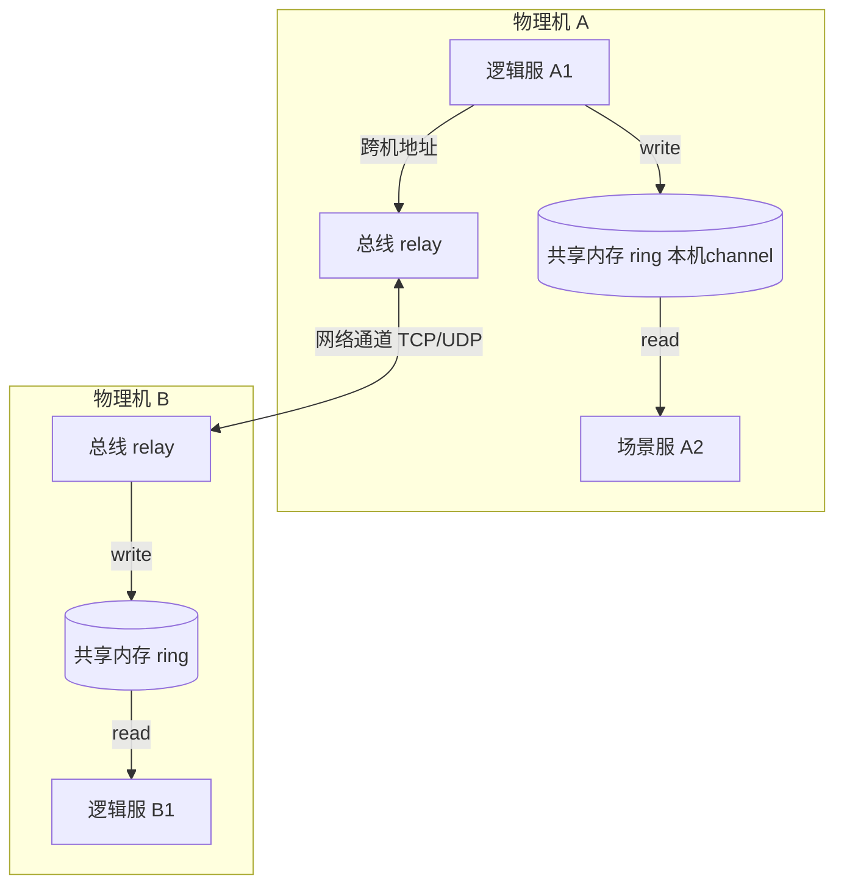

# 消息总线（共享内存 IPC）

游戏后台通信总线 · 共享内存零拷贝 IPC · 世界-集群-实例寻址 · 环形队列

> ::: tip 说明
> 本文描述的是游戏后台的进程间/服务间**通信总线组件**。以下按**公开可知的架构原理**层面描述其设计思想与取舍，不涉及内部私有数字或未公开实现细节。
> :::

::: tip 一句话结论
同机共享内存零拷贝、跨机走网络 relay，一套层次化地址实现位置透明的统一通信总线。
:::

## 场景问题

> **打个比方**：同一台机器上的进程互发消息，要是每次都走网络（哪怕是 localhost socket），就像同办公室两个人非要打电话——还得经接线员转接、话还得你念一遍、我抄一遍（数据在内核态用户态之间来回拷贝），又慢又费。**共享内存**则像两人共用一块**白板**：你写、我直接看，谁都不用抄（零拷贝）。而**环形队列**就是这块白板容量有限、写满了从头覆盖，读的人得及时跟上别被覆盖掉。至于**层次化寻址**（世界-集群-实例），好比"公司-部门-工位"的三级门牌号——你只管认门牌，系统自动判断对方在同一栋楼（走白板/共享内存）还是异地分部（发快递/跨机 relay），位置对你透明。**类比失效边界**：共用白板快归快，但也丢掉了网络那层天然隔离——某个进程一旦写脏了白板、或写越了界，同机所有读它的进程都可能读到垃圾数据甚至跟着崩。所以共享内存必须靠严格的读写约定 + 内存屏障来自律，不像 socket 那样有进程隔离替你兜底。

一台游戏物理机上跑着几十上百个进程：[接入网关](/game-infra/access-gateway.md)、逻辑服、场景服、AI、匹配、DB 代理……它们要**高频互发消息**。战斗帧里，一次玩家操作可能触发场景服 → AI → 逻辑服 → 接入回包的连锁调用，且要在**一帧（几十毫秒）内**跑完。

如果这些同机进程之间走 **RPC over TCP（gRPC / 自研 TCP RPC）**：

- 每条消息要经过**内核协议栈**：`send()` 拷贝到内核 socket buffer → 回环 → 另一进程 `recv()` 再拷贝回用户态，两次数据拷贝 + 两次系统调用 + 内核调度。
- loopback 虽不过网卡，但**内核态往返 + 拷贝**在每帧上万次调用下会吃掉可观的 CPU 与延迟抖动。
- 跨机时还要真正走网络，需要统一的**寻址与路由**，不能让每个业务进程各自维护"谁在哪台机的哪个端口"。

于是需要一条**统一通信总线**：同机走**共享内存零拷贝**极致低延迟，跨机走**网络通道**，并用一套**层次化地址**统一寻址，业务只管"发给某个逻辑地址"，不关心对端在本机还是远端。



## 实现方案

### 1. 层次化寻址（GCIM 思想：世界-集群-实例-模块）

消息总线用一套**结构化地址**标识每个通信端点，而非"IP:Port"。可理解为多段编码：

```text
Address = World . Cluster . Instance . Module
          世界    集群      实例      模块
例：  区服1 . 战斗集群 . GameSvr-3 . 场景管理器
```

- 业务发消息只写**逻辑地址**（"发给区服1的匹配模块"），总线负责把它翻译成"本机某共享内存 channel"或"某远端 relay 通道"。
- 地址与物理位置解耦：进程迁移、扩缩容后，只需更新地址表映射，发送方代码不变。

### 2. 共享内存环形队列（本机零拷贝核心）

同机两进程通过一段 `mmap` 的共享内存，里面是一个 **SPSC/MPSC 环形队列（ring buffer）**。发送方写、接收方读，靠**头尾指针**推进，无需内核参与数据搬运：

```c
// 共享内存单生产者单消费者环形队列（伪码，示意零拷贝 IPC）
typedef struct {
    volatile uint64_t head;   // 消费者读位置（放共享内存头部）
    volatile uint64_t tail;   // 生产者写位置
    uint64_t          cap;    // 容量（2 的幂，& 掩码取模）
    uint8_t           buf[];  // 柔性数组，位于同一 mmap 段
} ShmRing;

// 生产者：写一条消息（跨进程，无系统调用、无内核拷贝）
int ring_push(ShmRing *r, const void *msg, uint32_t len) {
    uint64_t t = r->tail;
    uint64_t h = __atomic_load_n(&r->head, __ATOMIC_ACQUIRE);
    if (t - h + len + 4 > r->cap) return -EAGAIN;   // 满 → 背压，交上层处理
    uint64_t off = t & (r->cap - 1);
    memcpy(&r->buf[off], &len, 4);                   // 长度前缀
    memcpy(&r->buf[off + 4], msg, len);              // 直接写进共享内存
    __atomic_store_n(&r->tail, t + 4 + len, __ATOMIC_RELEASE); // 发布：release 屏障
    return 0;
}

// 消费者：读一条消息（对端进程 mmap 同一段内存）
int ring_pop(ShmRing *r, void *out, uint32_t *len) {
    uint64_t h = r->head;
    uint64_t t = __atomic_load_n(&r->tail, __ATOMIC_ACQUIRE);
    if (h == t) return -EAGAIN;                       // 空
    uint64_t off = h & (r->cap - 1);
    memcpy(len, &r->buf[off], 4);
    memcpy(out, &r->buf[off + 4], *len);
    __atomic_store_n(&r->head, h + 4 + *len, __ATOMIC_RELEASE);
    return 0;
}
```

::: tip 为什么叫"零拷贝"
数据只在**共享内存里存在一份**：生产者 `memcpy` 进 ring，消费者直接从同一物理页读（更极致的实现连这次 `memcpy` 都省，直接在 ring 里构造消息）。相比 TCP，省掉了「用户态→内核 socket buf→用户态」的**两次内核拷贝**和系统调用/调度开销。
:::

### 3. 消息可靠性与背压

- **背压**：ring 满时 `ring_push` 返回 `EAGAIN`，上层选择丢弃（可容忍帧）、缓冲重试、或反压上游，而不是无限堆积 OOM。
- **可靠性**：同机共享内存本身可靠；跨机 relay 通道上做序号 + 重传（或依赖 TCP）。业务层对关键消息加 seq/ack 幂等。

## 为什么这么做

**为什么同机用共享内存总线而非 RPC over TCP？**

| 维度 | 共享内存 ring | TCP loopback RPC |
|---|---|---|
| 数据拷贝 | 1 份（共享） | 2 次内核拷贝 |
| 系统调用 | 无（纯内存 + 原子操作） | send/recv 每次陷入内核 |
| 延迟 | 纳秒~微秒级 | 微秒~几十微秒 + 抖动 |
| 内核调度 | 不参与 | 参与，帧内抖动 |

游戏后台每帧上万次同机调用，**延迟与抖动**直接决定帧率是否稳定，共享内存把每次调用的固定开销压到极低。

**为什么要统一寻址而非各进程自己记 IP:Port？**

- 进程会迁移、扩缩容、重启换端口。业务写死物理地址就得跟着改。层次化逻辑地址 + 地址表，让**位置透明**：发送方永远只写逻辑地址。

## 为什么别的选择不行

::: warning 其他通信方案的短板
| 方案 | 为什么不选（在游戏同机高频场景） |
|---|---|
| **gRPC / RPC over TCP** | 内核往返 + 双拷贝 + HTTP2/序列化开销，同机高频下延迟/CPU 浪费；本机通信杀鸡用牛刀 |
| **Unix Domain Socket** | 比 TCP 省协议栈，但仍是**内核缓冲 + 拷贝 + 系统调用**，不如共享内存零拷贝 |
| **Service Mesh（sidecar）** | 每跳多一个代理进程 + 两次 socket，为治理牺牲延迟；游戏帧内通信承受不起（见 [Istio vs Cilium](/game-infra/mesh-istio-cilium.md)） |
| **纯消息队列（Kafka/MQ）** | 面向异步吞吐与持久化，非帧内低延迟同步调用，落盘/网络往返太重 |
:::

::: danger 共享内存不是银弹
共享内存 IPC 的代价：**跨机不适用**（需 relay 兜底）、**故障隔离弱**（一个进程写坏 ring 可能影响对端，需校验与守护）、**编程复杂**（内存屏障、生命周期、清理）。所以消息总线是"同机共享内存 + 跨机网络通道"的**混合模型**，不是纯共享内存。
:::

## 沉淀结论

::: tip 结论
- 消息总线 = **统一通信总线**：同机**共享内存零拷贝环形队列**极致低延迟，跨机走网络 relay，一套**层次化逻辑地址**（世界-集群-实例-模块）实现位置透明。
- 相比 RPC over TCP，省掉两次内核拷贝 + 系统调用，把同机高频调用延迟压到微秒级——这是游戏"帧内多跳调用还要稳帧率"的刚需。
- ring 满即**背压**，上层决定丢/缓/反压，避免 OOM。
- 取舍：换来低延迟，代价是跨机需兜底、故障隔离弱、编程复杂。与 gRPC/Mesh 相比，消息总线牺牲通用治理换极致性能。
:::

### 记忆口诀

**通道**：同机共享内存 ring / 跨机网络 relay / 混合模型
**寻址**：世界-集群-实例-模块（GCIM）/ 逻辑地址 / 位置透明
**零拷贝**：一份内存 / 无内核往返 / 无系统调用
**背压**：ring 满 EAGAIN / 丢·缓·反压 / 拒绝 OOM

**相关专题**：[接入网关（长连接接入层）](/game-infra/access-gateway.md) · [自研 Mesh 服务网格 × K8s](/game-infra/self-mesh-k8s.md) · [中心化 vs 去中心化网格](/game-infra/mesh-central-vs-decentral.md)

## 内容来源

综合整理。参考方向：共享内存 IPC 与无锁环形队列（SPSC/MPSC ring buffer）通用原理、`mmap` 零拷贝进程间通信的行业通行做法、游戏后台共享内存总线的公开介绍（共享内存总线 + 层次化寻址思想）、Service Mesh / gRPC 与本机 IPC 的性能取舍讨论。内部实现细节未公开，本文仅从设计思想与取舍层面描述。

## 自测：合上资料能说清楚吗？

同机高频进程通信，为什么共享内存 ring 比 TCP loopback 快？各省掉了什么？

<details><summary>参考答案</summary>

TCP loopback 每条消息要 **两次内核拷贝**（用户态→socket buf→用户态）加 **send/recv 两次系统调用**，还会引入内核调度抖动。共享内存 ring 数据只在共享段里存 **一份**，靠头尾指针 + **原子操作**推进，**无系统调用、无内核往返**，延迟从微秒级降到纳秒~微秒级，帧内抖动更小。

</details>

层次化地址（世界-集群-实例-模块）解决了什么问题？没有它会怎样？

<details><summary>参考答案</summary>

它让 **位置透明**：业务只写逻辑地址，总线负责翻译成本机 channel 或远端 relay 通道。进程迁移、扩缩容、重启换端口时，只改 **地址表映射**，发送方代码不动。若各进程自己记 **IP:Port**，物理位置一变就得改代码，耦合严重。

</details>

ring buffer 写满时怎么办？为什么不能无限扩容？

<details><summary>参考答案</summary>

写满时 `ring_push` 返回 **EAGAIN**，触发 **背压**：上层按消息类型选择丢弃（可容忍帧）、缓冲重试或反压上游。共享内存段容量固定，**无限堆积会 OOM**，且延迟膨胀违背低延迟初衷，所以必须显式定义满时策略而非默默扩容。

</details>

同机既然共享内存这么快，为什么不所有服务都用它，还要保留网络 relay？（对比两方案）

<details><summary>参考答案</summary>

共享内存 **跨机不可用**、**故障隔离弱**（一个进程写坏 ring 影响对端）、**编程复杂**（内存屏障/生命周期/清理）。网络 relay 覆盖跨机、天然进程隔离、可做序号重传。所以总线是 **同机共享内存 + 跨机网络** 的混合模型：同机要极致性能，跨机要通用与可靠。

</details>

消息总线与 Service Mesh sidecar 在游戏帧内通信场景的取舍差异是什么？

<details><summary>参考答案</summary>

Sidecar 每跳多一个 **代理进程 + 两次 socket**，为流量治理（熔断/灰度/mTLS）牺牲延迟。游戏帧内多跳调用几十毫秒内要跑完，**承受不起** 这种额外往返。消息总线选择 **极致低延迟**，放弃通用治理能力——治理由业务层或跨机通道另行承担。

</details>
