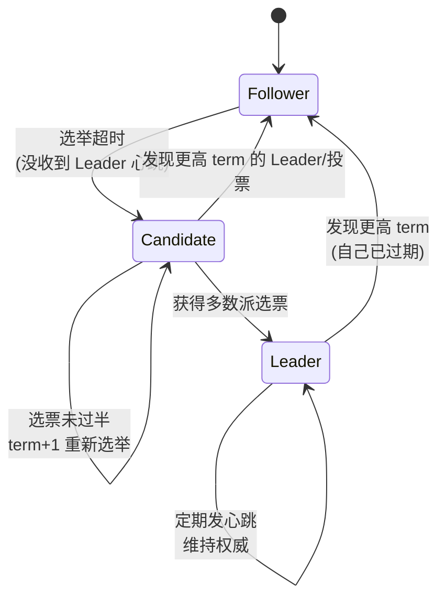
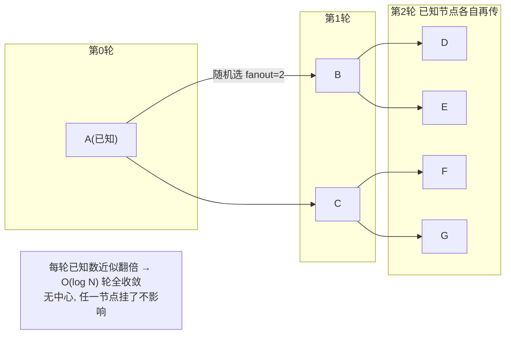

# Raft 与 Gossip：CP 强一致共识 vs AP 最终一致传播

> 分布式系统里两类需求泾渭分明：**元数据/配置**要强一致（谁是 Leader、当前分片表是什么，读到旧值就出错），用 Raft；**集群成员/故障探测**要高可用且抗故障（哪些节点活着，允许短暂不一致），用 Gossip。前者是 CP，多数派提交、有单点式的 Leader；后者是 AP，无中心、随机传播、O(log N) 轮收敛。选错了，要么强一致的东西被 gossip 弄脏，要么成员发现被 Raft 的单点拖垮。

::: tip 一句话结论
读到旧值就出错的元数据用 Raft（CP 强一致），大规模成员发现用 Gossip（AP 抗故障），二者配合。
:::

## 场景问题

自研游戏网格/集群管理里，有两组性质完全相反的状态：

- **要强一致的元数据**：分片路由表、配置版本、"哪个节点是某世界的主"。这类数据**读到旧值就会出事**（两个节点都以为自己是主 → 双写冲突 / 脑裂）。必须有**单一事实来源**、多数派确认后才算生效。
- **要高可用的成员视图**：集群里几千上万个节点，谁在线、谁挂了、谁的负载多少。这类数据**允许短暂不一致**（某节点挂了，30 秒内大家陆续知道即可），但**绝不能有单点**——成员发现服务自己挂了会导致全局瞎。

如果用一套协议硬扛两边：用 Raft 做成员发现，则 Leader 一挂、选举期间全集群成员视图冻结，且几千节点全连 Leader 上报心跳，Leader 连接数/写入被打爆；用 Gossip 存分片路由表，则传播期间不同节点看到不同的路由，请求被发错地方。所以工程上**分而治之**：Raft 管强一致元数据，Gossip 管最终一致成员。

## 实现方案

### Raft：Leader 选举 + 日志复制 + 安全性

Raft 把共识拆成三块：**Leader 选举**、**日志复制**、**安全性约束**。核心概念：

> **打个比方**：Raft 选主就像**班级选班长**。谁先觉得"好久没人管事了"（选举超时），就跳出来喊"选我"（转 Candidate），并向全班拉票；只有**超过半数同学**投了你，你才算当上班长（多数派）。为避免大家同时抢着喊、票被分散选不出来，每个人的"忍耐时长"都随机错开（随机化选举超时）。**任期（term）**则像"第几届班委"的届数——一旦有人亮出更高的届数，旧班长立刻明白自己过气了，乖乖退位。**类比失效边界**：真实班级只有一个教室，而分布式系统会**网络分区**成好几个"隔离小屋"。这时少数人那屋就算也推举了个"班长"，也凑不齐全班过半的票、发不出任何有效指令；等隔墙打通，他一看到更高届数就自动退位——正是"任期 + 多数派"这条铁律，保证任何时刻**至多一个班长能真正拍板**，不会出现两个班长各发各的命令（脑裂）。

- **term（任期）**：逻辑时钟，单调递增。每次选举 term+1，用来识别过期 Leader。
- **三种角色**：Follower（被动）、Candidate（拉票中）、Leader（唯一写入口）。
- **两个超时**：选举超时（Follower 多久没收到心跳就发起选举，随机化以避免同时开选）、心跳间隔（Leader 定期发 heartbeat 维持权威）。
- **多数派提交**：一条日志被复制到多数派（N/2+1）节点后才 commit，保证已提交的日志在任何后续 Leader 上都存在。

#### 选举状态机



#### 选举伪码

```text
// 每个节点的主循环
loop forever:
    switch state:
    case Follower:
        if 在 electionTimeout(随机 150~300ms) 内没收到 Leader 心跳 或 合法投票请求:
            转为 Candidate

    case Candidate:
        currentTerm += 1
        votedFor = self
        votesGranted = 1
        重置随机 electionTimeout
        向所有其他节点并行发送 RequestVote(term, lastLogIndex, lastLogTerm)
        收集响应:
            if 对方 term > currentTerm: 转 Follower, 更新 term  // 发现更新的任期
            if 得到多数派选票 (votesGranted > N/2): 转 Leader
            if electionTimeout 到期仍未过半: 保持 Candidate, 重新选举 (term 再 +1)

    case Leader:
        周期性向所有 Follower 发 AppendEntries(心跳 / 携带日志)
        if 收到更高 term 的消息: 转 Follower  // 网络分区愈合，旧 Leader 退位

// 投票方处理 RequestVote：
on RequestVote(term, candidateId, lastLogIndex, lastLogTerm):
    if term < currentTerm: 拒绝                          // 过期请求
    if term > currentTerm: currentTerm = term; votedFor = null; 转 Follower
    // 安全性：只投给日志"至少和自己一样新"的候选者
    logOk = (lastLogTerm > myLastLogTerm) ||
            (lastLogTerm == myLastLogTerm && lastLogIndex >= myLastLogIndex)
    if (votedFor == null || votedFor == candidateId) && logOk:
        votedFor = candidateId; 授予选票; 重置 electionTimeout
    else: 拒绝
```

#### 日志复制伪码

```text
// 客户端写请求只能到 Leader
on ClientWrite(cmd):
    log.append({term: currentTerm, cmd})
    // 并行复制给所有 Follower
    for each follower:
        AppendEntries(prevLogIndex, prevLogTerm, entries[], leaderCommit)
    // 当某 index 被多数派确认，推进 commitIndex
    if 某条目已复制到多数派节点:
        commitIndex = 该 index
        apply 到状态机, 回复客户端

on AppendEntries(term, prevLogIndex, prevLogTerm, entries, leaderCommit):
    if term < currentTerm: 拒绝  // 过期 Leader
    if 本地 log[prevLogIndex].term != prevLogTerm: 拒绝  // 日志不匹配 → Leader 回退重试
    删除冲突条目并追加 entries
    if leaderCommit > commitIndex: commitIndex = min(leaderCommit, 最后新条目 index)
    重置 electionTimeout  // 收到合法心跳
```

::: warning
**脑裂处理**靠 term + 多数派：网络分区时，少数派那边即使选出"Leader"也拿不到多数派选票、无法 commit 任何日志；分区愈合后，它一看到更高 term 立刻退位为 Follower，其未提交的日志被覆盖。**任何时刻至多一个 Leader 能提交日志**，这是 Raft 不脑裂的根本。
:::

### Gossip：最终一致的成员传播（SI / SIR 传染模型）

Gossip（流行病/传染病模型）：每个节点**周期性随机挑几个 peer**，交换各自的成员状态（谁在线、版本号、心跳计数），像病毒一样扩散。收敛速度 **O(log N) 轮**——一轮翻几倍，几千节点几秒内全知道。没有中心节点，任何节点挂了不影响传播，天然抗故障。

传染模型：
- **SI（Susceptible-Infected）**：知道消息的节点持续传播，最终全体感染（简单但网络流量不收敛）。
- **SIR（Susceptible-Infected-Removed）**：节点传播一段时间后转为"移除"（不再主动传该消息），限制流量放大，实际系统（Serf）用这类反熵 + 有限次传播。



#### Gossip 伪码（含故障探测）

```text
// 每个节点维护 members: {id -> {state: alive/suspect/dead, incarnation: 版本号, heartbeat}}

// 传播循环：每 gossipInterval(如 200ms) 一次
loop:
    peers = 从存活成员里随机选 fanout 个 (如 3 个)
    for p in peers:
        向 p 发送 (我的 members 摘要)          // push-pull / 反熵
        收到 p 的 members, 逐条 merge:
            if 对方 incarnation > 本地: 采纳对方状态  // 版本新者胜
            if 状态冲突(我说 alive, 它说 suspect): 用更高 incarnation 裁决

// 故障探测(SWIM 风格)：直接探测 + 间接探测降误判
loop probeInterval:
    t = 随机选一个成员
    发 ping(t); 若 ackTimeout 内无 ack:
        向 k 个其他成员请求 "帮我 ping t" (indirect ping)  // 排除自身网络抖动
        若都无 ack: 标 t 为 suspect, 通过 gossip 广播
    被标 suspect 的节点若自己还活着, 会广播更高 incarnation 的 alive 反驳(自我澄清)
    suspect 超时未澄清 → 标 dead
```

::: tip
Gossip 的收敛是**概率性 O(log N) 轮**而非确定性：fanout=3、几千节点时，几秒内几乎必然全收敛。SWIM 的"间接探测 + 自我澄清（incarnation 反驳）"是降低误判的关键——避免一次网络抖动就把好节点判死。Serf、Redis Cluster、Cassandra、HashiCorp Consul 的成员层都是这套。
:::

### Gossip 实战：自研网格 nzmesh 的实现（与教科书 SWIM 的差异）

上面是教科书 SWIM。实际落地时，可信内网 + 万级节点的场景往往用一个**更简化的变体**就够——我自研网格 nzmesh 的成员层就是"**心跳全连接广播 + Last-Write-Wins**"，刻意砍掉了 incarnation、间接探测、反熵这些 SWIM 组件。下面是它的实现骨架（C）。

> 口径统一：[自研服务网格 + K8s](./self-mesh-k8s.md) 一页从"代码里无 gossip/infect 标识符、收方不转发"角度强调它**不是教科书 SWIM**；本页从算法家族角度称其为 **gossip 退化特例/变体**——两者说的是同一件事的两面（fanout 拉满 + 砍组件），不矛盾。本页是 nzmesh 成员层的**代码归属页**，K8s 部署落地见前者。

**① 成员节点结构：没有版本号，只有时间戳 + 状态枚举**

```c
// nzmesh/nzmesh.h:111
typedef struct STBusIP {
    uint64_t last_data;    // 最后一次收到该节点心跳的时间戳 —— 超时判定的唯一依据
    uint64_t last_change;  // 最后一次状态变更时间
    uint32_t tbus_addr;    // 节点唯一 ID（编码了 zone/route/mod/instance）
    uint32_t ip; int32_t port;
    uint8_t  status;       // BUS_STATUS_NORMAL / DISABLE / TIMEOUT / UNREACHABLE
    SSvrHeartBeat info;    // 心跳信息体（分组、路由类型、backup 等）
    // ...
} STBusIP;
// 注意：结构体里没有 incarnation / version —— 冲突不靠逻辑时钟，靠"谁来得晚"
```

**② 传播：5s 定时器只置标志位，真正发送在主循环里做全连接广播**

```c
// nzmesh/nzmesh_main.c:930 —— 定时器不做重活，只打标记
void __tmr_nzmesh_heartbeat(void *ctx, uint64_t interval) {
    ((SNZMeshContext *) ctx)->isHeartBeat = TRUE;
}
// nzmesh_main.c:979 注册：每 5 秒一次
tmr_insert2(mesh->tmr, __tmr_nzmesh_heartbeat, mesh, 5 * 1000, -1);

// 主循环消费标志（nzmesh_main.c:1020）
if (mesh->isHeartBeat) { mesh->isHeartBeat = FALSE; nzmesh_heartbeat(mesh); }

// nzmesh_main.c:873 —— 关键：不是随机选 fanout，而是遍历所有已建连接全量广播
void nzmesh_heartbeat(SNZMeshContext *mesh) {
    SRouteProtocol *mesh_pkg = make_mesh_heartbeat_package(mesh, now); // 打包本地全量实例
    hash_rewind(mesh->hash_cache);
    while ((cache = hash_next(mesh->hash_cache))) {   // 遍历每一条 TCP 连接
        SRouteProtocol *pkg = cache->mn->islocal ? msc_pkg : mesh_pkg;
        // memcpy 进该连接的发送缓冲、加入发送队列（push-only，无 pull / 无反熵）
    }
}
```

**③ merge：无 incarnation 比较，Last-Write-Wins + 状态变更即时再广播**

```c
// nzmesh/nzmesh_net.c:819 —— 收到对端心跳，按 tbus_addr 找到本地记录后
if (tip->tbus_addr == (uint32_t)header->src_servbusip) {
    uint8_t old_status = tip->status;
    // 没有版本号可比：直接用"收到的此刻"覆盖，谁来得晚谁说了算
    tip->status    = status;
    tip->last_data = now;
    // 本地实例状态一变，立刻置位触发下一轮广播（不等下一个 5s），加速收敛
    if (header->flag == ECONN_HEARTBEAT_TOPXY && old_status != tip->status)
        mesh->isHeartBeat = TRUE;
    if (old_status != tip->status)
        route_update_active_list(mesh, route, FALSE, TRUE); // 立即刷新路由活跃表
}
```

**④ 故障探测：纯心跳超时，无 ping-req 间接探测、无 incarnation 自我澄清**

```c
// nzmesh/nzmesh_net.c:338 —— 转发/巡检时发现 now - last_data 超阈值即判死
if (now/1000 - tip->last_data > heartbeat_timeout) {   // 阈值 HeartBeatTimeOut=9000ms
    tip->status = BUS_STATUS_TIMEOUT;                  // NORMAL → TIMEOUT
    if (dl_find(mesh->local_tbus, tip, cmpTBusMap))     // 若是本机实例超时
        mesh->isHeartBeat = TRUE;                       // 立即广播，让别人尽快知道
}
// 恢复：TIMEOUT/DISABLE 的实例再次收到心跳 → 回到 NORMAL（nzmesh_net.c:828）
```

nzmesh 相对教科书 SWIM 的取舍一览：

| 维度 | 教科书 SWIM | nzmesh 实现 | 代价/理由 |
|---|---|---|---|
| peer 选择 | 随机 fanout（如 3） | **全连接广播**（遍历所有 TCP 连接） | 收敛快、实现简单；代价是连接数/流量随规模上升 |
| 交换方式 | push-pull 反熵 | **仅 push 全量本地实例** | 无需拉取逻辑；靠全连接广播保证覆盖，无定期反熵 |
| 冲突裁决 | incarnation 版本号 | **Last-Write-Wins（比 last_data 时刻）** | 无逻辑时钟，极端分区/乱序下可能误判，可信内网可接受 |
| 故障探测 | ping + 间接 ping-req | **纯心跳超时（9s）** | 少一层探测；靠"本机超时即时广播"压低发现延迟 |
| 自我澄清 | 被误判者广播更高 incarnation 反驳 | **无**（下一轮心跳自然恢复 TIMEOUT→NORMAL） | 无 refute 机制；恢复靠对端重新收到心跳 |
| 收敛加速 | — | **状态变更立即触发广播**，不等下个周期 | 用"事件驱动补一刀"弥补固定 5s 周期的延迟 |

::: warning
这是一个**"强一致优先 + 可信内网"取向的 gossip 变体**，不是完整 SWIM。它用"全连接广播 + 状态变更即时补发"换取实现简单和快速收敛，适合**万级、网络可信、业务本身能容错**的自研网格；但因为没有 incarnation 自我澄清和间接探测，在**超大规模自组织网络或高分区抖动**环境下会退化（一次抖动可能误判、连接数随节点数上升）。面试里能说清"我砍了哪些 SWIM 组件、为什么砍、代价是什么"，比背全套 SWIM 更有说服力。
:::

## 为什么这么做

**CP vs AP，用 CAP 视角看两者定位：**

| 维度 | Raft (CP) | Gossip (AP) |
|---|---|---|
| 一致性 | **强一致**（线性一致，多数派提交） | **最终一致**（收敛后一致） |
| 可用性 | 选举期间短暂不可写；需多数派存活 | **始终可用**，无单点 |
| 中心 | 有 Leader（写单点，读可扩） | **完全去中心** |
| 规模 | 受 Leader 连接/复制吞吐限制（通常 3~7 节点核心组） | 上万节点（流量 O(fanout)/节点） |
| 收敛/延迟 | 提交延迟 = 一次多数派 RTT | O(log N) 轮，秒级 |
| 用途 | 元数据/配置/KV 强一致（etcd、ZooKeeper 类、分片表、Leader 选主） | 成员发现、故障探测、状态传播（Serf、Redis Cluster、Cassandra） |

- **为什么元数据用 Raft**：分片路由表、"谁是主"这类数据**读到旧值即错**，必须线性一致 + 单一提交点。Raft 的多数派提交 + term 保证"已提交的永不丢、任意时刻至多一主"，正是元数据要的。etcd（K8s 的大脑）就是 Raft。
- **为什么成员发现用 Gossip**：几千上万节点的存活视图，用不着强一致（晚几秒知道某节点挂了可接受），但**绝不能有单点**且**流量不能集中**。Gossip 去中心、O(log N) 收敛、每节点只跟少数 peer 通信（流量 O(fanout)），完美契合。
- **两者配合**：自研网格常见架构是——**Gossip 层维护"谁在线"的成员视图（AP，抗故障）**，**Raft 组维护"分片怎么分、配置版本"的强一致元数据（CP）**，Raft 组的成员本身也可由 Gossip 层发现。各司其职。

## 为什么别的选择不行

- **用 Raft 做成员发现**：几千节点全向 Leader 上报心跳，Leader 连接数/写入被打爆；Leader 一挂，选举期间全局成员视图冻结。规模和可用性都不匹配。
- **用 Gossip 存强一致元数据**：传播期间不同节点看到不同版本的路由表，请求被发错节点、双主并存。Gossip 只保证**最终**一致，中间态不可靠，强一致数据绝不能用。
- **中心化注册中心（单 master）做成员**：单点故障 = 全局瞎；连接数随节点数线性增长，扩展瓶颈明显。Gossip 去中心正是为此。
- **两阶段提交（2PC）替代 Raft**：2PC 协调者单点、阻塞、无容错（协调者挂在提交中会阻塞参与者）。Raft 用多数派 + 选举解决了容错，是共识的正解。
- **只用一套协议统一两边**：如上所述，CP 和 AP 的取舍相反，硬用一套必然在另一边出问题。**分而治之**是唯一对的选择。

## 沉淀结论

- **Raft = CP 强一致共识**：Leader 选举（term + 随机选举超时 + 多数派选票）+ 日志复制（多数派提交）+ 安全性（只投日志更新者、任意时刻至多一主）。用于**元数据/配置/KV**，代表 etcd。
- **Gossip = AP 最终一致传播**：周期随机选 peer 交换状态，SI/SIR 传染模型，O(log N) 轮收敛，无单点抗故障；SWIM 的间接探测 + incarnation 自我澄清降误判。用于**成员发现/故障探测**，代表 Serf/Redis Cluster/Cassandra。
- **选型分界**：读到旧值就出错的 → Raft；允许短暂不一致但要抗故障、大规模的 → Gossip。
- 一句话：**元数据一致用 Raft，成员发现用 Gossip，二者配合而非二选一。**

### 记忆口诀

**Raft(CP)**：term 任期 / 多数派提交 / 单一 Leader / 元数据·etcd
**Gossip(AP)**：随机选 peer / O(log N) 收敛 / 无单点 / 成员发现·Serf
**降误判**：SWIM 间接探测 / incarnation 自我澄清
**nzmesh 变体**：全连接广播 / LWW（比 last_data）/ 纯心跳超时 9s / 状态变更即时补发（砍掉 incarnation·间接探测·反熵）
**分界**：读旧值出错→Raft；允许短暂不一致要抗故障→Gossip

## 内容来源

综合整理。参考论文与资料：Ongaro & Ousterhout "In Search of an Understandable Consensus Algorithm (Raft)"（USENIX ATC 2014）及 raft.github.io、Das et al. "SWIM: Scalable Weakly-consistent Infection-style Process Group Membership Protocol"（DSN 2002）、Demers et al. "Epidemic Algorithms for Replicated Database Maintenance"（PODC 1987），以及 etcd/Raft、HashiCorp Serf/Consul memberlist、Redis Cluster、Cassandra gossip 的实现文档。

## 自测：合上资料能说清楚吗？

Raft 靠什么保证任意时刻至多一个 Leader 能提交日志、从而不脑裂？

<details><summary>参考答案</summary>

靠 **term（任期）+ 多数派**。少数派分区即使选出"Leader"也拿不到**多数派选票**、无法 commit 任何日志；分区愈合后它看到**更高 term** 立刻退位为 Follower，未提交日志被覆盖。多数派提交保证已提交的永不丢。

</details>

Gossip 为什么能在几千节点里做到秒级收敛，且没有单点？

<details><summary>参考答案</summary>

每节点**周期随机选 fanout 个 peer** 交换状态，已知节点数每轮近似翻倍，故 **O(log N) 轮**全收敛（fanout=3、几千节点几秒）。完全**去中心**，任一节点挂了不影响传播，每节点流量只 O(fanout)，天然抗故障。

</details>

同样是"哪个节点是主/在线"，为什么分片路由表用 Raft、成员存活视图用 Gossip？（对比）

<details><summary>参考答案</summary>

分片路由表**读到旧值即错**（双主/发错节点），需**线性一致 + 单一提交点**→Raft。成员存活视图**允许晚几秒知道**，但要**大规模、抗故障、无单点、流量不集中**→Gossip。取舍相反，故分而治之。

</details>

用 Raft 做几千节点的成员发现会遇到什么问题？

<details><summary>参考答案</summary>

几千节点全向 **Leader 上报心跳**，Leader **连接数/写入被打爆**；Leader 一挂，**选举期间全局成员视图冻结**。规模（受 Leader 复制吞吐限制，核心组通常 3~7 节点）和可用性都不匹配成员发现的需求。

</details>

SWIM 的"间接探测"和"incarnation 自我澄清"分别解决什么问题？

<details><summary>参考答案</summary>

**间接探测**：直接 ping 无 ack 时，请 k 个其他成员帮 ping，排除**探测方自身网络抖动**导致误判。**incarnation 自我澄清**：被误标 suspect 的节点若还活着，广播**更高 incarnation 的 alive** 反驳，避免一次抖动把好节点判死。

</details>

自研网格 nzmesh 的 gossip 相比教科书 SWIM 砍掉了哪些组件？为什么可接受，代价是什么？

<details><summary>参考答案</summary>

nzmesh 用"**心跳全连接广播 + Last-Write-Wins**"的简化变体：**砍掉** incarnation 版本号（冲突只比 `last_data` 时刻，谁晚谁赢）、间接探测 ping-req（纯心跳超时 9s 判死）、push-pull 反熵（仅 push 全量本地实例）、随机 fanout（改为遍历所有 TCP 连接**全量广播**）。**可接受**是因为目标场景是**可信内网 + 万级节点 + 业务本身能容错**，且用"**状态变更即时触发广播**（不等下个 5s 周期）"弥补收敛延迟。**代价**：连接数/流量随规模上升、无自我澄清 → 高分区抖动下一次网络抖动可能误判好节点。

</details>

