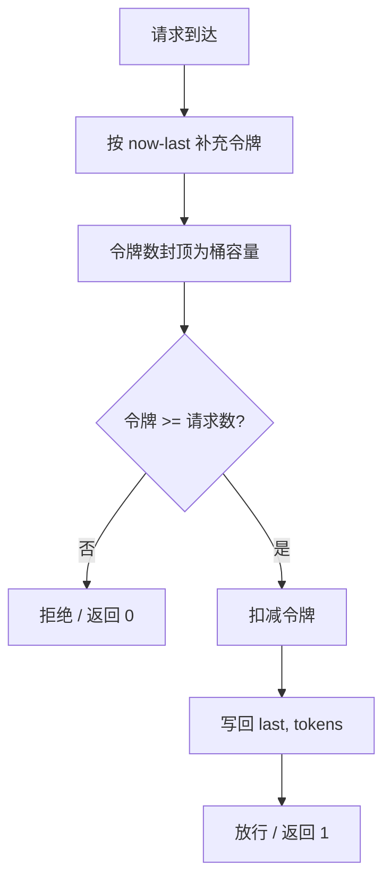

# 限流：互联网 vs 游戏

> 两种世界的两种解法 · 无状态 vs 强状态

::: tip 一句话对比
**互联网**：请求彼此独立，用**令牌桶/漏桶 + Redis+Lua** 集群限流控 QPS，超限直接拒或降级；**游戏**：世界状态高度耦合，用 **Tick 内 CD + 分层配额 + 排队机 + 帧摊派** 控节奏，玩家看到的是"排队"而不是 429。
:::

## 场景问题

限流的本质是**保护系统 + 塑造用户体验**：

- **保护系统**：防止下游被打爆（DB 连接池、外部 API 配额）
- **塑造体验**：秒杀、活动开服、直播抢购的公平性与可预期时延

面对高并发洪峰时，互联网世界和游戏世界的请求形态完全不同：一个是无状态的独立请求洪流，一个是彼此高度耦合的世界状态更新。同一个"限流"命题，落到两个世界会长出截然不同的解法。

### 四大经典算法

| 算法 | 特点 | 适用场景 |
| --- | --- | --- |
| **计数器** | 固定窗口，简单，**边界毛刺** | 粗粒度接口保护 |
| **滑动窗口** | 把窗口切分为小格子，逐格滚动 | 需要平滑的 QPS 统计 |
| **漏桶** | 恒定流出速率，**削峰但不允许突发** | 严格匀速的下游（DB 写、老接口） |
| **令牌桶** | 恒定填充速率、允许桶容量内的突发 | **最常用**，Sentinel/Guava/Nginx 都用它 |

## 实现方案

### 互联网侧：分层限流的常见组合

**接入层（网关/Nginx）** → **服务层（框架内）** → **资源层（DB/Cache/外部 API）**

- **Nginx `limit_req`**：漏桶算法，按 IP/URI 限；配 `burst` 允许瞬时突发
- **Nginx `limit_conn`**：并发连接数限制
- **API 网关**（Kong/APISIX/Higress/Envoy）：**分布式令牌桶**，Redis 集群同步计数
- **Sentinel（阿里）**：QPS/线程数、系统自适应、集群限流、热点参数限流、熔断降级一体
- **Guava RateLimiter**：**单机令牌桶**，简单场景合适，无法跨进程
- **Resilience4j / Bucket4j**：Java 生态里较轻的替代

分布式限流有两条路。

**1. Redis + Lua 原子脚本（主流）**

```lua
-- KEYS[1] 限流 key, ARGV[1] 令牌桶容量, ARGV[2] 每毫秒填充速率, ARGV[3] 请求令牌数
local now = tonumber(redis.call("time")[1]) * 1000 + math.floor(tonumber(redis.call("time")[2])/1000)
local last = tonumber(redis.call("hget", KEYS[1], "last") or now)
local tokens = tonumber(redis.call("hget", KEYS[1], "tokens") or ARGV[1])
tokens = math.min(tonumber(ARGV[1]), tokens + (now - last) * tonumber(ARGV[2]))
if tokens < tonumber(ARGV[3]) then return 0 end
tokens = tokens - tonumber(ARGV[3])
redis.call("hmset", KEYS[1], "last", now, "tokens", tokens)
redis.call("pexpire", KEYS[1], 60000)
return 1
```

- 优点：一致强、跨语言、和网关/服务/中台通用
- 坑：**Redis 单点热 key**（一致性哈希打散）；网络 RTT（近端本地令牌桶 + 定期回填 Redis "**批采令牌**"）

**2. 集群限流：中心配额 + 本地精算**

- 中心（Sentinel Token Server / 独立 quota 服务）分发配额
- 每个节点消费配额，用完向中心申请下一批
- **Netflix concurrency-limits** / **Google Doorman** 都是这个思路

令牌桶的判定流程如下：



### 游戏侧：多层次的"节奏控制"

游戏没有"429"，只有"排队"、"CD"、"进度条"——限流融进玩法里。

- **Tick 内 CD**：技能 CD、聊天冷却、跨服请求 CD——服务端记录 `last_use_time`，Tick 循环检查
- **玩家 / 账号 / 服务器 / 大区多层配额**：单玩家上限 + 服务器总量上限 + 大区总量上限，**三层拦截**避免热点账号打爆整台服务器
- **按帧摊派 (Time-slicing)**：一次要处理 10w 玩家排行榜刷新——**每帧只处理 1000 个**，10 帧摊完；避免单帧卡顿导致游戏 FPS 掉
- **写队列削峰 + 落地合并**：玩家背包变更先塞队列，异步批量写 DB；同一玩家多次变更**合并为一条**
- **活动开服的排队机 + 平滑扩容**：玩家进入前先分配令牌（token），登录服控排队；后端根据实时容量下发放行速率；扩容时不是全量放行，而是**按扩容节点数按比例放开**
- **跨服玩法排队匹配**：MMR 匹配池 + 时间等待惩罚，本质也是限流（分批入场）

## 为什么这么做

组合拳的顺序是**限流 → 熔断 → 降级 → 兜底**，每一层触发时机与用户感知都不同：

| 阶段 | 触发时机 | 手段 | 用户感知 |
| --- | --- | --- | --- |
| **限流** | QPS 超阈值 | 拒绝新请求 | 429 / 排队 |
| **熔断** | 错误率超阈值 | 直接短路，不打下游 | 快速失败 |
| **降级** | 依赖不可用 | 走缓存/静态兜底/本地默认值 | 部分能力缺失 |
| **兜底** | 一切皆炸 | 前端友好提示，避免白屏 | "服务繁忙请稍后" |

核心决策清单：

- **哪层拦？** 网关粗粒度 + 服务层细粒度
- **对谁拦？** 用户/租户/接口/来源 IP/参数值
- **拦多少？** 从压测容量倒推，留 20~30% buffer
- **怎么算？** 令牌桶（允许突发）or 漏桶（严格匀速）
- **超限做什么？** 拒 vs 排队 vs 降级 vs 兜底
- **可观测？** QPS、拦截率、桶剩余令牌、排队时长——**都要埋点**

## 为什么别的选择不行

互联网侧常见坑：

- **网关限流粒度过粗**：整个 API 一刀切，误伤高价值用户 → 分**用户等级、租户、渠道**多维度限流
- **令牌桶补偿机制忘做**：突发场景桶被打空后长期饥饿 → 桶容量 = QPS × N 秒
- **Redis + Lua 集群模式踩 Slot**：Lua 用多 key 会报错 → **Hash Tag** 强制同 Slot
- **限流降级链路混乱**：限流后不知道该返 429 还是走降级 → 明确 SLA：快速失败 vs 排队 vs 降级 vs 兜底
- **压测没打限流**：压测被限流削平，误判系统能扛 → 压测环境关闭或提高阈值

游戏侧常见坑：

- **单玩家做 CD 但漏了账号**：脚本用一个账号连开多个客户端绕过 → 加账号级 QPS
- **Tick 内长任务卡帧**：一次刷排行榜卡 3 帧 → 按帧摊派 + 优先级队列
- **活动开服炸机**：所有人 0 点冲进来，排队机压垮登录服 → 排队机独立集群 + 令牌预分配 + 客户端本地倒计时错峰
- **抢购超卖**：并发扣库存没上锁 → Redis Lua 原子扣减 + DB 乐观锁双保险
- **跨服匹配挤爆**：所有大区打一个匹配池 → 分区匹配 + 分层匹配 (MMR × 时长)

## 沉淀结论

两个世界的本质差异：

| 维度 | 互联网 | 游戏 |
| --- | --- | --- |
| 请求耦合 | 独立无状态 | 世界状态高度耦合 |
| 密集类型 | I/O 密集 | CPU 计算密集 |
| 限流单位 | QPS / QPM | Tick / 帧 / 玩家配额 |
| 超限反馈 | 429 / 降级 | 排队 / CD / 进度条 |
| 分布式协调 | Redis+Lua / 中心配额 | 单服权威 + 分层配额 |
| 可观测重点 | 拦截率、延时、错误码分布 | 帧时长、队列长度、CD 命中率 |

## 内容来源

迁移自 guide/theme-rate-limit（综合整理）。原始出处：综合整理 Sentinel、Nginx、腾讯游戏后台经验，具体实现请以官方文档为准（2026-07）。
