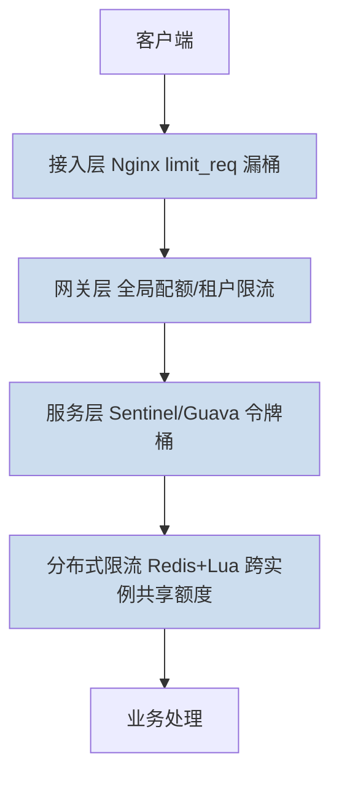
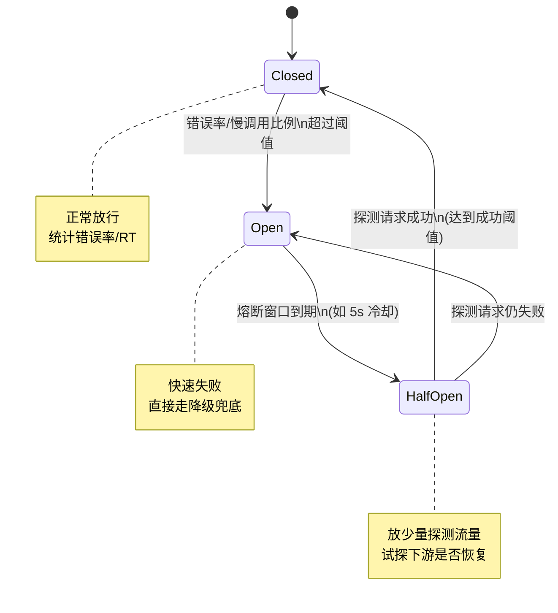

# 限流与熔断

> 限流是**入口控流**（我只接这么多），熔断是**故障隔离**（下游坏了我不再喂给它）。二者一前一后，共同兜底系统的稳定性；而互联网与游戏后台因"无状态可扩 vs 强状态世界耦合"的本质差异，落地形态截然不同。

## 场景问题

系统面临两类稳定性威胁：

1. **过载**：流量超过容量（活动、秒杀、爬虫、突发热点），若不控流，资源被打满 → 雪崩。
2. **依赖故障**：下游（DB、第三方、微服务）变慢或不可用，上游线程/连接被阻塞请求耗尽，故障**沿调用链反向蔓延**，一个慢依赖拖垮整条链。

限流解决第 1 类，熔断解决第 2 类。核心矛盾是：**资源有限且下游会坏**，必须主动丢弃/降级，而不是被动等死。

## 实现方案

### 限流：分层拦截

限流不是一层的事，而是**层层设防**，越靠前越粗、越省成本：

| 层 | 手段 | 特点 |
|---|---|---|
| 接入层 | Nginx `limit_req`（漏桶）、`limit_conn` | 廉价、粗粒度、离用户最近 |
| 网关层 | 按租户/API/大区全局配额 | 业务维度、多维限流 |
| 服务层 | Sentinel、Guava `RateLimiter`（令牌桶） | 单机精细、可热配置 |
| 分布式 | Redis + Lua 令牌桶 | 跨实例共享同一额度 |

算法选型（详见 [令牌桶与漏桶](/game-infra/token-leaky-bucket.md)、[限流算法专题](/game-infra/rate-limit.md)）：**固定窗口**最简但有临界突刺；**滑动窗口**消除临界；**令牌桶**限流且允许突发；**漏桶**整流严格恒速削峰。

### 熔断：状态机

熔断器是一个三态状态机，包裹对下游的调用，在下游故障时**快速失败**而非苦等超时：

- **Closed（闭合）**：正常放行，滑动窗口统计错误率与慢调用（RT）比例。
- **Open（打开）**：触发条件满足（如 1s 内错误率 > 50% 或慢调用占比 > 60% 且请求数达阈值），**跳闸**，所有请求**快速失败**并走**降级兜底**（返回缓存/默认值/排队提示），保护下游喘息、避免上游阻塞。
- **Half-Open（半开）**：冷却窗口后放少量**探测流量**，成功达阈值 → 回到 Closed；仍失败 → 回到 Open。

熔断必须配**降级兜底**：跳闸后返回什么？常见有 fallback 默认值、读本地缓存、排队/稍后重试、有损服务（关闭非核心功能）。代表实现：Hystrix（已停更）、Sentinel、resilience4j。

## 为什么这么做

- **限流分层**：单点限流要么太粗（保护不了内部热点）要么太重（每请求都查分布式配额，成本高）。分层让廉价的接入层拦掉大头，精细的服务层管热点，分布式层只兜"跨实例总额"。
- **熔断快速失败**：下游慢时，最危险的不是它慢，而是上游**线程/连接被慢调用占住**耗尽资源。熔断把"等 30s 超时"变成"立即失败走降级"，切断资源占用，防止故障蔓延。
- **半开探测**：不能永久熔断，也不能一到点就全量放行（可能把刚恢复的下游再次打死），半开小流量试探是安全的恢复姿势。

## 为什么别的选择不行

- **只靠超时不熔断**：每个请求都等满超时才失败，高并发下超时期间线程全被占，等于没保护。
- **只靠扩容不限流**：扩容有上限且滞后（分钟级），突发流量秒级到来，无限流则先崩后扩没意义；且有状态服务无法瞬间水平扩。
- **限流不配熔断/降级**：限流只拦"多余进来的"，拦不住"已进来的请求因下游坏而堆积"；反之熔断不配限流，正常流量也可能压垮自己。二者正交，都要有。

## 沉淀结论

::: tip 互联网后台 vs 游戏后台的本质差异
| 维度 | 互联网后台 | 游戏后台 |
|---|---|---|
| 状态 | **无状态**，可水平扩、就近扩容 | **强状态**，世界/房间与节点强耦合，扩容要迁移状态 |
| 负载 | **I/O 密集**，靠加机器摊 | **计算密集**，单 Tick 内计算是硬上限 |
| 限流粒度 | QPS/租户/API | **玩家/账号/服/大区多层** + **Tick 内 CD**（技能冷却） |
| 削峰 | MQ 异步、缓存 | **按帧摊派**（把爆发操作分摊到多帧）+ **写队列** |
| 过载兜底 | 拒绝请求、降级 | **开服排队机**（排队进服）+ 平滑扩容 + 有损降级 |
| 熔断对象 | 微服务/第三方依赖 | 跨服 RPC、DB、匹配/大厅等中心服 |
:::

游戏后台的特殊玩法：
- **Tick 内 CD 与按帧摊派**：技能/操作限频天然按逻辑帧（Tick）实现；大量玩家同帧涌入的操作，摊派到后续若干帧执行，避免单帧计算爆炸——这是计算密集场景特有的"整流"。
- **开服排队机**：新服/热门服开服瞬间涌入远超容量，用排队系统把玩家挡在门外匀速放入，本质是**漏桶**保护后端世界状态。
- **降级熔断兜底**：核心战斗不可降级（影响公平），可降级的是排行榜/邮件/日志上报等非核心链路，熔断优先牺牲它们保战斗。

一句话：**限流管入口、熔断管故障、降级管兜底**；互联网靠"无状态 + 水平扩 + I/O 摊派"，游戏靠"帧摊派 + 排队机 + 有损降级"应对强状态与计算密集。

## 内容来源

- Alibaba Sentinel 官方文档（滑动窗口统计、熔断状态机、系统自适应限流）
- Netflix Hystrix 设计文档、resilience4j 断路器实现
- Nginx `limit_req`/`limit_conn` 模块文档
- 相关专题：[令牌桶与漏桶](/game-infra/token-leaky-bucket.md)、[限流算法](/game-infra/rate-limit.md)
- 作者在游戏网关限流、开服排队机与按帧摊派的落地经验
