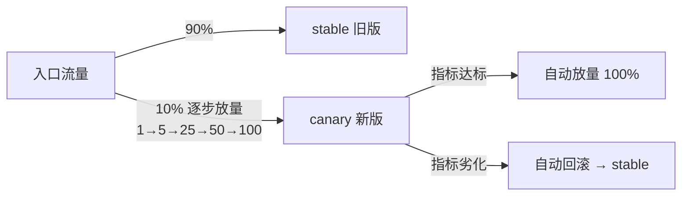

# 灰度发布 · Canary / BlueGreen / A-B / Shadow

K8s 内建 RollingUpdate 只是起点 · 真正的生产要 Canary + 自动指标验收 + 一键回滚

## 场景问题

::: tip 一句话地图
**Canary（金丝雀）= 按流量比例逐步放量**、**BlueGreen（蓝绿）= 双环境瞬时切换**、**A-B = 按用户特征分流做业务实验**、**Shadow（影子）= 复制流量不返回**。四种模型正交组合，落地靠 `Deployment` + Service Mesh / Ingress 权重 + Argo Rollouts / Flagger 自动化。
:::

### 六大发布策略正面对比

| 策略 | 一句话 | 停机 | 回滚速度 | 需要基础设施 | 典型场景 |
|---|---|---|---|---|---|
| **Recreate** | 先杀老 Pod 再拉新 Pod | **有**（有窗口期） | 重跑一次 | K8s 原生 | 开发环境 / 强状态单实例服务 |
| **RollingUpdate** | K8s 默认，按 `maxSurge/maxUnavailable` 逐批替换 | 无 | 慢（要滚回旧版） | K8s 原生 | 所有无状态服务的默认起点 |
| **BlueGreen（蓝绿）** | 两套完整环境 (Blue=旧 / Green=新)，Service selector 切换 | 无 | **极快**（selector 切回） | 两倍资源 + Ingress/Service 切换 | 版本跨度大、要秒级回滚、不能混跑 |
| **Canary（金丝雀）** | 只放 1%/5%/25%/50%/100% 流量到新版 | 无 | 快 | 流量分流（Ingress/Mesh 权重） | 生产标配，配指标自动放量 |
| **A-B Testing** | 按 header/cookie/UID 把特定用户导到新版 | 无 | 快 | 流量按规则路由（Mesh `match`） | 产品实验、灰度看效果、大主播定向 |
| **Shadow（影子）/ Traffic Mirroring** | **复制**流量到新版但**不返回**响应 | 无 | 零风险 | Mesh mirror / GoReplay | 压测新版真实负载、Diff 校验、协议兼容验证 |



## 实现方案

### K8s 原生四种策略字段

```yaml
apiVersion: apps/v1
kind: Deployment
spec:
  strategy:
    type: RollingUpdate           # 或 Recreate
    rollingUpdate:
      maxSurge: 25%              # 最多超出 replicas 多少（越大越快、越费资源）
      maxUnavailable: 25%        # 最多允许多少不可用（生产建议 0，只 surge 不 unavailable）
  minReadySeconds: 30            # 新 Pod ready 后再等 30s 才算真的可用（防抖）
  progressDeadlineSeconds: 600   # 10 分钟未完成 → 标为 failed
  revisionHistoryLimit: 10       # 保留 10 个旧 ReplicaSet 用于回滚
```

**关键 5 个字段**：**maxSurge / maxUnavailable / minReadySeconds / progressDeadlineSeconds / revisionHistoryLimit**——面试爱一个个抠。

**回滚**：`kubectl rollout undo deployment/foo`；`kubectl rollout history` 查看版本；`kubectl rollout status` 看进度。

### Canary 的三种实现层次（生产由浅到深）

**层次 1 · 副本比例 Canary**（最土的做法）
- 部署 `foo-stable`（9 副本）+ `foo-canary`（1 副本），共用同一个 Service selector
- 流量比例 = 副本比例 = 10%
- **缺点**：粒度粗（1/10、2/10）；扩缩容和权重耦合

**层次 2 · Ingress 权重 Canary**（中等成熟度）
- Nginx-Ingress `nginx.ingress.kubernetes.io/canary: "true"` + `canary-weight: "10"`
- APISIX / Higress / Traefik 都有类似 annotation
- 支持按 header/cookie 定向：`canary-by-header: X-Canary`
- **缺点**：只在南北流量入口生效；东西向服务间调用无法灰度

**层次 3 · Service Mesh 权重 Canary**（生产标配）
- Istio `VirtualService` + `DestinationRule`：**按 subset 分流**
- 支持**任意百分比**、**多维匹配**（header/uri/uid）、**东西向流量**
- 配合 **Argo Rollouts / Flagger 自动化**：观测指标 → 达标自动放量 → 不达标自动回滚

### Istio Canary（VirtualService + DestinationRule）

```yaml
# 1) DestinationRule 声明两个 subset
apiVersion: networking.istio.io/v1beta1
kind: DestinationRule
metadata: { name: foo }
spec:
  host: foo
  subsets:
    - name: stable
      labels: { version: v1 }
    - name: canary
      labels: { version: v2 }
---
# 2) VirtualService 权重分流
apiVersion: networking.istio.io/v1beta1
kind: VirtualService
metadata: { name: foo }
spec:
  hosts: [foo]
  http:
    # 优先规则：header 有 X-Canary=true 全走 canary
    - match:
        - headers: { X-Canary: { exact: "true" } }
      route:
        - destination: { host: foo, subset: canary }
    # 兜底：按权重分流
    - route:
        - destination: { host: foo, subset: stable }
          weight: 90
        - destination: { host: foo, subset: canary }
          weight: 10
```

### Nginx-Ingress Canary annotation

```yaml
# 主 Ingress
apiVersion: networking.k8s.io/v1
kind: Ingress
metadata:
  name: foo-stable
spec:
  rules:
    - host: foo.example.com
      http:
        paths:
          - path: /
            pathType: Prefix
            backend: { service: { name: foo-stable, port: { number: 80 } } }
---
# Canary Ingress（同 host 同 path）
apiVersion: networking.k8s.io/v1
kind: Ingress
metadata:
  name: foo-canary
  annotations:
    nginx.ingress.kubernetes.io/canary: "true"
    nginx.ingress.kubernetes.io/canary-weight: "10"     # 10% 走 canary
    # 或按 header 定向
    # nginx.ingress.kubernetes.io/canary-by-header: "X-Canary"
    # nginx.ingress.kubernetes.io/canary-by-header-value: "true"
    # 或按 cookie
    # nginx.ingress.kubernetes.io/canary-by-cookie: "canary"
spec:
  rules:
    - host: foo.example.com
      http:
        paths:
          - path: /
            pathType: Prefix
            backend: { service: { name: foo-canary, port: { number: 80 } } }
```

### BlueGreen（蓝绿）落地范式

**做法**：
- 部署 `foo-blue`（当前生产，label `version: blue`）
- 拉起 `foo-green`（新版本，label `version: green`）
- Service selector 从 `version: blue` 改成 `version: green` → **瞬时切换**
- 观察一阵 → 出问题 selector 切回 `blue`

**优点**：**回滚极快**（改 selector 一秒生效）、新版可预热预压测、DB 未切换时零风险
**缺点**：
- **两倍资源**——生产大集群成本高
- **DB / 缓存 / 消息队列共享**——新版 schema 变更时旧版可能崩
- **不适合超长事务**——切换瞬间进行中的请求会异常

**常见变体**：
- **蓝绿 + Service Mesh 分流**：不改 selector，改 `VirtualService` weight 从 blue=100/green=0 → 0/100，粒度更细
- **蓝绿 + DNS 切换**：跨集群蓝绿时改 DNS，靠 TTL；**不推荐**（DNS 缓存不可控）

### Shadow / Traffic Mirroring（影子流量）

**做法**：真实请求同时**复制一份**发到新版，**新版响应被丢弃**——只用于观测。

**Istio 里就一行**：
```yaml
http:
  - route:
      - destination: { host: foo, subset: stable }
    mirror: { host: foo, subset: canary }
    mirrorPercentage: { value: 100 }   # 全量镜像
```

**用途**：
- **性能压测**：新版扛得住真实负载吗
- **协议兼容验证**：新版对同样的输入返回一致吗（**Diff 测试**）
- **数据兼容**：新版写 DB 后老版本还能读吗（**要写独立 DB / 只读 mirror**）

**坑**：
- 如果新版**有副作用**（写 DB、发短信、扣费）→ 会**双写、双发、双扣**！Shadow **必须只用于纯查询链路**，或用 Sandbox DB 隔离
- Mirror 请求打不满新版容量——因为响应被丢，请求排队少；不能替代压测

### Argo Rollouts vs Flagger vs Kruise Rollout

**都是把「Canary + 自动指标验收 + 自动回滚」封装成 CRD**，K8s 原生 `Deployment` 做不到。

| 工具 | 出品 | 特点 | 适合 |
|---|---|---|---|
| **Argo Rollouts** | Argo（Intuit + CNCF） | **CRD 替代 Deployment**（`Rollout` 类型）；GUI 直观；步骤化 `steps: [-setWeight: 20, -pause: {duration: 5m}, ...]` | **GitOps + Argo CD** 生态首选 |
| **Flagger** | Weaveworks + Flux | **不改 Deployment**，靠额外 `Canary` CR 编排；**Prometheus 指标自动分析**（Success Rate / P99 latency） | **Flux 生态**、深度自动化指标验收 |
| **Kruise Rollout** | 阿里 OpenKruise | **原地升级**（Pod 不重建、只换镜像），启动更快；**兼容原生 `Deployment`**，无侵入 | **国内大厂**、需要原地升级和无侵入 |

**共同能力**：按步骤放量（1%→5%→25%→50%→100%）、指标不达标自动回滚、支持 Istio/Nginx/Traefik/AppMesh/SMI 多种流量提供方。

### Argo Rollouts 完整清单

```yaml
apiVersion: argoproj.io/v1alpha1
kind: Rollout
metadata: { name: foo }
spec:
  replicas: 10
  selector: { matchLabels: { app: foo } }
  strategy:
    canary:
      canaryService: foo-canary       # 独立 canary Service
      stableService: foo-stable
      trafficRouting:
        istio:
          virtualService: { name: foo-vs }
      steps:
        - setWeight: 5
        - pause: { duration: 2m }
        - analysis:                    # ← 关键：自动化指标验收
            templates:
              - templateName: success-rate
            args:
              - name: service-name
                value: foo-canary
        - setWeight: 20
        - pause: { duration: 5m }
        - setWeight: 50
        - pause: { duration: 10m }
        - setWeight: 100
---
apiVersion: argoproj.io/v1alpha1
kind: AnalysisTemplate
metadata: { name: success-rate }
spec:
  args: [{ name: service-name }]
  metrics:
    - name: success-rate
      interval: 30s
      successCondition: result[0] >= 0.95
      failureLimit: 3
      provider:
        prometheus:
          address: http://prometheus.monitoring.svc:9090
          query: |
            sum(irate(istio_requests_total{destination_service="{{args.service-name}}",response_code!~"5.."}[2m]))
            /
            sum(irate(istio_requests_total{destination_service="{{args.service-name}}"}[2m]))
```

### 游戏后台的灰度：不一样的思路

游戏后台**不能用 Ingress 权重**灰度——玩家会话强状态、重连必须落原服。做法：

- **按大区 / 服务器分批**：先灰度 1 个测试区、再 1 个休闲区、再全量国服；每级观察 24h+
- **按玩家 UID 白名单**：登录服路由时判断 `uid % 100 < 5` 走新版；**必须持久化在玩家档案**，防止重连不一致
- **按功能开关（Feature Flag）**：新逻辑用开关包裹，配置中心下发；灰度就是**开关的百分比放量**（不换镜像）
- **DS 战斗服的滚动升级**：一台一台重启，玩家断线自动匹配到别的战斗服；**关键：`preStop` 里等玩家全部退出再 SIGTERM**
- **网关按分区导流**：跨服匹配、跨服聊天走**中央路由**，路由表配置化；灰度=改路由表

## 为什么这么做

### 选型公式：先看状态，再看回滚成本

```text
服务状态？
  ├─ 有状态（DB / 队列 / 强会话） → BlueGreen（切换瞬时）或 按分片灰度
  └─ 无状态 →
        版本跨度？
          ├─ 大跨度（协议不兼容、大改） → BlueGreen（避免混跑）
          └─ 小跨度 →
                需要按用户特征？
                  ├─ 是 → A-B（Mesh header 匹配）
                  └─ 否 → Canary（比例放量 + 自动指标）

有副作用？（写 DB / 发短信）
  ├─ 是 → 不能 Shadow；用 Canary 小流量
  └─ 否 → Shadow 零风险验证
```

### 不同规模的落地路径

- **创业期 / 小集群**：K8s 原生 `RollingUpdate` + `maxUnavailable: 0` + `minReadySeconds: 30`——够用了，别过度工程
- **中等规模、有 Ingress**：**Nginx-Ingress canary annotation** 起步——按 weight/header/cookie 分流，无需引入 Mesh
- **大规模、多服务、东西向流量灰度**：**Istio + Argo Rollouts / Flagger**——CR 编排、Prometheus 自动验收、GitOps 集成
- **要秒级回滚**：BlueGreen（Service selector 切换）；准备好 DB schema 双向兼容
- **做产品实验**：A-B + Feature Flag（LaunchDarkly / Unleash / GrowthBook）——发布与实验解耦

### 「灰度 ≠ 随便发」——四道验收关

真正生产级的 Canary 每一步之间都有验收：

1. **健康检查**：`readinessProbe` 必须严格；readyness 通过 ≠ 业务可用（要 warm-up 池、连数据库）
2. **烟雾测试（Smoke Test）**：小流量（1%）跑 5 分钟，看错误率是否高于 stable
3. **黄金指标 SLI**：**成功率 / 延迟 P99 / 饱和度 / 错误码分布** 四项必看；**任一项劣化 3σ 立即回滚**
4. **业务指标**：核心业务成功率（下单成功率、登录成功率）——运维层看不到，需要业务打点

**Argo Rollouts 的 `AnalysisTemplate` 就是把这些指标写成 PromQL，自动化决策**。

## 为什么别的选择不行

### Endpoints 摘除滞后 → 用户看到 502

**场景**：Pod 收到 SIGTERM 后立即退出，但 kube-proxy 还没同步 iptables 规则 → 请求打到已死 Pod → 502。

**根因**：`SIGTERM` 与 `Endpoints` 更新是**并发**的，不是串行——K8s 只保证「最终一致」，不保证「先摘再杀」。

**填坑**（生产必备）：
```yaml
spec:
  containers:
    - name: app
      lifecycle:
        preStop:
          exec:
            command: ["sh", "-c", "sleep 15"]     # 等 15s 让 Endpoints 传播
      # 或 HTTP：让业务先关闭 accept 新连接、把 in-flight 处理完再退出
  terminationGracePeriodSeconds: 60             # 总优雅期，> preStop + 业务 drain 时间
```

### 会话粘性打破 Canary

**场景**：Canary 5% 流量放量，但用户登录后建立了长连接（WebSocket / SSE）→ 一旦断连重连，可能被路由到 stable 或反过来 → 用户体验断层

**填坑**：
- **粘性会话**：Nginx `ip_hash` / Envoy consistentHash / Session Affinity（`service.spec.sessionAffinity: ClientIP`）
- **明确 Canary 用户**：`X-Canary` header 或 cookie 一次性打上，之后请求都带；避免随机分流带来的抖动
- **无状态化**：Session 存 Redis / JWT，任意 Pod 都能处理——从根上避免粘性问题

### DB Schema 变更时 BlueGreen 崩

**场景**：新版加字段 `ALTER TABLE ADD COLUMN`，蓝绿切换后回滚 blue → blue 老代码读到未知字段崩。

**填坑**（**双向兼容**是铁律）：
1. **只加不删**（Additive Migration）：新字段 nullable / default，旧代码忽略即可
2. **两阶段删列**：先发布「不再写此列」的版本 → 观察一周 → 再删列
3. **枚举扩展**：只加值不改语义；新枚举旧代码要有 fallback 分支
4. **索引变更**：低峰期 online DDL；MySQL 用 `pt-online-schema-change` / `gh-ost`；PostgreSQL 用 `CREATE INDEX CONCURRENTLY`

### Feature Flag 腐烂

**场景**：一年前的实验开关还在代码里，if-else 满天飞，谁都不敢删。

**填坑**：
- **每个 flag 建单**：**上线时创建工单，实验结束时删除**；用 LaunchDarkly / Unleash 有 flag 生命周期管理
- **flag 有过期时间**：过期后开关关闭并**告警提醒清理**
- **静态代码扫描**：CI 里跑 flag 扫描器，**超过 30 天的 flag 阻断合并**
- **文档化**：每个 flag 一个 owner + 目标状态（100% ON / 100% OFF）

### Canary 假阳性（老版本本来就有毛刺）

**场景**：Canary 错误率 0.5% 触发回滚，但一查 stable 也是 0.5%——**新版本没问题，是基线本来就烂**。

**填坑**：
- **对比而非绝对阈值**：Argo Rollouts / Flagger 支持**对照组**（`baseline`）——新版只要不比老版差就通过
- **多样本对照**：新版 vs 老版都取 5 分钟窗口，做 **t 检验 / Mann-Whitney**
- **观察期够长**：低流量服务 1 分钟指标不显著，要 10~30 分钟窗口

### 多集群 / 多可用区不同步

**场景**：南京集群 Canary 已 100%，上海集群还是 stable——用户跨机房访问看到不一致。

**填坑**：
- **中心化编排**：Argo CD ApplicationSet 统一推所有集群；Flagger 每集群独立分析但有全局阈值
- **按可用区分批**：先南京 25% → 观察 → 再上海 25% → 逐步汇合
- **DNS / 就近路由感知**：跨机房用户尽量粘同一版本（用 `X-Version` header 记住）

### Sidecar / iptables 缓存导致新版本被跳过

**场景**：Istio Envoy 缓存了旧的 `DestinationRule` subset，Canary 权重改了不生效。

**填坑**：
- **改 subset 后重启 Envoy**（sidecar hot reload 不完全）
- **用 Argo Rollouts 的 `trafficRouting`**——它会强制 push xDS 更新
- **kube-proxy iptables 模式**规则数暴涨 → 切 IPVS 或 Cilium eBPF

## 沉淀结论

### 生产灰度 SOP（八步）

1. **代码合入前**：单元测试 + 集成测试全绿；DB 变更**双向兼容**
2. **镜像构建 + 签名**：CI 打 tag、镜像扫描（Trivy）、签名（cosign）
3. **预发环境验证**：功能测试 + 契约测试（Pact）+ 性能基线
4. **Canary 1%**：`setWeight: 1`，pause 5 分钟；观测错误率 / 延迟 / 业务指标
5. **Canary 5% → 25% → 50%**：每级 pause + 自动指标验收（`AnalysisTemplate`）
6. **100% 放量**：`setWeight: 100`；旧 ReplicaSet 保留 24h 备回滚
7. **观察期 24h**：告警值班；**任何 Sev1 事件立即 `rollout undo`**
8. **归档**：release notes、变更单、指标截图存档

### A-B Testing 与 Canary 的差别（面试爱问）

**都是分流，但目的不同**：

| 维度 | Canary | A-B Testing |
|---|---|---|
| **目的** | **技术验证**：新版会不会崩 | **业务验证**：哪个方案效果好 |
| **分流依据** | **随机比例**（10% 流量） | **用户特征**（VIP / 地区 / cohort） |
| **持续时间** | **短**（几分钟到几小时） | **长**（几天到几周，等统计显著） |
| **成功指标** | 错误率、延迟、SLO | 转化率、点击率、留存 |
| **失败动作** | **自动回滚** | 保留数据，选优胜者上线 |

**实操组合**：先 Canary 技术验证（确保新版不崩），通过后再全量上线；同时对新功能开 A-B 实验组（部分用户可见）——**Canary 保下限，A-B 求上限**。

### 面试话术：把发布策略绑到实际系统

别答概念——绑到你做过的系统：

- 「**业务代理 platpxy** 是 3 副本 + `maxSurge: 1, maxUnavailable: 0` 的滚动升级；**支付回调 paypxy** 因为米大师有幂等重试，用 Canary 5% + 幂等 4 道闸兜底」
- 「**mallsvrd 商城**用 `preStop: sleep 15` 加**优雅退出**：先关闭 accept、把 in-flight 支付处理完；否则回调打到已死 Pod 会 502」
- 「**自研 Mesh 是 DaemonSet + hostNetwork**，**没法用 Ingress 权重灰度**——按节点批次滚动，一次 5 台，观察 30 分钟」
- 「**游戏 DS 战斗服**按大区分批：测试区 → 休闲区 → 匹配区，每批间隔 24h；`preStop` 等玩家全退出」
- 「**Feature Flag** 我们用配置中心下发，一个开关一个业务开关，实验结束**立刻清理**避免代码腐烂」

### 一句话反应表

- **看到「怎么发布」→ 想到**：Recreate / RollingUpdate / BlueGreen / Canary / A-B / Shadow 六种，先问状态再选
- **看到「怎么灰度」→ 想到**：K8s 副本比例（土）→ Ingress annotation（中）→ Mesh + Argo Rollouts（生产）
- **看到「怎么回滚」→ 想到**：`kubectl rollout undo`（RollingUpdate）/ Service selector 切回（BlueGreen）/ Argo Rollouts abort
- **看到「怎么防止 502」→ 想到**：`preStop` sleep + 优雅退出 + `terminationGracePeriodSeconds`
- **看到「怎么做实验」→ 想到**：A-B 按 header/cookie/UID 分流 + Feature Flag + 统计显著性检验
- **看到「怎么验证新版性能」→ 想到**：Shadow / Traffic Mirroring（无副作用链路）+ Diff 测试
- **看到「Canary 自动化」→ 想到**：Argo Rollouts / Flagger + Prometheus AnalysisTemplate + 对照组基线
- **看到「DB 变更 + 灰度」→ 想到**：Additive-only + 两阶段删列 + Online DDL（gh-ost / pt-osc）

### 每种策略的「杀手场景」

- **Recreate**：**开发环境 / 单实例强状态服务**（数据库主节点）
- **RollingUpdate**：**默认无脑用**——90% 场景够了，配 `maxUnavailable: 0`
- **BlueGreen**：**协议大跨度、要秒级回滚**——但准备两倍资源、DB 双向兼容
- **Canary**：**生产标配**——每个业务变更都该走
- **A-B**：**产品实验**——业务效果验证，与技术发布解耦
- **Shadow**：**只用于查询链路**——写链路会双写；用于压测 / 协议 Diff
- **游戏后台按分区/UID 灰度 + Feature Flag**：**强状态、长会话场景的独家答案**

## 内容来源

迁移自 guide/theme-release-strategy（综合整理：K8s 官方文档、Argo Rollouts / Flagger / Kruise Rollout 官方指南、Istio Traffic Management、Nginx-Ingress annotations、Google SRE Book Ch.16，2026-07）

