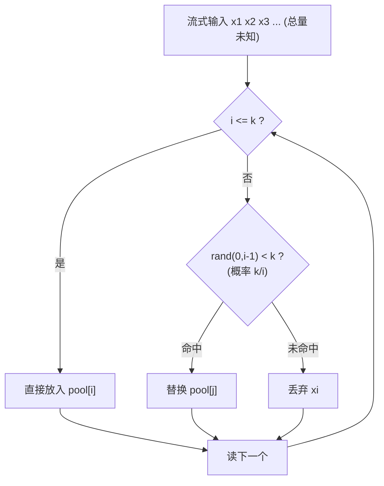

# 蓄水池抽样（Reservoir Sampling）与加权扩展

> 蓄水池抽样解决一个看似不可能的问题：在**总量未知、只能单遍扫描、内存只够放 k 个**的流式数据里，等概率抽出 k 个样本。核心只有一行：第 i 个元素以 k/i 的概率替换池中随机一个。它的美在于——你永远不知道流有多长，却能保证每个元素最终留存概率恰好是 k/n。

## 场景问题

游戏后台的"从流里公平抽样"随处可见，且都带着"总量未知 + 内存受限"的约束：

- **日志/监控抽样**：战斗服每秒产几十万条日志，全量落盘存不下也贵，要**等概率抽 1%** 落库做分析。日志流是无界的，你不知道今天总共会有多少条。
- **自研网格选连接目标**：去中心化网格里每个节点要从**全量成员**（可能上万）中选固定 `k` 个建连/广播，成员表在流式变化，且不想为此把全量列表拷一份排序。
- **大流量 Trace 采样**：一条请求链路要不要采样，得在**看到第一个 span 时就决定**，那时还不知道这条链路总共多少 span。
- **内存受限统计**：嵌入式/边缘节点上做 Top-K 之外的"代表性样本"，内存只够 k 个槽。

朴素做法是"先把所有元素收集起来，再随机选 k 个"——但**总量未知**（流不知道何时结束）且**内存放不下**（全量可能是 TB 级）。蓄水池抽样让你**单遍、O(k) 内存、O(1) 每元素**就搞定，且严格等概率。

## 实现方案

### 基础算法（Algorithm R）

维护一个大小为 k 的"蓄水池"：

1. 前 k 个元素**直接放入**池中。
2. 从第 `i = k+1` 个元素起：以 `k/i` 的概率决定是否"入选"；若入选，随机替换池中某一个（即 `rand(0, i-1) < k` 时，替换 `pool[rand(0,i-1)]`）。
3. 流结束时，池中 k 个元素就是等概率样本。

```go
package reservoir

import "math/rand"

// Sample 对未知长度的整数流做等概率 k-抽样。
// stream 用 channel 表示"边到边处理、无需知道总长"。
func Sample(stream <-chan int, k int) []int {
	pool := make([]int, 0, k)
	i := 0
	for x := range stream {
		i++
		if i <= k {
			pool = append(pool, x) // 前 k 个直接入池
			continue
		}
		// 第 i 个以 k/i 概率入选：等价于 rand(0,i-1) 落在前 k 个位置
		j := rand.Intn(i) // [0, i)
		if j < k {
			pool[j] = x // 替换池中第 j 个
		}
	}
	return pool
}
```



::: tip
每个元素只做一次 `rand` 和至多一次赋值，**O(1) 每元素、O(k) 总内存、单遍扫描**。当 n 远大于 k 时，绝大多数元素直接被丢弃（概率 k/i 随 i 增大迅速变小），实际非常快。
:::

### 概率正确性证明

**命题**：流结束（长度 n）时，任意元素 `x` 最终留在池中的概率恰为 `k/n`。

设第 `m` 个元素（`m > k`）。它要"最终留存"，需要：**入选时被选中** 且 **之后再没被替换掉**。

- 第 m 个元素入选的概率：`k/m`。
- 之后每一步 `t`（`t = m+1 ... n`），第 t 个元素入选概率是 `k/t`，若入选则等概率替换池中 k 个之一，故"我这一格被替换"的概率是 `(k/t)·(1/k) = 1/t`，"没被替换"的概率是 `1 - 1/t = (t-1)/t`。

于是第 m 个元素最终留存的概率为：

$$
P = \frac{k}{m} \cdot \prod_{t=m+1}^{n} \frac{t-1}{t}
= \frac{k}{m} \cdot \frac{m}{m+1}\cdot\frac{m+1}{m+2}\cdots\frac{n-1}{n}
$$

连乘裂项后中间全部抵消，只剩 `m/n`：

$$
P = \frac{k}{m} \cdot \frac{m}{n} = \frac{k}{n}
$$

对前 k 个元素（`m ≤ k`）同理：它一开始必然在池中（概率 1），之后每步不被替换的概率同样连乘出 `k/n`。故**所有 n 个元素留存概率都是 k/n，抽样等概率**。∎

::: tip
证明的关键是那串"裂项连乘"——`(m)/(m+1)·(m+1)/(m+2)·…·(n-1)/n = m/n`。这正是蓄水池抽样正确性的数学核心：无论 n 多大、m 在哪，连乘总能抵消成 m/n，再乘上入选概率 k/m 得 k/n。
:::

### 加权扩展：A-Res（Algorithm A with Reservoir）

基础算法假设每个元素等权。现实里常需**按权重抽样**（权重大的更该被选中，如按流量大小抽节点）。Efraimidis & Spirakis 的 **A-Res** 给每个元素算一个 key：`key = u^(1/w)`（`u` 是 `(0,1)` 均匀随机数，`w` 是权重），然后**保留 key 最大的 k 个**——用一个大小 k 的最小堆维护。权重越大，`key` 期望越大，越容易留在堆里。

```go
package reservoir

import (
	"container/heap"
	"math"
	"math/rand"
)

type item struct {
	val int
	key float64 // u^(1/w)
}

// 最小堆：堆顶是当前 k 个里 key 最小的，便于被更大的替换
type minHeap []item

func (h minHeap) Len() int            { return len(h) }
func (h minHeap) Less(i, j int) bool  { return h[i].key < h[j].key }
func (h minHeap) Swap(i, j int)       { h[i], h[j] = h[j], h[i] }
func (h *minHeap) Push(x interface{}) { *h = append(*h, x.(item)) }
func (h *minHeap) Pop() interface{} {
	old := *h
	n := len(old)
	it := old[n-1]
	*h = old[:n-1]
	return it
}

// WeightedSample: 流式加权抽样，(值,权重) 一一对应地到来
type Elem struct {
	Val    int
	Weight float64
}

func WeightedSample(stream <-chan Elem, k int) []int {
	h := &minHeap{}
	heap.Init(h)
	for e := range stream {
		key := math.Pow(rand.Float64(), 1.0/e.Weight) // u^(1/w)
		if h.Len() < k {
			heap.Push(h, item{e.Val, key})
		} else if key > (*h)[0].key { // 比当前最小的还大 → 替换堆顶
			(*h)[0] = item{e.Val, key}
			heap.Fix(h, 0)
		}
	}
	res := make([]int, 0, k)
	for _, it := range *h {
		res = append(res, it.val)
	}
	return res
}
```

::: warning
A-Res 每元素是 O(log k)（堆操作）而非基础版的 O(1)，因为要维护"最大 k 个 key"。它保证"元素被选中的概率正比于权重"，但注意这是 **Efraimidis-Spirakis 定义的加权无放回**抽样语义；若要严格按权重成比例或流特别长，可用 A-ExpJ（指数跳跃）变体进一步优化。
:::

## 为什么这么做

- **为什么不能"先收集再随机"**：流式数据**总量未知**——你不知道何时结束，无法先算出 n 再选；且**内存放不下**——全量可能远超单机内存。蓄水池用 O(k) 内存、单遍就完成，且不需要知道 n。
- **为什么用 k/i 概率**：这是让"每个元素最终 k/n"成立的唯一正确概率（见上面裂项证明）。直觉上，越靠后的元素越少见到它替换的机会（i 越大 k/i 越小），恰好补偿了它"入池晚"，最终打平。
- **为什么加权用 `u^(1/w)`**：这个 key 变换让"权重大的元素 key 大概率更大"，等价于按权重做无放回抽样，且同样能**单遍流式**完成，只需把"随机替换"换成"堆维护最大 k 个"。
- **在自研网格里的价值**：从上万成员里选固定 k 个建连/广播时，成员在流式变化，蓄水池让每个节点用极小内存就得到一份**均匀（或按权重）代表性子集**，无需拷贝全量列表排序。

## 为什么别的选择不行

- **先收集全部再 `rand.Perm` 选 k 个**：需要 O(n) 内存和已知 n，流式/大数据场景直接爆内存或根本拿不到 n。
- **每来一个元素独立以 p 概率保留（伯努利采样）**：样本量不固定（可能远多于或少于 k），且总量未知时无法定出合适的 p 使期望正好 k。蓄水池保证**恰好 k 个**。
- **只保留最近 k 个（滑动窗口）**：会偏向流的尾部，早期元素留存概率为 0，不是等概率抽样。
- **对加权场景仍用基础 Algorithm R**：忽略权重，权重大的元素不会被更多地选中，业务语义错误。加权必须上 A-Res / A-ExpJ。

## 沉淀结论

- 蓄水池抽样 = **未知总量 + 单遍 + O(k) 内存**下的等概率 k-抽样，核心一行：第 i 个以 k/i 概率替换池中随机一个。
- 正确性靠**裂项连乘**证明：任意元素最终留存概率恰为 k/n。
- 加权用 **A-Res**：`key = u^(1/w)`，最小堆保留最大 k 个，每元素 O(log k)。
- 记住反例边界：**先收集再选**（要 O(n) 内存 + 已知 n）、**滑动窗口**（偏尾部）都不是等概率流式抽样。
- 一句话选型：**总量未知、只能扫一遍、内存只够 k 个时，用蓄水池；要按权重就换 A-Res。**

## 内容来源

综合整理。参考资料：Knuth《The Art of Computer Programming》Vol.2 §3.4.2（Algorithm R）、Vitter "Random Sampling with a Reservoir"（ACM TOMS 1985）、Efraimidis & Spirakis "Weighted Random Sampling with a Reservoir"（Information Processing Letters 2006，即 A-Res / A-ExpJ），以及日志采样、分布式 Trace 采样与流式统计的工程实践。
