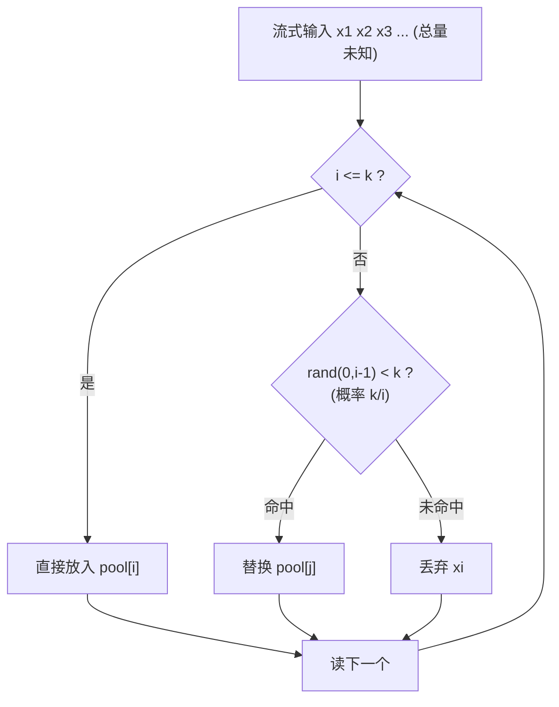
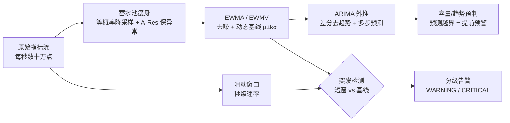

# 蓄水池抽样（Reservoir Sampling）与加权扩展

> 蓄水池抽样解决一个看似不可能的问题：在**总量未知、只能单遍扫描、内存只够放 k 个**的流式数据里，等概率抽出 k 个样本。核心只有一行：第 i 个元素以 k/i 的概率替换池中随机一个。它的美在于——你永远不知道流有多长，却能保证每个元素最终留存概率恰好是 k/n。

::: tip 一句话结论
总量未知、单遍、O(k) 内存下等概率抽 k 个：第 i 个以 k/i 概率替换池中随机一个。
:::

## 场景问题

游戏后台的"从流里公平抽样"随处可见，且都带着"总量未知 + 内存受限"的约束：

- **日志/监控抽样**：战斗服每秒产几十万条日志，全量落盘存不下也贵，要**等概率抽 1%** 落库做分析。日志流是无界的，你不知道今天总共会有多少条。
- **自研网格选连接目标**：去中心化网格里每个节点要从**全量成员**（可能上万）中选固定 `k` 个建连/广播，成员表在流式变化，且不想为此把全量列表拷一份排序。
- **大流量 Trace 采样**：一条请求链路要不要采样，得在**看到第一个 span 时就决定**，那时还不知道这条链路总共多少 span。
- **内存受限统计**：嵌入式/边缘节点上做 Top-K 之外的"代表性样本"，内存只够 k 个槽。

朴素做法是"先把所有元素收集起来，再随机选 k 个"——但**总量未知**（流不知道何时结束）且**内存放不下**（全量可能是 TB 级）。蓄水池抽样让你**单遍、O(k) 内存、O(1) 每元素**就搞定，且严格等概率。

## 实现方案

### 基础算法（Algorithm R）

维护一个大小为 k 的"蓄水池"：

1. 前 k 个元素**直接放入**池中。
2. 从第 `i = k+1` 个元素起：以 `k/i` 的概率决定是否"入选"；若入选，随机替换池中某一个（即 `rand(0, i-1) < k` 时，替换 `pool[rand(0,i-1)]`）。
3. 流结束时，池中 k 个元素就是等概率样本。

```go
package reservoir

import "math/rand"

// Sample 对未知长度的整数流做等概率 k-抽样。
// stream 用 channel 表示"边到边处理、无需知道总长"。
func Sample(stream <-chan int, k int) []int {
	pool := make([]int, 0, k)
	i := 0
	for x := range stream {
		i++
		if i <= k {
			pool = append(pool, x) // 前 k 个直接入池
			continue
		}
		// 第 i 个以 k/i 概率入选：等价于 rand(0,i-1) 落在前 k 个位置
		j := rand.Intn(i) // [0, i)
		if j < k {
			pool[j] = x // 替换池中第 j 个
		}
	}
	return pool
}
```



::: tip
每个元素只做一次 `rand` 和至多一次赋值，**O(1) 每元素、O(k) 总内存、单遍扫描**。当 n 远大于 k 时，绝大多数元素直接被丢弃（概率 k/i 随 i 增大迅速变小），实际非常快。
:::

### 概率正确性证明

**命题**：流结束（长度 n）时，任意元素 `x` 最终留在池中的概率恰为 `k/n`。

设第 `m` 个元素（`m > k`）。它要"最终留存"，需要：**入选时被选中** 且 **之后再没被替换掉**。

- 第 m 个元素入选的概率：`k/m`。
- 之后每一步 `t`（`t = m+1 ... n`），第 t 个元素入选概率是 `k/t`，若入选则等概率替换池中 k 个之一，故"我这一格被替换"的概率是 `(k/t)·(1/k) = 1/t`，"没被替换"的概率是 `1 - 1/t = (t-1)/t`。

于是第 m 个元素最终留存的概率为：

$$
P = \frac{k}{m} \cdot \prod_{t=m+1}^{n} \frac{t-1}{t}
= \frac{k}{m} \cdot \frac{m}{m+1}\cdot\frac{m+1}{m+2}\cdots\frac{n-1}{n}
$$

连乘裂项后中间全部抵消，只剩 `m/n`：

$$
P = \frac{k}{m} \cdot \frac{m}{n} = \frac{k}{n}
$$

对前 k 个元素（`m ≤ k`）同理：它一开始必然在池中（概率 1），之后每步不被替换的概率同样连乘出 `k/n`。故**所有 n 个元素留存概率都是 k/n，抽样等概率**。∎

::: tip
证明的关键是那串"裂项连乘"——`(m)/(m+1)·(m+1)/(m+2)·…·(n-1)/n = m/n`。这正是蓄水池抽样正确性的数学核心：无论 n 多大、m 在哪，连乘总能抵消成 m/n，再乘上入选概率 k/m 得 k/n。
:::

### 加权扩展：A-Res（Algorithm A with Reservoir）

基础算法假设每个元素等权。现实里常需**按权重抽样**（权重大的更该被选中，如按流量大小抽节点）。Efraimidis & Spirakis 的 **A-Res** 给每个元素算一个 key：`key = u^(1/w)`（`u` 是 `(0,1)` 均匀随机数，`w` 是权重），然后**保留 key 最大的 k 个**——用一个大小 k 的最小堆维护。权重越大，`key` 期望越大，越容易留在堆里。

```go
package reservoir

import (
	"container/heap"
	"math"
	"math/rand"
)

type item struct {
	val int
	key float64 // u^(1/w)
}

// 最小堆：堆顶是当前 k 个里 key 最小的，便于被更大的替换
type minHeap []item

func (h minHeap) Len() int            { return len(h) }
func (h minHeap) Less(i, j int) bool  { return h[i].key < h[j].key }
func (h minHeap) Swap(i, j int)       { h[i], h[j] = h[j], h[i] }
func (h *minHeap) Push(x interface{}) { *h = append(*h, x.(item)) }
func (h *minHeap) Pop() interface{} {
	old := *h
	n := len(old)
	it := old[n-1]
	*h = old[:n-1]
	return it
}

// WeightedSample: 流式加权抽样，(值,权重) 一一对应地到来
type Elem struct {
	Val    int
	Weight float64
}

func WeightedSample(stream <-chan Elem, k int) []int {
	h := &minHeap{}
	heap.Init(h)
	for e := range stream {
		key := math.Pow(rand.Float64(), 1.0/e.Weight) // u^(1/w)
		if h.Len() < k {
			heap.Push(h, item{e.Val, key})
		} else if key > (*h)[0].key { // 比当前最小的还大 → 替换堆顶
			(*h)[0] = item{e.Val, key}
			heap.Fix(h, 0)
		}
	}
	res := make([]int, 0, k)
	for _, it := range *h {
		res = append(res, it.val)
	}
	return res
}
```

::: warning
A-Res 每元素是 O(log k)（堆操作）而非基础版的 O(1)，因为要维护"最大 k 个 key"。它保证"元素被选中的概率正比于权重"，但注意这是 **Efraimidis-Spirakis 定义的加权无放回**抽样语义；若要严格按权重成比例或流特别长，可用 A-ExpJ（指数跳跃）变体进一步优化。
:::

## 实战：监控预判系统里的蓄水池 + 时间序列

监控/预判系统的矛盾是：**指标点海量到存不下、看不过来**，但又要**实时发现突发、提前预判趋势**。单一手段都不够——只存原始点太贵、只看瞬时值会误报、只做长期基线又抓不住秒级突刺。工程上的答案是一条**多时间尺度的流水线**：蓄水池负责"存什么"（瘦身且保异常），EWMA/ARIMA 负责"往哪走"（趋势预判），滑动窗口负责"现在炸没炸"（突发高警）。



三个手段本质是**不同时间尺度的分层防御**，各自的取舍：

| 手段 | 时间尺度 | 内存/算力 | 能力 | 典型用途 |
|---|---|---|---|---|
| 滑动窗口 | 秒级 | O(窗口桶数) | 即时突发速率/计数 | 突发高警、限流 |
| EWMA / EWMV | 分钟级 | O(1) 每流 | 去噪、动态基线、异常度打分 | 实时基线、3σ 报警 |
| ARIMA / SARIMA | 小时~天 | O(n) 拟合 | 趋势/季节外推、提前量 | 容量预判、周期性预测 |

### 1）数据瘦身：等概率蓄水池 + 加权"保异常"

监控点全量落库既贵又无必要——绝大多数点是"正常无聊"的。直接用 **Algorithm R** 对每个指标流做等概率 1% 降采样，就能在**总量未知、内存只够 k 个**的前提下拿到一份代表性样本（见上文基础实现）。

但等概率有个致命问题：**异常点是稀有的高价值样本，会被一并稀释掉**。解法是把上文的 **A-Res 加权蓄水池**直接复用，权重取"**当前点对基线的偏离度**"——偏离越大（越像异常），`key = u^(1/w)` 期望越大，越容易留在池里。这就实现了**分层采样**：正常点狠狠稀释、异常点重点保留。

```go
package predict

import "math"

// devWeight 用 EWMA 基线把"偏离度"折算成 A-Res 的权重 w。
// 正常点 w≈1（正常稀释），偏离 3σ 的点 w 明显放大（优先留存）。
func devWeight(x float64, base *EWMA) float64 {
	sigma := math.Sqrt(base.varc)
	if sigma == 0 {
		return 1
	}
	z := math.Abs(x-base.mean) / sigma
	return 1 + z*z // 偏离度平方放大：3σ 点权重≈10，均值点权重≈1
}
```

把 `devWeight` 的返回值喂给上文 `WeightedSample` 的 `Elem.Weight`，就得到一个**"降采样 + 自动保异常"**的存储层。此外常配合**时间分桶蓄水池**（每个 1min 窗口各维护一个池），保证样本在时间轴上均匀覆盖，而不是全挤在流量高峰。

### 2）趋势预判之一：EWMA（去噪 + 动态基线）

原始曲线抖动大，静态阈值不是误报就是漏报。**EWMA（指数加权移动平均）**用一行递推得到平滑基线，且 **O(1) 内存、O(1) 每点**，天然适合海量实时流：

$$
s_t = \alpha\, x_t + (1-\alpha)\, s_{t-1}
$$

`α` 越大越"跟手"（对突变敏感、噪声大），越小越平滑（滞后大）。工程上常用**半衰期**反推 `α`：希望旧值经过 `H` 个点权重衰减一半，则 `(1-α)^H = 0.5`，即 `α = 1 - 0.5^(1/H)`。同时用 **EWMV（指数加权方差）** 得到动态的 `σ`，报警阈值就是随基线漂移的 `μ ± kσ`，而不是拍脑袋的固定线。

```go
package predict

import "math"

// EWMA 同时维护指数加权均值(mean)与方差(varc, EWMV)。
type EWMA struct {
	alpha float64
	mean  float64 // s_t
	varc  float64 // EWMV：方差估计
	init  bool
}

// NewEWMA 用半衰期 H（多少个点后旧权重减半）构造，比直接调 alpha 更直观。
func NewEWMA(halfLife float64) *EWMA {
	alpha := 1 - math.Pow(0.5, 1.0/halfLife) // (1-α)^H = 0.5
	return &EWMA{alpha: alpha}
}

func (e *EWMA) Update(x float64) {
	if !e.init {
		e.mean, e.init = x, true
		return
	}
	diff := x - e.mean
	incr := e.alpha * diff
	e.mean += incr
	// 指数加权方差（West 增量式）：var = (1-α)(var + diff·incr)
	e.varc = (1 - e.alpha) * (e.varc + diff*incr)
}

// UpperBound 动态 kσ 上界，作为随基线漂移的报警线。
func (e *EWMA) UpperBound(k float64) float64 {
	return e.mean + k*math.Sqrt(e.varc)
}
```

::: tip
EWMA 只描述"当前水平 + 波动"，**不外推未来**。它是"实时基线 + 异常度打分"的主力，也是下面滑动窗口突发检测的"长期参照系"。要真正**预判未来趋势/季节**，得上 ARIMA。
:::

### 3）趋势预判之二：ARIMA（趋势/季节外推，抢提前量）

`ARIMA(p, d, q)` 把一条序列拆成三块：

- **I（差分，`d` 阶）**：做 `d` 次差分把带趋势的非平稳序列变平稳（`y_t = x_t - x_{t-1}`）。平稳性可用 ADF 检验定 `d`。
- **AR（自回归，`p` 阶）**：`X_t = c + \sum_{i=1}^{p}\varphi_i X_{t-i} + \varepsilon_t`，用过去 `p` 个值线性预测当前。
- **MA（移动平均，`q` 阶）**：`+ \sum_{j=1}^{q}\theta_j \varepsilon_{t-j}`，用过去 `q` 个残差修正。

定阶经验：**PACF 在 `p` 阶后截尾 → 定 AR(p)；ACF 在 `q` 阶后截尾 → 定 MA(q)**。监控里的价值在**提前量**：对分钟级聚合序列拟合 ARIMA，预测未来 `N` 步及其置信区间，**实际值一旦越界就在真正爆炸前预警**（容量预判、慢性泄漏预判）。日/周周期强的指标改用 **SARIMA**（带季节项）或 Holt-Winters。

下面给出**可独立运行的 AR 核心**——`ARIMA(p,1,0)`（一阶差分 + AR(p) 最小二乘拟合 + 递推外推 + 逆差分还原）。完整 ARIMA 的 MA(q) 项需极大似然/迭代估计，工程上多交给 `statsmodels` 等库；但 AR 核心已能覆盖"去趋势 + 短期外推"的多数预判需求。

```go
package predict

import "math"

// ARIMA(p,1,0)：一阶差分去趋势 + AR(p) 自回归。
type ARIMA struct {
	p   int
	phi []float64 // AR 系数
}

func diff(x []float64) []float64 {
	d := make([]float64, len(x)-1)
	for i := 1; i < len(x); i++ {
		d[i-1] = x[i] - x[i-1]
	}
	return d
}

// Fit 对序列做一阶差分后，用最小二乘（正规方程）拟合 d[t] ≈ Σ φ_i·d[t-i]。
func Fit(series []float64, p int) *ARIMA {
	d := diff(series)
	n := len(d)
	A := make([][]float64, p) // 正规方程 A = XᵀX
	b := make([]float64, p)   //          b = Xᵀy
	for i := range A {
		A[i] = make([]float64, p)
	}
	for t := p; t < n; t++ {
		y := d[t]
		for i := 0; i < p; i++ {
			xi := d[t-1-i]
			b[i] += xi * y
			for j := 0; j < p; j++ {
				A[i][j] += xi * d[t-1-j]
			}
		}
	}
	return &ARIMA{p: p, phi: solve(A, b)}
}

// Forecast 外推 h 步：AR 递推预测差分，再逐步逆差分还原到原尺度。
func (m *ARIMA) Forecast(series []float64, h int) []float64 {
	hist := append([]float64{}, diff(series)...)
	last := series[len(series)-1]
	out := make([]float64, h)
	for step := 0; step < h; step++ {
		yhat := 0.0
		for i := 0; i < m.p; i++ {
			yhat += m.phi[i] * hist[len(hist)-1-i]
		}
		hist = append(hist, yhat) // 预测值当作已知，继续递推
		last += yhat              // 逆差分：累加回原尺度
		out[step] = last
	}
	return out
}

// solve 高斯消元（带主元）解 A x = b。
func solve(A [][]float64, b []float64) []float64 {
	n := len(b)
	for c := 0; c < n; c++ {
		piv := c
		for r := c + 1; r < n; r++ {
			if math.Abs(A[r][c]) > math.Abs(A[piv][c]) {
				piv = r
			}
		}
		A[c], A[piv] = A[piv], A[c]
		b[c], b[piv] = b[piv], b[c]
		for r := c + 1; r < n; r++ {
			f := A[r][c] / A[c][c]
			for k := c; k < n; k++ {
				A[r][k] -= f * A[c][k]
			}
			b[r] -= f * b[c]
		}
	}
	x := make([]float64, n)
	for r := n - 1; r >= 0; r-- {
		s := b[r]
		for k := r + 1; k < n; k++ {
			s -= A[r][k] * x[k]
		}
		x[r] = s / A[r][r]
	}
	return x
}
```

::: warning
EWMA vs ARIMA 不是二选一：**EWMA 是 ARIMA 的特例**（`ARIMA(0,1,1)` 在特定 `θ` 下等价于 EWMA 预测）。海量流的实时基线用 EWMA（O(1)、无需拟合）；需要**多步趋势/季节外推**才上 ARIMA（要攒历史、周期性重拟合，算力更重，通常准实时/离线跑）。
:::

### 4）突发高警：滑动窗口 + 时间序列基线

EWMA/ARIMA 的时间尺度偏长，**秒级突刺会被长期基线稀释而漏报**。突发检测必须有一个**秒级短窗**独立盯着瞬时速率，再拿它和 EWMA 长期基线对比分级。滑动窗口用**按秒分桶的环形缓冲**实现，时间推进时把跨过的旧桶清零即可 O(1) 滑动：

```go
package predict

import (
	"math"
	"time"
)

// SlidingWindow 按秒分桶的滑动窗口速率统计（环形缓冲）。
type SlidingWindow struct {
	buckets []float64
	size    int
	last    int64 // 当前 head 对应的秒时间戳
	head    int
}

func NewSlidingWindow(seconds int) *SlidingWindow {
	return &SlidingWindow{buckets: make([]float64, seconds), size: seconds}
}

func (w *SlidingWindow) Add(ts time.Time, v float64) {
	sec := ts.Unix()
	if w.last == 0 {
		w.last = sec
	}
	for w.last < sec { // 时间推进：跨过的桶清零，实现窗口滑动
		w.head = (w.head + 1) % w.size
		w.buckets[w.head] = 0
		w.last++
	}
	w.buckets[w.head] += v
}

func (w *SlidingWindow) Sum() float64 {
	s := 0.0
	for _, b := range w.buckets {
		s += b
	}
	return s
}

// Grade 突发分级：短窗速率对比 EWMA 长期基线 μ±kσ。
// 短窗把秒级突刺放大，EWMA 提供随时间漂移的动态阈值，两者结合既灵敏又少误报。
func Grade(shortRate float64, base *EWMA) string {
	mu, sigma := base.mean, math.Sqrt(base.varc)
	switch {
	case shortRate > mu+3*sigma:
		return "CRITICAL" // 远超基线，突发
	case shortRate > mu+2*sigma:
		return "WARNING"
	default:
		return "OK"
	}
}
```

::: tip
突发检测的关键是**双尺度对比**：短窗（秒级、抓突刺）给"现在多少"，EWMA（分钟级、抓漂移）给"平时多少"，`μ+kσ` 就是随业务节律自动升降的阈值。比"固定阈值"少误报（半夜低峰不会把正常波动当突发），比"只看瞬时值"少漏报（白天高峰的真突发照样抓得住）。更抗噪的变体是 **CUSUM / EWMA 控制图**，对缓慢累积的漂移比单点 3σ 更敏感。
:::

## 为什么这么做

- **为什么不能"先收集再随机"**：流式数据**总量未知**——你不知道何时结束，无法先算出 n 再选；且**内存放不下**——全量可能远超单机内存。蓄水池用 O(k) 内存、单遍就完成，且不需要知道 n。
- **为什么用 k/i 概率**：这是让"每个元素最终 k/n"成立的唯一正确概率（见上面裂项证明）。直觉上，越靠后的元素越少见到它替换的机会（i 越大 k/i 越小），恰好补偿了它"入池晚"，最终打平。
- **为什么加权用 `u^(1/w)`**：这个 key 变换让"权重大的元素 key 大概率更大"，等价于按权重做无放回抽样，且同样能**单遍流式**完成，只需把"随机替换"换成"堆维护最大 k 个"。
- **在自研网格里的价值**：从上万成员里选固定 k 个建连/广播时，成员在流式变化，蓄水池让每个节点用极小内存就得到一份**均匀（或按权重）代表性子集**，无需拷贝全量列表排序。

## 为什么别的选择不行

- **先收集全部再 `rand.Perm` 选 k 个**：需要 O(n) 内存和已知 n，流式/大数据场景直接爆内存或根本拿不到 n。
- **每来一个元素独立以 p 概率保留（伯努利采样）**：样本量不固定（可能远多于或少于 k），且总量未知时无法定出合适的 p 使期望正好 k。蓄水池保证**恰好 k 个**。
- **只保留最近 k 个（滑动窗口）**：会偏向流的尾部，早期元素留存概率为 0，不是等概率抽样。
- **对加权场景仍用基础 Algorithm R**：忽略权重，权重大的元素不会被更多地选中，业务语义错误。加权必须上 A-Res / A-ExpJ。
- **监控里只用等概率蓄水池瘦身**：会把稀有异常点一并稀释掉——异常恰恰是最该留的。必须用 A-Res 以"偏离度"为权重做保异常分层采样。
- **突发检测只用 EWMA/ARIMA 一个长尺度**：秒级突刺被长期基线平滑掉，漏报。必须叠加秒级滑动窗口做双尺度对比。
- **报警只用固定阈值**：白天高峰误报、半夜低峰漏报。要用 EWMA 动态基线 `μ±kσ`，阈值随业务节律自动升降。

## 沉淀结论

- 蓄水池抽样 = **未知总量 + 单遍 + O(k) 内存**下的等概率 k-抽样，核心一行：第 i 个以 k/i 概率替换池中随机一个。
- 正确性靠**裂项连乘**证明：任意元素最终留存概率恰为 k/n。
- 加权用 **A-Res**：`key = u^(1/w)`，最小堆保留最大 k 个，每元素 O(log k)。
- 记住反例边界：**先收集再选**（要 O(n) 内存 + 已知 n）、**滑动窗口**（偏尾部）都不是等概率流式抽样。
- **监控预判是多时间尺度分层**：蓄水池（A-Res 保异常）管"存什么"、EWMA/EWMV 管"实时基线 + 异常度"、ARIMA/SARIMA 管"趋势/季节外推抢提前量"、滑动窗口管"秒级突发"。四者时间尺度递增，配合而非替代。
- 一句话选型：**总量未知、只能扫一遍、内存只够 k 个时，用蓄水池；要按权重（或保异常）就换 A-Res；实时基线用 EWMA、预判趋势上 ARIMA、抓突发靠滑动窗口 + 双尺度对比。**

### 记忆口诀

**基础**：k/i 替换 / O(1) 每元素 / O(k) 内存 / 单遍
**正确性**：裂项连乘 / 任意元素 k/n
**加权 A-Res**：key = u^(1/w) / 最小堆保最大 k 个 / O(log k)
**监控四尺度**：滑动窗口(秒·突发) / EWMA(分·基线) / ARIMA(时天·外推) / A-Res(保异常·存什么)

## 内容来源

综合整理。参考资料：Knuth《The Art of Computer Programming》Vol.2 §3.4.2（Algorithm R）、Vitter "Random Sampling with a Reservoir"（ACM TOMS 1985）、Efraimidis & Spirakis "Weighted Random Sampling with a Reservoir"（Information Processing Letters 2006，即 A-Res / A-ExpJ）；时间序列部分参考 Box & Jenkins《Time Series Analysis: Forecasting and Control》（ARIMA/SARIMA 建模与定阶）、Roberts "Control Chart Tests Based on Geometric Moving Averages"（1959，EWMA 控制图）、Page "Continuous Inspection Schemes"（1954，CUSUM），以及日志采样、分布式 Trace 采样、监控异常检测与容量预判的工程实践。

## 自测：合上资料能说清楚吗？

为什么第 i 个元素要用 k/i 而不是别的概率替换？换成固定概率会怎样？

<details><summary>参考答案</summary>

**k/i** 是让每个元素最终留存概率都等于 **k/n** 的唯一正确值。靠**裂项连乘**：入选概率 k/m 乘上后续每步不被替换概率的连乘 m/n，抵消得 k/n。用固定概率会破坏这个平衡——靠后元素替换机会没随 i 缩小，早期元素被过度稀释，不再等概率。

</details>

请证明任意元素在流结束时的留存概率恰为 k/n。

<details><summary>参考答案</summary>

第 m 个（m>k）元素留存 = **入选**(k/m) 且**之后每步不被替换**。第 t 步被替换概率 = (k/t)·(1/k) = 1/t，不被替换 = (t-1)/t。连乘 t=m+1..n 得 **m/n**（裂项抵消），再乘 k/m 得 **k/n**。前 k 个初始必在池中(概率1)同理得 k/n。∎

</details>

基础 Algorithm R 和加权 A-Res 有什么区别？各自复杂度和适用场景？

<details><summary>参考答案</summary>

**Algorithm R** 等权，每元素 **O(1)**（一次 rand + 至多一次赋值），保证等概率。**A-Res** 按权重，给每元素算 **key = u^(1/w)**，用最小堆保留最大 k 个，每元素 **O(log k)**，选中概率正比于权重。等概率场景用 R，需按权重（如监控里以偏离度为权"保异常"）用 A-Res。

</details>

监控预判为什么要"多时间尺度分层"而不是只用一个手段？

<details><summary>参考答案</summary>

单一手段有盲区：**滑动窗口**(秒级)抓突刺但无长期视角；**EWMA**(分钟级)给动态基线 μ±kσ 但不外推未来；**ARIMA**(小时~天)能趋势/季节外推抢提前量但算力重需拟合；**A-Res 蓄水池**管"存什么"且保异常。时间尺度递增、能力互补，是**分层防御**而非替代。

</details>

为什么不能"先收集全部再随机选 k 个"，也不能用伯努利采样（每个以 p 概率留）？

<details><summary>参考答案</summary>

**先收集再选**：需 **O(n) 内存 + 已知 n**，流式数据总量未知且可能 TB 级，爆内存或拿不到 n。**伯努利采样**：样本量不固定（可能远多于/少于 k），且总量未知时无法定出使期望恰为 k 的 p。蓄水池保证**恰好 k 个** + **单遍 O(k) 内存**。

</details>
