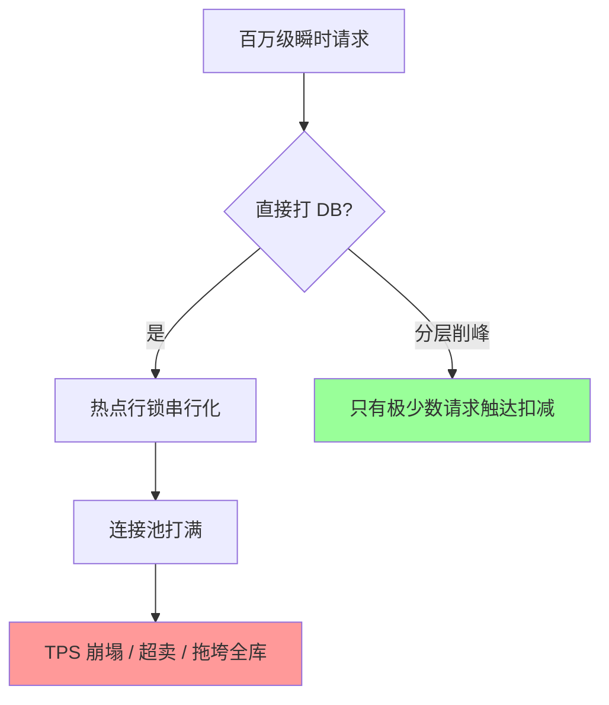
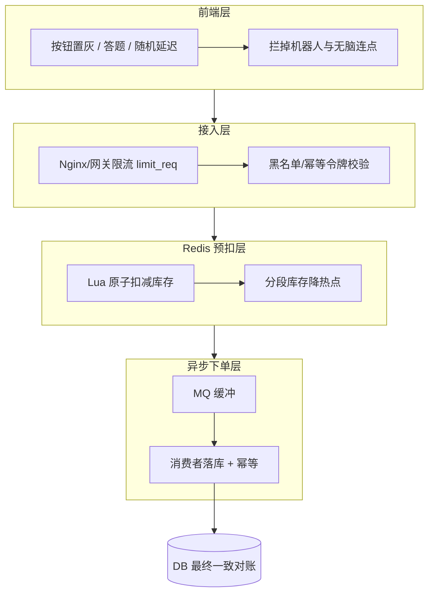

# 游戏秒杀场景承载

> 秒杀的本质是**极短时间窗内海量请求争抢极少量库存**。承载它靠的不是把 DB 换成更强的机器，而是**分层削峰**——在每一层把无效流量拦掉，只让"能中"的请求走到最后的原子扣减。

::: tip 一句话结论
秒杀靠分层削峰漏斗把注定失败的请求尽早在廉价层拦掉，DB 只做原子扣减兜底。
:::

## 场景问题

秒杀/限量抢购（游戏里如限量皮肤、开服礼包、拍卖行竞拍、活动兑换）的流量特征：**瞬时峰值可达日常的百倍**，且高度集中在同一个热点资源（同一件商品的库存）。直接打 DB 会踩到几个经典瓶颈：

- **热点单行的行锁竞争**：所有请求都 `UPDATE stock SET count=count-1 WHERE id=? AND count>0`，MySQL 对同一行加行锁串行化，请求排队，TPS 被单行锁拖死。
- **DB 连接与 IOPS 打满**：连接池被抢占，慢查询堆积，拖垮同库其他业务。
- **缓存击穿**：热点 key 恰好过期的瞬间，海量请求穿透到 DB。
- **超卖**：读-判断-写非原子，并发下多个请求都读到"还有库存"，扣成负数。
- **重复下单/刷单**：脚本/外挂对同一账号重复提交。



::: warning 核心矛盾
库存只有 100 件，却有 100 万请求。**其中 99.99% 注定失败**，工程目标是让这 99.99% 尽早、尽廉价地失败，而不是都挤到最贵的 DB 层去失败。
:::

## 实现方案

思路是一个**逐层收窄的漏斗**：前端 → 接入层 → 消息队列 → Redis 预扣 → 异步落库。



**1. 前端 + 接入层削峰**：按钮置灰防连点、答题/滑块增加人力成本、随机延迟打散峰值；网关侧 `limit_req` 令牌桶限流、按 IP/账号限速、幂等令牌（下单前先领 token，无 token 直接拒）。

**2. Redis + Lua 原子预扣库存**（核心）：库存预热到 Redis，扣减用 Lua 脚本保证"读+判断+扣+记录"在单线程内原子完成，杜绝超卖。同时用 Lua 完成**幂等**（同一 token 只能扣一次）：

```lua
-- seckill.lua
-- KEYS[1] = 库存 key，如 stock:{item123}
-- KEYS[2] = 已购去重集合，如 bought:{item123}
-- ARGV[1] = userId    ARGV[2] = 幂等令牌 token
-- 返回: 1=成功  0=售罄  -1=重复下单(已购/token 用过)

-- 幂等：token 已消费过则拒绝
if redis.call('SISMEMBER', KEYS[2], ARGV[2]) == 1 then
    return -1
end
-- 限购：同一用户已购则拒绝
if redis.call('SISMEMBER', KEYS[2], ARGV[1]) == 1 then
    return -1
end

local stock = tonumber(redis.call('GET', KEYS[1]))
if stock == nil or stock <= 0 then
    return 0            -- 售罄，快速失败
end

redis.call('DECR', KEYS[1])          -- 原子扣减
redis.call('SADD', KEYS[2], ARGV[1]) -- 记录该用户已购
redis.call('SADD', KEYS[2], ARGV[2]) -- 记录 token 已消费
return 1
```

Go 侧调用（用 `EVALSHA` 减少脚本传输）：

```go
package seckill

import (
	"context"
	"crypto/sha1"
	"encoding/hex"

	"github.com/redis/go-redis/v9"
)

//go:embed seckill.lua
var luaScript string

type SeckillService struct {
	rdb *redis.Client
	sha string // 预加载脚本的 SHA1
}

func NewSeckillService(rdb *redis.Client) (*SeckillService, error) {
	sha, err := rdb.ScriptLoad(context.Background(), luaScript).Result()
	if err != nil {
		return nil, err
	}
	return &SeckillService{rdb: rdb, sha: sha}, nil
}

// TryAcquire 返回: 1 成功 / 0 售罄 / -1 重复
func (s *SeckillService) TryAcquire(ctx context.Context, itemID, userID, token string) (int64, error) {
	stockKey := "stock:{" + itemID + "}"   // hash tag 保证同槽，便于集群
	boughtKey := "bought:{" + itemID + "}"
	res, err := s.rdb.EvalSha(ctx, s.sha, []string{stockKey, boughtKey}, userID, token).Int64()
	if err == redis.Nil || isNoScript(err) {
		// 脚本被逐出，回退到 Eval 重新加载
		res, err = s.rdb.Eval(ctx, luaScript, []string{stockKey, boughtKey}, userID, token).Int64()
	}
	return res, err
}

func isNoScript(err error) bool {
	return err != nil && len(err.Error()) >= 8 && err.Error()[:8] == "NOSCRIPT"
}

var _ = sha1.New
var _ = hex.EncodeToString
```

**3. 分段库存降热点**：把 100 件拆成 `stock:item:0..9` 各 10 件，请求按 hash 落到不同分片，把单一热点行/热 key 打散成 N 个，扣减吞吐提升 N 倍。某分片售罄可"借"其他分片（需二次原子判断）。

**4. MQ 异步下单 + 落库**：Redis 预扣成功后仅入队一条下单消息，快速返回"排队中"，消费者慢慢写 DB。DB 从"承受百万写"降级为"承受 100 条写"。落库带幂等键（token）防止消息重复消费重复下单。

**5. 最终一致对账**：Redis 扣减数与 DB 订单数定期对账，处理"扣了 Redis 但 MQ 丢消息/落库失败"的差异，补偿或回补库存。

## 为什么这么做

- **削峰的经济学**：越靠前的层拦截越便宜。前端拦一个请求成本近 0，网关拦一个是内存操作，Redis 拦一个是一次内存 CAS，DB 拦一个则要一次磁盘 I/O + 行锁。把 99.99% 的失败下沉到廉价层，DB 才活得下来。
- **Lua 保证原子性**：Redis 单线程执行 Lua，脚本内的"读-判断-写"不会被其他命令穿插，从根上消灭超卖，比"WATCH+MULTI 乐观锁重试"更省往返、更稳。
- **分段库存打散热点**：单点原子操作再快也有上限（单 key 单线程），分桶是把热点转化为并行度的标准手法，同思路见一致性哈希的分片。
- **异步落库解耦峰值与容量**：MQ 把"瞬时峰值"整流成"平稳消费速率"，正是**漏桶**思想的应用（见 [令牌桶与漏桶](/game-infra/token-leaky-bucket.md)）。

## 为什么别的选择不行

- **直接打 DB / 加 DB 只读从库**：热点是**同一行的写竞争**，加从库只解决读，写仍串行在主库单行锁上，无解。
- **纯乐观锁 CAS 重试**：低并发可行，秒杀级并发下重试风暴反而加剧竞争，成功率随并发上升而暴跌。
- **只在应用层加锁（分布式锁）**：把并发串行化到一把分布式锁上，锁本身成为新瓶颈，且锁粒度粗、超时/续期复杂。
- **只加限流不做预扣**：限流能保护 DB 不被打死，但不能保证"不超卖"与"公平"，两者是正交的，都要有。

## 沉淀结论

| 层 | 手段 | 拦掉什么 |
|---|---|---|
| 前端 | 置灰/答题/随机延迟 | 连点、机器人 |
| 接入层 | 令牌桶限流、幂等令牌 | 超额流量、无票请求 |
| Redis+Lua | 原子预扣 + 分段库存 | 超卖、热点、重复购买 |
| MQ | 异步下单 | 瞬时写峰值 |
| DB | 幂等落库 + 对账 | 最终一致兜底 |

::: tip 游戏秒杀 vs 电商秒杀
- **公平性/世界状态**：游戏抢的常是影响世界状态的资源（唯一装备、排行榜名次），公平性诉求更强，常引入服务器权威时间戳排序、答题门槛。
- **防外挂**：客户端不可信，扣减必须服务端权威，需强幂等 + 行为风控识别脚本连点。
- **强状态耦合**：中奖后要改玩家背包/世界数据，比电商单纯生成订单耦合更深，异步落库要保证与玩家状态的一致性。
:::

一句话：**秒杀 = 分层削峰漏斗 + Redis/Lua 原子扣减 + MQ 异步落库 + 最终对账**。核心是让绝大多数注定失败的请求尽早在廉价层失败。

### 记忆口诀

**削峰漏斗**：前端置灰 / 网关限流 / Redis 预扣 / MQ 落库
**防超卖**：Lua 原子 / 单线程读判写 / 分段库存打散热点
**防重复**：幂等令牌 / 已购去重集合 / 落库幂等键
**兜底**：MQ 整流 / 最终一致对账 / 差异补偿回补

## 内容来源

- 业界大厂电商与游戏秒杀实践公开分享（分层削峰、预扣库存、异步下单）
- Redis 官方文档：`EVAL`/`EVALSHA`、Lua 脚本原子性、Redis Cluster hash tag
- 《数据密集型应用系统设计》分区与热点章节
- 作者在游戏活动/限量发放系统的落地经验

## 自测：合上资料能说清楚吗？

秒杀的核心矛盾是什么？为什么"加更强的 DB/加从库"解决不了？

<details><summary>参考答案</summary>

矛盾是**极短窗口内海量请求争抢极少库存**，99.99% 请求注定失败。热点是**同一行的写竞争**，从库只解决读，写仍串行在主库单行**行锁**上无解；工程目标是让失败请求**尽早在廉价层**（前端/网关/Redis）失败，而非都挤到最贵的 DB。

</details>

为什么用 Redis + Lua 做预扣，而不是"WATCH+MULTI 乐观锁重试"或分布式锁？

<details><summary>参考答案</summary>

Redis **单线程**执行 Lua，脚本内"读-判断-扣-记录"不会被穿插，从根上消灭**超卖**，比乐观锁少往返、无重试风暴；秒杀级并发下 CAS 重试反而加剧竞争、成功率暴跌。分布式锁把并发**串行化到一把锁**，锁本身成新瓶颈。

</details>

分段库存为什么能提升吞吐？代价是什么？

<details><summary>参考答案</summary>

把 100 件拆成 N 个分片各若干件，请求按 **hash** 落到不同 key，把单一热点打散成 N 个原子操作，吞吐约提升 **N 倍**（单 key 单线程有上限）。代价：某分片**售罄需借其他分片**（二次原子判断），逻辑更复杂、分配可能不均。

</details>

只做限流不做预扣够不够？两者是什么关系？

<details><summary>参考答案</summary>

不够。限流保护 DB **不被打死**，但不能保证**不超卖**与**公平**——两者**正交**，都要有。限流控总量，预扣（Lua 原子）控精确扣减与幂等。

</details>

游戏秒杀和电商秒杀有什么不同？

<details><summary>参考答案</summary>

游戏抢的常是**影响世界状态**的资源（唯一装备、排行榜名次），**公平性**诉求更强，常用服务器权威时间戳排序；客户端不可信需**强幂等+风控**防外挂连点；中奖改**背包/世界数据**，状态耦合比电商生成订单更深，异步落库要保证与玩家状态一致。

</details>
