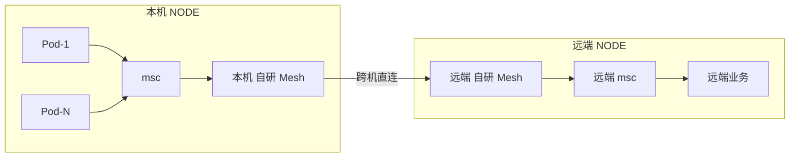

# 自研 Mesh 服务网格 × K8s 部署

自研服务网格 · 从 Consul 到全连接单跳广播 · 万级节点

::: tip 一句话结论
用 O(N) 全连接换 O(1) 单跳收敛，靠数字 ID + hostNetwork 撑起万级有状态直连。
:::

## 场景问题

::: warning ⚠️ 校正清单（面试必带）
1. **是 gossip 的退化特例，不是教科书 SWIM**：代码是"全连接网格 + 单跳全量广播"，fanout 拉满、无感染轮次、无随机邻居、收方不转发。准确说法是"gossip 家族的退化变体"，别简单说"未落地/不是 gossip"。
2. **节点发现**：自研 Mesh 的 C 代码只读 `host.txt`；K8s API / 服务发现是运维面板(Go) 的外部链路，负责把 IP 写进 host.txt。
3. **本机通信**：本机 mesh 客户端(msc) 接业务是 **消息总线共享内存 channel**，**不是 UDS**。
4. **跨 DC "选 2 个中转"**：代码只见"直连优先 (host_cache)"，独立实现未见，**存疑**。
:::

### 一台机器一个 mesh，所有 Pod 共享

```text
        NODE（实体机 / 云主机 / K8s 节点）
   ┌──────────────────────────────────┐
   │  Pod-1   Pod-2   ...   Pod-N      │
   │   └───────┴────┬─────────┘        │
   │        本机 自研 Mesh ──► 跨机直连 │
   └──────────────────────────────────┘
跨机调用：业务→msc→本机自研 Mesh→远端自研 Mesh→远端msc→远端业务
```



收益：**连接数大幅收敛** · 内存/CPU 省 · 用主机网络**跳出 K8s Overlay**（公司内网即可跨集群组网，规避 K8s 网络组件频繁异常）。

### 三种部署模型

| 模型 | 说明 | 用在哪 |
| --- | --- | --- |
| **DaemonSet（主用）** | 一机一 mesh，所有 Pod 共享 | 通用业务 |
| **Service** | 业务连内网 CLB，不在每节点部署 mesh | 战斗服务集群 (DS 链路单一) |
| **Sidecar（已弃用）** | 每 Pod 一个 mesh sidecar | **放弃**：K8s 网络组件频繁异常；多 Pod 互联单实例近 1GB 内存，10 Pod 节点要 10GB |

### Gossip 的真相：概念 vs 代码

**代码里没有任何 gossip/infect 标识符**（grep 命中 0），关键在于**收方不转发、组包不装别人的实例**：
- 组包 `make_mesh_heartbeat_package`：只装本机 `local_bus` 实例，**不装从别人学到的实例**
- 广播 `mesh_heartbeat`：遍历 `hash_cache`（所有连接）逐个发；内部计数就叫 `broadcasts++`
- 收包 `_mesh_heartbeat`：对每条实例只 `svr_heartbeat` 更新本地路由表，循环结束就 return，**无任何 re-broadcast**

> **口径统一（两层要分清）**：从**算法家族**看，它属于 **gossip 的一种退化特例**——把 fanout 拉满成"全连接"、砍掉 incarnation 与间接探测；从**教科书定义**看，它**不是完整 SWIM**（无多跳感染、无反熵、收方不转发）。所以准确表述是"**gossip 家族的退化变体，而非教科书 SWIM**"，不要简单说成"不是 gossip"。取舍方向：**自研 Mesh 用 O(N) 连接换 O(1) 收敛跳数**，教科书 gossip 用 O(W) 连接换 O(log N) 跳数——方向相反。nzmesh 相对 SWIM 砍了哪些组件、代价如何，逐行代码详见 [Raft & Gossip · nzmesh 实战](./raft-gossip.md)。

## 实现方案

### 心跳机制

| 链路 | 周期 | 备注 |
| --- | --- | --- |
| mesh⇄mesh | 5s | 定时器只置 `isHeartBeat=TRUE`，主循环检测才真发包 |
| msc⇄mesh | 3s | 客户端侧心跳 |
| 业务→mesh | TCP 直连 | 标 `islocal=TRUE` |

**三大加速手段**：
- **事件驱动立即广播**：状态变更（disable/normal/迁移）直接置 `isHeartBeat=TRUE`，下轮主循环立即广播不等 5s
- **合包 StampCache**：发送不直接 write，取缓冲块挂到连接待发链表，主循环批量刷出——**多个逻辑包合并成少量 syscall**
- **单线程主循环**：连接检查/定时器/收发/心跳全在一个无锁线程跑完

### 路由能力（6 类 + 备份 + 就近 + 跨DC）

| 路由类型 | 实现 | 场景 |
| --- | --- | --- |
| RANDOM | `_mesh_random` | **先就近再 rand**，失败走备份重试 |
| MOD / MOD_BACKUP | `_mesh_mod` | 取模分片（合并 backup） |
| MOD_MS | `_mesh_mod_ms` | 取模 + **主备双发** |
| MASTER_SLAVE | `_mesh_master_slave` | 中心化服务 |
| CO_HASH | `_mesh_co_hash` | 一致性哈希（玩家/房间粘性） |

### 就近路由：解决云主机跨机性能

`get_nearest_instance_index`：只有**本地连接**（`islocal`）的包才尝试就近，命中本机同 zone/route 的健康实例则直接走本地（按 `backup_cnt` 概率）。

> 云主机跨节点网络因虚拟化下降，对高流量请求**多部署几个本地 DB 代理**，就近路由让本地优先承接——本地转发基本不受 IO 虚拟化影响。

### 备份路由 + 跨 DC

- **两级灾备**：`SBusRoute` 有 `backup_route_id`（route 全挂切别的 route）和 `backup_zone_id`（zone 全异常切别的 zone），回包失败时改写 header 重路由
- **跨 DC**："**直连优先**"已落地——实例记录来源连接 `host_cache`，转发直接用这条已知连接发
- **跨外网**（比赛现场）：引入外网 CLB，链路开加解密

### K8s 部署：DaemonSet + hostNetwork

```yaml
kind: DaemonSet                         # 一机一节点
spec.template.spec:
  hostNetwork: true                     # 跳出 Overlay，用宿主机网络
  hostPID: true                         # preStop killall daemon 需要
  terminationGracePeriodSeconds: 7200   # 优雅退出窗口 2 小时
  volumes: [hostPath /data/home/user00,
            hostPath /data/corefile,
            emptyDir(Memory) /dev/shm]
  containers[mesh]:
    ports: 8000/TCP(mesh 主服务), 9912/UDP(tlog), 9906/TCP
    lifecycle.preStop: exec [killall, daemon]
    resources: requests{2Gi,1core} limits{4Gi,2core}
```

**Service 模型是 headless Service**（`clusterIP: None`）。

### 业务 Pod 怎么连本机 mesh — hostIP 注入，不是 UDS

业务 Pod → 本机 mesh 靠 **hostNetwork + hostIP 注入**：

1. 业务进程启动参数统一带 `--mesh=$host-ip$:8000`
2. `$host-ip$` 来自 Downward API：所有工作负载注入 `HOST_IP <- status.hostIP`
3. 自研 Mesh DaemonSet `hostNetwork: true`，监听宿主机 `0.0.0.0:8000`，业务用 `HOST_IP:8000` **直接命中本机这台 mesh**，流量不走 Overlay

### 多集群 / 跨 DC 拓扑

- **集群清单**：按地域分文件（如 `regionA.yaml`/`regionB.yaml`），各一套 apiserver 证书
- **CLB 接入**：某云厂商托管 K8s 的自定义 Ingress（**非标准 nginx**）；按运营商拆 CLB：`-dx`(电信)/`-yd`(移动)/`-wt`(联通)/`hongkong-bgp`/`-inner`；**`isDirectConnect: true` CLB 直连 Pod**
- **DS 战斗集群**：`ds/` chart 三件套 `idc-dispatcher`/`ds-center`/`ds-agent`；ds-agent 单实例 16Gi/4core 起、limit 可到 128Gi/64core，`nodeSelector: node_type=ds` + `podAntiAffinity` 强制**一机一 ds-agent**，PortPool 申请固定 UDP 端口给玩家直连

### 运维面板：运维 + 节点发现的真正落点

入口是内网运维面板（Go 进程 + Vue 前端）。**它才是"K8s API 拉节点 / 服务发现 / host.txt 对账"的实现处**。

**节点发现两条来源 + 交叉对账**：
- **host.txt**：扫 `host.*.txt`，构建 IP→文件映射；**同 IP 出现在多个 host.txt 会告警**
- **K8s API**（client-go）：为每个集群建 clientset，`Nodes().List()` 拉节点、`Pods().List()` 拼总线地址
- **对账**：在 host.txt 却未组网 / 已组网却不在 host.txt / DS 节点未跑 ds-agent，分别告警

**生产保护**：所有写操作受 `enable_k8s_op` 总闸控制，dev/test=1，**体验/线上=0（线上禁止面板直接操作 Pod）**。

### 状态机与一致性冲突应对

```text
NORMAL ──disable signal──► DISABLE
   │                          │
heartbeat timeout       （组包时跳过，不再扩散）
   ▼
TIMEOUT
```

**冲突应对组合拳**：
- 缩短不一致窗口（**立即广播 + 快速收敛**）
- 业务用**一致性 HASH**（扩缩容时少迁移）
- 关键包**最多 3 次重试**（避免雪崩）
- **客户端兜底**

### 新旧两套 K8s 部署（Helm → 自研生成器）

- **旧（声明式 Helm）**：按 `system / game / ds` 三 chart，每服务一份手写 `templates/*.yaml` + 一堆按"环境-地域-集群"命名的 values。**目录名 `old/` 本身就是"已归档"信号**
- **新（程序化生成器）**：读精简的 `service.*.yaml`/`system.*.yaml` + 3 个基础模板，内存里组装 K8s 资源并下发

> **为什么从 Helm 转程序化生成**：手写模板"每个 yaml 复制粘贴改名"太脆——旧 Helm 里 `limits` 把 `{{` 误写成 `{ {` 渲染不出，同款笔误还误引用了别的服务的 `memory_limit`。程序化生成把差异收敛到几行配置。

## 为什么这么做

### 为什么要自研：早期方案的死法

**中心网关 + PROXY + 消息总线时代**（容器化后直接崩）：
- **消息总线走共享内存**：容器化后容器间内存隔离，**共享内存通道直接失效**
- **服务发现纯人工**：K8s 按资源调度，无法预知部署到哪台
- **PROXY 中心化**：路由要跨 3 跳（业务→网关→PROXY→网关→业务）
- **PROXY 带宽吃紧**：越来越多模块走无状态化，PROXY 处理跟不上

### calc_connect：单向连接算法（最扎实的亮点）

全互联的代价是连接数——但 TCP 是全双工，**两节点之间只需 1 条链路**，关键是"谁主动连"。

- **朴素方案**"大 IP 连小 IP"：主动/被动连接数极度不均，CPU 倾斜
- **自研 Mesh 方案**：**基于 IP 末位 bit 异或的"公认随机值"**——两个数相加奇偶各 50%，异或值双方算出必然一致且 0/1 均匀

```c
int calc_connect(SMeshNode *a, SMeshNode *b) {
    if (a->outside_ip == b->outside_ip) return 0;
    unsigned int bit = (a->outside_ip ^ b->outside_ip) & 0x01000000;
    return !bit == (a->outside_ip > b->outside_ip) ? 1 : -1;
}
```

实测均衡度：**5000 节点下最大连接差仅 0.37%**，单次比较开销可忽略、额外内存 0。

### Reservoir Sampling 推荐 32 个节点

msc 启动要快速感知附近 mesh。下行心跳 `make_msc_heartbeat_package` 用**水库抽样**从全网 mesh **等概率抽 32 个**健康节点：

```text
先顺序填满 32；之后 r = rand() % (idx+1)；r < 32 则替换。
```

**不论集群多大，下行包恒定 32 个、分布均匀。**

### Jump Consistent Hash（取代 Ketama）

`_jump_consistent_hash`：Google Jump Hash，64 位 LCG，**O(log n)、0 内存**，分布更均匀。实测"100 桶≈10M/s，1000 桶≈7.2M/s"。

> **成立前提**：实例 ID 用**数字**标识（沿用数字实例 ID）。字符串 ID 得建环 + 字符串 hash，性能差——这是自研 Mesh 整体的性能基石。

## 为什么别的选择不行

### 业界方案对比

| 维度 | Istio | 某公司内部 Mesh 组件 | 自研 Mesh |
| --- | --- | --- | --- |
| 有状态服务 | 不支持 | 路由不完美，需再叠一层 PROXY | **原生支持** |
| 点对点 | 不支持 | 跨多节点跳转 | **直连单跳** |
| 性能 | ~6000 QPS，3 倍 socket 开销 | 单节点 ~6w QPS，跨节点骤降 | **云主机 130% CPU 跑满万兆网卡** |
| 跨集群 | 依赖 Overlay | 需开发 CROSS 模块 | **主机网络直连多 K8s 集群** |

### 第一版基于 Consul 的水土不服（用了一年多）

- 实例超 **300** 个就数据重复
- 100+ 服务要同时 100 个 Watch
- 单实例 4.5KB 冗余，5000 实例每次变更解析要 **5~8 秒**
- 节点上限 5000
- **2021 年 Consul 官方宣布不再对中国区支持**

**第二版根本性需求**：去中心化（不依赖配置中心）· 万级节点 · 自动注册/剔除 · 云主机转发性能挖掘 · 异构混部互通 · 可定制路由。

### 云主机网络虚拟化 40~45% 瓶颈

**云主机（虚拟化机型）网络 IO 仅为实体机 40~45%**，专业团队结论"所有 virtio 方案都有此问题"。单核单线程到顶，转**多核多通道**：

- **方案一**（否）自研 Mesh 本地多通道转发：业务无感，但**新增 2 次额外中转**
- **方案二（选）SDK 直连多通道**：业务 SDK 直连多个通道无多余中转；自研 Mesh 更新时 SDK 自适应动态屏蔽链路；多通道用**一致性 HASH 选链路**保证玩家数据有序、迁移最少

**效果**：**云主机总 CPU 130% 跑满万兆网卡**。

## 沉淀结论

### 工程细节里的经验教训

- **msc ↔ mesh 主连接切换太频繁**："**9 秒才更新一次防止切换太频繁被 mesh 误判不稳定**"——细节到"9 秒"这种拍出来的量。
- **实例迁移防抖反复**：演进痕迹里"超时实例是否组包"曾被去掉、又因网页显示异常恢复，**典型反复**。
- **CPU 热点抓取到锅**：总线 pair 统计因比较/查找函数占 **13%/10% CPU** 被注释掉，"优化后 CPU 54%→33%"。

### 最终结论

- 自研 Mesh 的本质是**用 O(N) 全连接换 O(1) 单跳收敛**，与 gossip 的取舍方向相反；这套取舍在**万级节点、有状态、点对点直连**的游戏后台场景下成立。
- 性能基石是**数字 ID**：让 Jump Consistent Hash、calc_connect、水库抽样都能 O(1)/O(log n)、0 额外内存跑起来。
- 部署上用 **DaemonSet + hostNetwork** 跳出 K8s Overlay，规避网络组件频繁异常；节点发现落在 **运维面板** 而非 mesh C 代码本身，靠 **host.txt 与 K8s API 交叉对账** 保证一致性。
- 面试记住四条校正：**是 gossip 退化特例（非教科书 SWIM）、节点发现在面板、本机通信走消息总线共享内存、跨 DC 只见直连优先**。

### 记忆口诀

**拓扑**：全连接 / 单跳广播 / O(N)换O(1)
**部署**：DaemonSet / hostNetwork / 跳出Overlay
**性能基石**：数字ID / Jump Hash / calc_connect / 水库抽样32
**一致性**：立即广播 / 一致性HASH / 3次重试 / 面板对账

## 内容来源

综合整理自自研服务网格的架构演进与工程实践（连接算法、水库抽样、Jump Consistent Hash、DaemonSet+hostNetwork 部署、节点发现对账等），配合 Consul、Istio、Cilium 等公开方案的对比。

## 自测：合上资料能说清楚吗？

自研 Mesh 的心跳广播和 Gossip 到底是不是一回事？它们的取舍方向有什么本质区别？

<details><summary>参考答案</summary>

**是 gossip 家族的退化特例，但不是教科书 SWIM**。代码是**全连接网格 + 单跳全量广播**：收包只更新本地路由表、**不再转发**，组包只装本机实例，且砍掉了 incarnation/间接探测。Gossip 用 **O(W) 连接换 O(log N) 跳数**；自研 Mesh 把 fanout 拉满，用 **O(N) 连接换 O(1) 收敛跳数**，**取舍方向恰好相反**。（逐行代码与砍掉的 SWIM 组件见 [Raft & Gossip · nzmesh 实战](./raft-gossip.md)）

</details>

为什么全互联下连接数还能均衡？calc_connect 怎么决定"谁主动连"？

<details><summary>参考答案</summary>

TCP 全双工，两节点只需 **1 条链路**。朴素"大 IP 连小 IP"会让连接数极度倾斜。calc_connect 用 **IP 末位 bit 异或的公认随机值**：异或值双方算出必然一致且 **0/1 各 50% 均匀**。实测 5000 节点最大连接差仅 **0.37%**。

</details>

业务 Pod 是怎么连到本机 mesh 的？为什么不用 UDS？

<details><summary>参考答案</summary>

靠 **hostNetwork + hostIP 注入**：mesh DaemonSet 监听宿主机 `0.0.0.0:8000`，业务经 Downward API 拿到 **`HOST_IP`**，用 `HOST_IP:8000` 直接命中本机 mesh，流量**不走 Overlay**。本机 msc 接业务走的是**消息总线共享内存 channel**，不是 UDS。

</details>

对比 Sidecar 与 DaemonSet 两种部署模型，为什么放弃 Sidecar？

<details><summary>参考答案</summary>

**Sidecar**：每 Pod 一个 mesh，多 Pod 互联单实例近 **1GB 内存**，10 Pod 节点要 10GB，且 K8s 网络组件频繁异常。**DaemonSet**：一机一 mesh 所有 Pod 共享，**连接数大幅收敛**、内存/CPU 省、用主机网络跳出 Overlay。故弃 Sidecar 用 DaemonSet。

</details>

第一版基于 Consul 为什么撑不住？第二版提出了哪些根本性需求？

<details><summary>参考答案</summary>

Consul 痛点：超 **300 实例**数据重复、100+ 服务同时 Watch、5000 实例每次变更解析 **5~8 秒**、节点上限 5000、**2021 官方停中国区支持**。第二版需求：**去中心化 · 万级节点 · 自动注册剔除 · 云主机转发性能 · 异构混部 · 可定制路由**。

</details>

