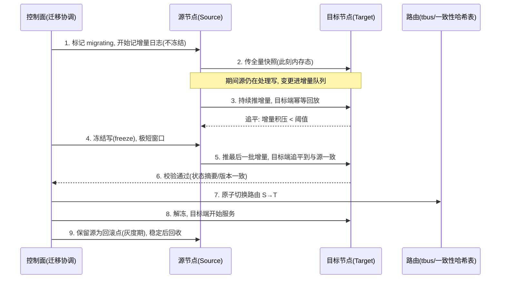

# 有状态服务的数据迁移

> 迁移是**计划内变更**:你主动把某台机器/某个分片上的玩家、房间、内存态搬到另一处(扩缩容、机器下线、机房搬迁、一致性哈希重分片)。难点不在"搬数据",而在"搬的过程中在线业务不能停、不能丢、不能双份"。与 `stateful-recovery`(面向故障的恢复)是两码事——本篇最后专门讲区别。

## 场景问题

无状态服务扩容很爽:起新 Pod、注册进 LB、流量自然打过来,旧 Pod 摘掉即可,因为**每个请求自包含,状态在 DB**。

有状态服务(战斗服、房间服、场景服)不行:

- **内存态**:玩家的战斗上下文、AOI 视野、房间内所有人的实时状态都在进程内存里,不落 DB 或落得很粗。
- **连接态**:玩家和这台服有长连接(经 tconnd/tbus 路由),迁走后连接指向哪?
- **不可重算**:一局 MOBA 打到一半的血量/技能 CD/位置,无法从"初始状态 + 日志"廉价重放出来(即使能,也贵)。

于是一致性哈希扩容时的 slot 搬迁、机器计划下线时的房间腾挪,都要求:**在线迁移(migration in flight),玩家几乎无感,数据零丢失零重复。**

## 实现方案

### 迁移方式谱系(按停机时间递减)

| 方式 | 停机 | 适用 |
|---|---|---|
| 停机迁移 | 长(冻结全服/分区) | 大版本、允许维护窗口 |
| 双写灰度 | 无,但双份写压力 | 存储层换引擎/分库 |
| **快照 + 增量追平 + 切换** | 极短(仅切换瞬间冻结) | 房间/玩家在线迁移,主流 |
| 一致性哈希 slot 搬迁 | 按 slot 短暂冻结 | 扩缩容重分片 |

### 主流方案:快照 + 增量 + 追平 + 切流 + 校验



关键点:**先冻结写、快照 + 增量、目标端回放、切流量、校验、留回滚点**。冻结只发生在最后追平的一瞬(增量已很小),对玩家近似无感。

### 快照 + 增量回放伪码

```go
// ==== 源节点 ====
func (s *Source) StartMigration(target Node) {
    s.mode = MIGRATING
    s.deltaLog = NewDeltaQueue()      // 从此刻起, 所有写既作用于内存也追加进 deltaLog

    snap := s.Snapshot()               // 一致性快照: 记录 version=V0
    stream := target.OpenStream()
    stream.SendSnapshot(snap)          // 传全量

    // 持续推增量, 直到积压足够小
    for {
        batch := s.deltaLog.Drain()    // 取出自上次以来的增量
        stream.SendDelta(batch)
        if s.deltaLog.Backlog() < THRESHOLD {
            break
        }
    }

    // —— 极短冻结窗口 ——
    s.Freeze()                         // 拒绝新写(客户端会重试/被路由挡住)
    tail := s.deltaLog.Drain()
    stream.SendDelta(tail)             // 推最后残余增量
    if !target.Verify(s.StateDigest()) {   // 状态摘要比对
        s.Unfreeze(); return ROLLBACK      // 校验失败, 回滚到源
    }
    controlPlane.SwitchRoute(s.Shard, target)  // 原子切路由
    s.mode = DRAINED                   // 源转为回滚点, 灰度期后回收
}

// ==== 目标节点: 幂等回放 ====
func (t *Target) OnDelta(batch []Op) {
    for _, op := range batch {
        // 每个 op 带全局递增 seq; 已回放过的直接跳过 => 幂等, 可安全重传
        if op.Seq <= t.lastApplied {
            continue
        }
        t.Apply(op)                    // Apply 本身也要幂等(如"设为X"而非"加X"更安全)
        t.lastApplied = op.Seq
    }
}
```

::: tip
增量回放**必须幂等**:网络重传、协调器重试都可能让同一批 op 送达两次。做法:op 带全局单调 `seq` + 目标端记 `lastApplied` 去重;能设计成"幂等语义操作"(set 而非 incr)则更稳。
:::

### 一致性哈希扩容下的 slot 搬迁

扩容加节点会导致约 `1/N` 的 key 需要重映射(见 `consistent-hash-impl`)。搬迁按 slot 粒度做:锁定待迁 slot → 该 slot 内的房间/玩家走上面的快照+增量流程 → 切路由表指向新节点 → 解锁。**逐 slot 滚动**,任一时刻只有一小撮 slot 短暂冻结,不影响其余流量。

## 为什么这么做

- **为什么快照 + 增量而不是停机全搬**:停机搬迁要冻结整段业务直到搬完,玩家掉线、体验崩。快照 + 增量把"长冻结"拆成"边跑边传的长过程 + 一瞬间的短冻结",在线无感。
- **为什么先冻结写再切**:切路由和最后追平之间若还有新写落在源上,就会丢。冻结保证"切换那一刻源与目标状态严格一致",这是零丢失的必要条件。
- **为什么留回滚点**:切流后新节点可能立刻暴露 bug(数据格式、性能)。保留源节点作为灰度期回滚点,发现问题能秒切回,是有状态迁移的安全网。
- **为什么按 slot/分区滚动**:把爆炸半径限制在一个 slot,失败只影响局部,且可暂停/续传。

## 为什么别的选择不行

- **简单重建(在目标端从零拉起 + 客户端重连)**:直接丢掉内存态和会话——玩家半局战斗归零、房间解散。有状态服务的状态**不可重算**,重建 = 数据丢失,不可接受。
- **纯双写灰度**:要求所有写路径改造成双写,且两端引擎/结构兼容;对"内存态房间"这种非存储型服务几乎无法双写(写的是内存对象,不是可复制的 SQL)。双写更适合存储层换引擎,不适合内存态在线迁移。
- **只传快照不传增量**:快照期间源还在处理写,快照一到目标端就已经过时(stale),切过去必然丢掉快照后的变更。增量追平不可省。
- **不冻结直接原子切**:切换瞬间的 in-flight 写会落在源、丢在目标,产生不一致。短冻结是代价最小的一致性保证。

::: warning
迁移中要明确定义**回滚点(rollback point)与一致性边界**:哪个 version 之前的状态在两端一致、切换失败退回哪个 version。没有清晰回滚点的迁移,一旦中途失败就进退两难。
:::

## 沉淀结论

- 迁移是**计划内主动搬迁**,难在"在线不丢不重",不在搬数据本身。
- 记住五步:**冻结写 → 快照 + 增量 → 目标端幂等回放 → 校验一致 → 原子切流(留回滚点)**。
- 幂等(seq + lastApplied)和短冻结窗口是零丢失的两根支柱。
- 有状态的核心约束:**内存态 + 连接态不可重算**,所以不能像无状态那样直接漂移或重建。
- 一致性哈希扩容用 **逐 slot 滚动搬迁**,把爆炸半径关进单个 slot。

::: tip 与 stateful-recovery 的区别(重要)
**迁移面向计划内变更**:源健在、你主动把状态从 A 搬到 B,可以慢慢追平、留回滚点、失败退回,追求"玩家无感"。
**恢复面向故障**:源已宕/失联,没有"源实时增量流"可用,只能靠**已落盘的 checkpoint + WAL 回放/副本接管**把状态重建到最近可用点,追求的是 RPO/RTO(能救回多少、多快救回)。
一句话:**迁移有一个活着的源做增量追平;恢复没有活源,只有落盘的历史。**
:::

## 内容来源

综合整理。参考方向:分布式系统教材(《Designing Data-Intensive Applications》一致性/复制章节)、一致性哈希与在线重分片实践(Redis Cluster resharding、Vitess reshard)、有状态服务在线迁移工程经验,以及游戏后台房间/场景服迁移的通用做法。
