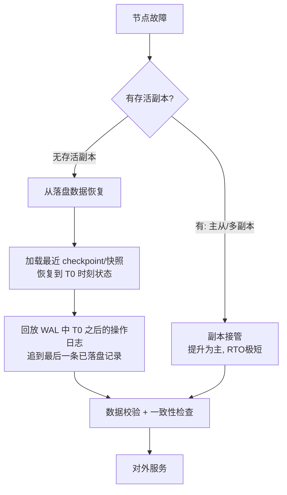

# 有状态服务的数据恢复与容灾

> 恢复是**面向故障**的:进程 crash、机器宕机、机房掉电后,把有状态服务的内存态重建到"最近一个可用点"。它没有一个活着的源可供实时追平——只有事先落盘的 checkpoint 和 WAL。核心指标是 RPO(丢多少)与 RTO(多快恢复)。与 `stateful-migration`(计划内主动搬迁,有活源追平)是完全不同的问题,本篇会讲清区别。

## 场景问题

战斗服/房间服/世界服的状态大多在内存里跑。一旦进程或机器故障:

- **纯内存服务宕机 = 状态归零**:没落盘的东西,断电即失。玩家的房间、进度、未落库的道具全没了。
- **不能靠重启自愈**:重启只能拉起一个空进程,内存态不会自己回来。
- **不能靠上游重算**:很多状态是长期累积、含随机性(战斗结算、掉落),无法从初始态廉价重放。

于是必须回答三个问题:**恢复的数据从哪来?能恢复到多近的时间点(RPO)?多快能对外服务(RTO)?** 并且要防止恢复过程中出现**脑裂/双主**——两个实例都以为自己是权威,各写各的,数据分叉。

## 实现方案

### 恢复的数据来源



四种来源,通常组合使用:

1. **周期快照 / checkpoint**:定期把内存态全量落盘(如每 5 分钟),恢复的**基线**。
2. **WAL / 操作日志(redo log)**:每次写操作先顺序追加到日志再改内存(Write-Ahead)。恢复时在快照基线上**回放**快照之后的日志,把状态追到最后一条落盘记录。
3. **上游重放**:若上游(如消息队列)保留了请求流且操作可重放,可从某 offset 重放补齐。
4. **副本接管(failover)**:主从/多副本时,主挂了直接提升从副本为主,RTO 最短(不用从盘上重建)。

### RPO / RTO 权衡

- **RPO(Recovery Point Objective)**:能恢复到的最近时间点,即"最多丢多少数据"。由 **checkpoint 频率 + WAL 落盘策略**决定:WAL 每条 `fsync` 则 RPO≈0 但写慢;批量/定时 fsync 则更快但可能丢最后几十毫秒。
- **RTO(Recovery Time Objective)**:从故障到恢复服务的时长。由 **快照加载 + 日志回放量 + 副本切换速度**决定:副本接管 RTO 秒级;从冷盘重建 RTO 取决于日志量。
- **权衡**:checkpoint 越频繁,需回放的 WAL 越少 → RTO 越低,但快照本身有开销(卡顿);WAL fsync 越勤 → RPO 越低,但写吞吐越低。按业务可容忍的丢失量与恢复时长调这两个旋钮。

### WAL 回放恢复伪码(幂等)

```go
// 恢复流程: 加载最近快照, 再幂等回放其后的 WAL
func Recover(store *StateStore) error {
    snap, snapLSN := LoadLatestCheckpoint()   // snapLSN: 快照覆盖到的日志序号
    store.RestoreFrom(snap)                    // 恢复到 T0 基线
    store.appliedLSN = snapLSN

    wal := OpenWAL()
    for rec := range wal.IterateFrom(snapLSN + 1) {  // 只回放快照之后的
        if rec.LSN <= store.appliedLSN {       // 幂等: 跳过已应用(防重复回放)
            continue
        }
        if !rec.ValidCRC() {                   // 校验: 遇到损坏/半写记录
            log.Warnf("truncated WAL at LSN=%d, stop replay", rec.LSN)
            break                              // 尾部半写记录截断, 到此为止即 RPO 边界
        }
        store.Apply(rec.Op)                    // Apply 必须幂等(set 而非 incr)
        store.appliedLSN = rec.LSN
    }
    return store.SelfCheck()                   // 一致性自检(计数/摘要/不变量)
}

// 正常写路径: Write-Ahead —— 先落日志再改内存
func (s *StateStore) Write(op Op) error {
    rec := Record{LSN: s.nextLSN(), Op: op, CRC: crc(op)}
    if err := s.wal.AppendAndSync(rec); err != nil {  // 先持久化(RPO 由 sync 策略定)
        return err
    }
    s.Apply(op)                                        // 再改内存
    s.appliedLSN = rec.LSN
    return nil
}
```

::: tip
回放**必须幂等**且能处理**尾部半写记录**:crash 时最后一条 WAL 可能只写了一半。用 per-record CRC 检测,遇到坏记录就在此截断——这个截断点就是本次恢复的实际 RPO 边界。
:::

### 脑裂与双主防护

副本接管最怕**脑裂**:网络分区让旧主没死透、新主又被提起来,两个"主"各自接受写,数据分叉,合并时无解。防护手段:

- **fencing(隔离/围栏)**:提升新主前,先通过存储/网络层"击杀"旧主(STONITH、租约过期后拒绝其写)。
- **多数派仲裁 / lease**:靠 Raft 之类的多数派选主(见 `raft-gossip`),或带 term 的租约,任一时刻只有一个持有效租约者能写。
- **epoch/term 单调递增**:旧主的写带旧 term,被存储层拒绝。

## 为什么这么做

- **为什么纯内存服务必须落盘 checkpoint**:内存态断电即失,没有落盘就没有任何恢复基线,RPO = "从上次启动到现在的全部",不可接受。checkpoint 是"最多丢多少"的下限保证。
- **为什么用 checkpoint + WAL 而非只快照**:只快照则 RPO = 快照间隔(可能几分钟),太粗。WAL 记录每笔写,把 RPO 从"分钟级"压到"最后一次 fsync 级"。快照负责压缩回放量(降 RTO),WAL 负责压低丢失量(降 RPO),两者互补。
- **为什么先写日志再改内存(Write-Ahead)**:若先改内存后写日志,crash 在两步之间就会"内存改了但日志没有",恢复不出来。WAL 保证"已确认的写一定在日志里",这是可恢复性的地基。
- **为什么要防脑裂**:恢复/接管过程中若双主,数据分叉后无法自动合并,比"丢一点数据"严重得多——不一致会污染后续所有写。

## 为什么别的选择不行

- **靠重启自愈**:重启只给空进程,内存态不回来,等于数据丢失。
- **靠上游重算全部状态**:含随机性、长期累积的状态(战斗结算、经济系统)不可确定性重放,重算结果与原状态不一致。上游重放只能补幂等、可重放的那部分。
- **只做异步全量快照、不做 WAL**:RPO 等于快照间隔,故障时丢掉整段间隔内的写,对交易/经济类状态是事故。
- **接管不做 fencing**:直接提升副本而不隔离旧主,分区恢复后双主写入分叉,数据不可挽回。
- **同步复制到所有副本再 ack(强同步)**:RPO 最优(≈0)但写延迟受最慢副本拖累、可用性受任一副本影响。多数场景选"多数派同步 + 少数异步"折中,而非全同步。

::: warning
恢复方案**必须定期演练**(chaos/断电演练)并做**数据校验**。没演练过的恢复流程在真出事时几乎必然踩坑:快照能不能加载、WAL 能不能回放、副本能不能顶上,只有演练能验证。RPO/RTO 是"演练测出来的",不是"文档里写的"。
:::

::: danger
恢复完成后**上线前务必自检不变量**(总量守恒、账目平衡、无重复 ID)。带着损坏或分叉的状态对外服务,会把错误持续放大到所有后续写入,比多停几分钟严重得多。
:::

## 沉淀结论

- 恢复面向**故障**:没有活源,只有落盘的 **checkpoint(基线)+ WAL(增量)**,外加**副本接管**这条快路。
- 两把旋钮:**checkpoint 频率**主要影响 RTO,**WAL fsync 策略**主要影响 RPO;按业务可容忍度调。
- 三条铁律:**Write-Ahead(先日志后内存)、回放幂等(LSN 去重 + CRC 截断)、防脑裂(fencing/多数派/term)**。
- 纯内存服务**必须落盘 checkpoint**,否则宕机即全丢。
- 恢复流程**必须演练 + 恢复后自检不变量**。

::: tip 与 stateful-migration 的区别(重要)
| | stateful-migration(迁移) | stateful-recovery(恢复) |
|---|---|---|
| 触发 | **计划内**主动变更(扩缩容/下线) | **故障**(crash/宕机/分区) |
| 源状态 | 源健在,可实时推增量 | 源已死/失联,无活源 |
| 数据来源 | 源的实时快照 + 增量流 | 落盘 checkpoint + WAL / 副本 |
| 追求 | 玩家无感、可回滚、慢慢追平 | RPO/RTO,尽快救回最近可用点 |
| 失败处理 | 退回源(回滚点) | 无源可退,只能到 WAL 截断点 |

一句话:**迁移有一个活着的源做实时追平;恢复没有活源,只能从历史落盘数据重建。**
:::

## 内容来源

综合整理。参考方向:分布式系统教材(《Designing Data-Intensive Applications》复制/容错章节、WAL 与日志结构存储)、数据库 checkpoint + redo log 恢复机制(如 ARIES 恢复算法思想)、Raft 等共识协议的选主与 fencing、以及游戏后台有状态服容灾演练的通用实践。
