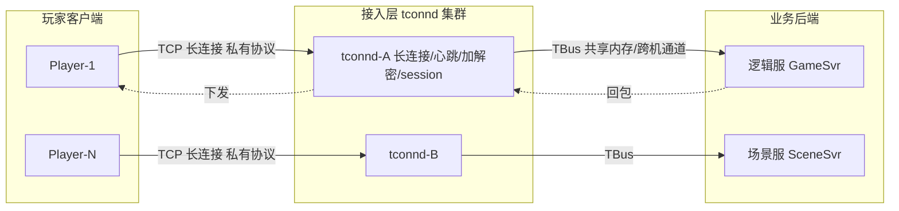
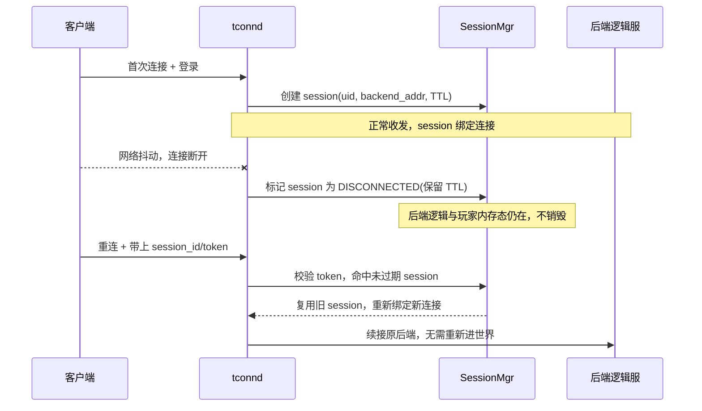

# tconnd 接入层

腾讯游戏接入网关 · 有状态长连接 · 私有协议 · 低延迟收发

> ::: tip 说明
> tconnd 是腾讯游戏后台常见的接入层组件（tconnd / connsvr 一类）。以下按**公开可知的架构原理**层面描述其设计思想与取舍，不涉及内部代码行号或未公开的私有数字。
> :::

## 场景问题

一款 MMO / 竞技类游戏，成百上千万玩家同时在线，每个玩家一条 **TCP/UDP 长连接**贴着接入层不放。业务后端（逻辑服、场景服、匹配服）是无数个进程，散在不同机器上。直接让业务进程去 `accept()` 海量连接会带来一堆麻烦：

- **连接与逻辑耦合**：业务进程既要处理游戏逻辑（帧驱动、战斗计算），又要处理 socket 读写、TLS 握手、心跳，CPU 被 I/O 抢占，逻辑帧率抖动。
- **有状态**：连接不是无状态 HTTP，一条连接对应一个玩家会话（session），断线要能重连回原逻辑上下文，不能随便打到任意后端。
- **私有协议**：游戏包是自定义二进制协议（省带宽、防抓包/外挂），不是 HTTP，通用网关（Nginx / API Gateway）识别不了。
- **安全**：外网直连业务进程 = 把逻辑服暴露给公网攻击面，DDoS 一打就穿。

于是需要一层专门的**接入网关 tconnd**：对外扛住海量长连接与收发包，对内把干净的业务消息路由给后端，让逻辑服只管逻辑。



## 实现方案

tconnd 作为**接入网关**，核心职责可以拆成六块：

1. **长连接维持**：`epoll`（Linux）单/多 reactor 管理十万级 fd，每条连接是一个 `Conn` 对象，维护读写缓冲、连接状态、最后活跃时间。
2. **收发包与粘包处理**：TCP 是字节流，私有协议要自己切帧（见下方帧结构）。
3. **心跳保活**：定时检查 `last_active`，超时踢连接；客户端周期发 heartbeat，弱网下用它探活。
4. **加解密**：握手协商密钥（如 ECDH），后续包体对称加密（AES/自研流密码），防明文抓包与篡改。
5. **会话（session）状态管理**：一条连接绑定一个 `session_id`，记录玩家 uid、路由到的后端地址、登录态；断线时 session 不立即销毁，保留一个 TTL 供重连。
6. **路由到后端 TBus**：解出业务消息后，按玩家所在世界/逻辑服，通过 **[TBus](/game-infra/tbus.md)** 投递到对应后端进程。

### 私有协议帧结构与粘包处理

游戏私有协议通常是 **length-prefixed（长度前缀）** 帧，用固定头 + 变长体解决 TCP 粘包/半包：

```c
// 接入层私有协议帧（示意；字段命名/长度按公开原理，非内部真实值）
struct PktHeader {
    uint32_t magic;      // 魔数，快速校验/丢弃脏流量
    uint32_t total_len;  // 整帧长度（含头），用于切帧
    uint16_t version;    // 协议版本，兼容灰度
    uint16_t cmd;        // 命令字，路由到后端 handler
    uint32_t seq;        // 序号，请求-响应匹配 & 幂等
    uint32_t flags;      // 位标记：是否加密 / 是否压缩
    // 后面紧跟 body[total_len - sizeof(PktHeader)]
} __attribute__((packed));

// 从 TCP 读缓冲切出完整帧（粘包/半包处理核心）
// 返回 >0: 消费的字节数; 0: 数据不足需继续收; <0: 协议错误踢连接
int try_parse_frame(RingBuf *rb, Frame *out) {
    if (rb->readable < sizeof(PktHeader)) return 0;   // 头都不够，半包
    PktHeader h;
    ringbuf_peek(rb, &h, sizeof(h));
    if (ntohl(h.magic) != PROTO_MAGIC) return -1;     // 脏流量，断开
    uint32_t len = ntohl(h.total_len);
    if (len < sizeof(PktHeader) || len > MAX_PKT) return -1; // 防超大包攻击
    if (rb->readable < len) return 0;                 // 体不够，等下一次 recv
    ringbuf_consume(rb, out->buf, len);               // 切出一整帧
    out->len = len;
    return (int)len;                                  // >0：交给上层解密/路由
}
```

::: tip 粘包三态
一次 `recv` 可能拿到：**半个包**（体没收全）、**一个包**、**一个半 / 多个包**（粘一起）。用 `while (try_parse_frame(...) > 0)` 循环切，直到返回 0（数据不足）为止，剩余字节留在环形缓冲等下次。
:::

### 断线重连与会话保持



关键点：**连接会断，会话不断**。session 有一个短 TTL（几十秒到几分钟），断线期间保留玩家在后端的内存态；重连时凭 `session_id + token` 复用，避免重新登录、重新加载数据、重新进场景。

## 为什么这么做

**为什么把接入独立成 tconnd，而不是业务进程自己 accept？**

- **职责分离**：逻辑服跑帧循环（如 15/30 tick），最怕被 I/O 阻塞。接入层扛住 epoll 收发与加解密，逻辑服只收到干净消息，帧率稳定。
- **连接收敛**：几百个业务进程若各自监听公网，等于几百个攻击面、几百套 TLS/协议栈。收敛到接入层一处，安全、限流、防刷统一做。
- **弹性解耦**：后端逻辑服可以扩缩容、迁移、重启，玩家连接挂在 tconnd 上不受影响（配合 session 保持），只需重路由。
- **有状态就近**：一条连接 = 一个玩家会话，tconnd 记住"这个玩家路由到哪台逻辑服"，实现连接与后端的稳定亲和。

**为什么用私有二进制协议而非 HTTP/JSON？**

- 包更小（省移动网络带宽、省电），解析更快（无文本解析），且不自描述 = 抓包/外挂逆向门槛更高。

## 为什么别的选择不行

::: warning 通用网关 / Service Mesh Ingress 顶不上
| 方案 | 为什么不适合游戏接入 |
|---|---|
| **Nginx / API Gateway** | 面向无状态短连接 HTTP，不懂私有二进制帧，不做游戏 session 保持，长连接管理与心跳非其所长 |
| **gRPC / HTTP2 网关** | 强 schema、文本/protobuf 之上还有 HTTP2 帧开销；移动弱网下头部与握手成本偏高；难塞自研加密与反外挂 |
| **让逻辑服直连** | I/O 抢占逻辑帧、公网攻击面爆炸、扩缩容时连接全断 |
| **无状态负载均衡** | 长连接 + 玩家亲和要求"同一玩家稳定打到同一后端"，纯轮询/最少连接会打散会话 |
:::

游戏接入的三个硬约束——**有状态长连接、私有低延迟协议、会话保持**——决定了通用网关不能直接替代，必须自研接入层。

## 沉淀结论

::: tip 结论
- tconnd = **有状态接入网关**：长连接维持 + 收发切帧 + 心跳 + 加解密 + session 管理 + 路由到 [TBus](/game-infra/tbus.md)。
- 私有协议用 **length-prefixed 帧**解决粘包，魔数 + 长度上限防脏流量/超大包攻击。
- **连接可断，会话不断**：session 带 TTL，断线重连凭 token 复用后端内存态，避免重登录。
- 之所以自研而非通用网关，本质是游戏"有状态 + 私有协议 + 低延迟"三条约束通用网关满足不了。
- 接入层把 I/O 与逻辑解耦，逻辑服帧率稳定、后端可弹性伸缩。
:::

**相关专题**：[TBus 进程间通信总线](/game-infra/tbus.md) · [自研 Mesh 服务网格 × K8s](/game-infra/nzmesh-k8s.md) · [限流与熔断](/game-infra/ratelimit-circuitbreak.md)

## 内容来源

综合整理。参考方向：Reactor / epoll 网络模型通用原理、TCP 粘包/半包与 length-prefixed 帧的行业通行做法、游戏接入层（connsvr/gateway 类组件）公开架构讨论、腾讯游戏后台组件生态（tconnd + TBus 配合）的公开介绍。tconnd 内部实现细节未公开，本文仅从设计思想与取舍层面描述。
