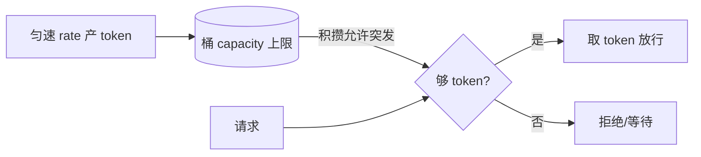
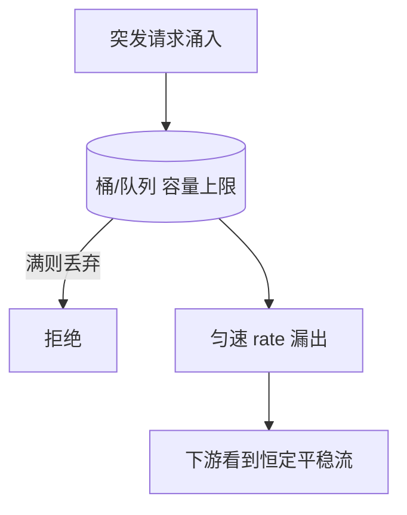

# 令牌桶与漏桶

> 两者都做速率控制，但气质相反：**令牌桶允许突发、追求平均速率**；**漏桶严格恒速、追求平滑输出**。选哪个取决于你要"限流"还是"整流"。

::: tip 一句话结论
令牌桶容忍突发做限流，漏桶严格恒速做整流，二者是语义之别而非优劣。
:::

## 场景问题

服务需要控制请求/操作的速率：API 网关限 QPS、游戏里限玩家技能释放频率、下游写库需要平滑削峰。朴素的**固定窗口计数器**（每秒清零计数）有两个毛病：

- **临界突刺**：窗口边界处（如第 0.99s 和第 1.01s）可放行两倍额度，瞬时打到下游 2×。
- **不平滑**：额度可能在窗口开头一瞬间用光，后面全被拒，体验抖动。

滑动窗口能缓解临界问题，但仍是"计数式"，无法表达"允许一定突发但长期受限"或"严格恒速输出"这类语义。**令牌桶**与**漏桶**正是为此设计。

> **打个比方**：**令牌桶**像景区以固定速率往桶里投游乐券——来一个游客得先拿一张券才能玩。平时没人时券会攒着（攒到桶的上限为止），于是人潮一下涌来时，能靠存货一次放行一批（**允许突发**），但券的产出速率恒定，长期下来照样受限。**漏桶**则像一只桶底开了个固定小孔的水桶：不管上面水倒得多猛，孔口永远匀速滴漏（**严格恒速整流**），水倒太快桶满了就直接溢出（丢弃）。一句话记牢：**令牌桶管"进"（可攒券、容突发），漏桶管"出"（恒速滴、强平滑）**。**类比失效边界**：令牌桶"攒够就放一批"是特性也是坑——若下游其实扛不住瞬时 2 倍突发，这一批放行反而把它打崩，此时该要的是漏桶的恒速；反过来，想保护用户体验、容忍玩家偶尔手快连点，就用令牌桶。二者是语义之别，不是谁更优。

## 实现方案

### 令牌桶（Token Bucket）

- 以固定速率 `rate` 向桶里放 token，桶容量 `capacity` 封顶（放满则溢出丢弃）。
- 请求到来时**取走** N 个 token，取到才放行，取不到则拒绝/等待。
- 空闲时 token 积攒到满桶，因此**允许一次突发**（最多消耗 `capacity` 个），但长期平均速率不超过 `rate`。

关键实现技巧是**惰性计算**：不用后台定时器加 token，而是每次请求时按"距上次的时间差 × rate"补算应新增的 token。



```go
package ratelimit

import (
	"sync"
	"time"
)

// TokenBucket 惰性计算版令牌桶
type TokenBucket struct {
	mu       sync.Mutex
	capacity float64   // 桶容量（允许的突发上限）
	rate     float64   // 每秒产生的 token 数
	tokens   float64   // 当前 token 数
	last     time.Time // 上次补算时间
}

func NewTokenBucket(rate, capacity float64) *TokenBucket {
	return &TokenBucket{
		capacity: capacity,
		rate:     rate,
		tokens:   capacity, // 初始满桶
		last:     time.Now(),
	}
}

// Allow 尝试取 n 个 token，成功返回 true
func (tb *TokenBucket) Allow(n float64) bool {
	tb.mu.Lock()
	defer tb.mu.Unlock()

	now := time.Now()
	elapsed := now.Sub(tb.last).Seconds()
	// 惰性补算：last_time + rate*elapsed，封顶到 capacity
	tb.tokens = min(tb.capacity, tb.tokens+elapsed*tb.rate)
	tb.last = now

	if tb.tokens >= n {
		tb.tokens -= n
		return true
	}
	return false
}

func min(a, b float64) float64 {
	if a < b {
		return a
	}
	return b
}
```

### 漏桶（Leaky Bucket）

- 请求先**入队**（桶），以固定速率从桶底"漏出"被处理。
- 输出速率**严格恒定**，无论输入多突发，下游看到的都是平稳流。
- 桶满则新请求被丢弃/拒绝。**不允许突发透传**——突发只会让队列变长或溢出。



```go
package ratelimit

import (
	"sync"
	"time"
)

// LeakyBucket 匀速漏出版漏桶（计量式实现）
type LeakyBucket struct {
	mu       sync.Mutex
	capacity float64   // 桶容量（排队上限）
	rate     float64   // 每秒漏出速率
	water    float64   // 当前水位（排队量）
	last     time.Time
}

func NewLeakyBucket(rate, capacity float64) *LeakyBucket {
	return &LeakyBucket{capacity: capacity, rate: rate, last: time.Now()}
}

// Allow 请求尝试入桶；桶未满返回 true
func (lb *LeakyBucket) Allow() bool {
	lb.mu.Lock()
	defer lb.mu.Unlock()

	now := time.Now()
	elapsed := now.Sub(lb.last).Seconds()
	// 先漏水：按恒定 rate 减少水位
	lb.water = max(0, lb.water-elapsed*lb.rate)
	lb.last = now

	if lb.water+1 <= lb.capacity {
		lb.water++ // 入桶排队
		return true
	}
	return false // 桶满溢出
}

func max(a, b float64) float64 {
	if a > b {
		return a
	}
	return b
}
```

### 分布式版：Redis + Lua 令牌桶

单机内存桶只对本进程有效。多实例共享限额需把桶状态放 Redis，用 Lua 保证"补算 + 取 token"原子：

```lua
-- token_bucket.lua
-- KEYS[1]=桶key   ARGV[1]=rate ARGV[2]=capacity ARGV[3]=now(秒,浮点) ARGV[4]=需要token数
-- 返回 1=放行 0=拒绝
local key   = KEYS[1]
local rate  = tonumber(ARGV[1])
local cap   = tonumber(ARGV[2])
local now   = tonumber(ARGV[3])
local need  = tonumber(ARGV[4])

local data   = redis.call('HMGET', key, 'tokens', 'ts')
local tokens = tonumber(data[1])
local ts     = tonumber(data[2])
if tokens == nil then tokens = cap; ts = now end

-- 惰性补算
local delta = math.max(0, now - ts) * rate
tokens = math.min(cap, tokens + delta)

local allowed = 0
if tokens >= need then
    tokens = tokens - need
    allowed = 1
end

redis.call('HMSET', key, 'tokens', tokens, 'ts', now)
redis.call('EXPIRE', key, math.ceil(cap / rate) + 1)
return allowed
```

## 为什么这么做

- **惰性计算省定时器**：给每个 key 挂后台加 token 的定时器无法扩展（百万 key 就是百万定时器）。惰性法把"加 token"折算成一次减法，`O(1)` 且无定时器，是工程标准做法。
- **令牌桶允许突发符合真实流量**：真实请求本就是突发的，长期平均受限、短期允许积攒额度爆发，既保护下游又不误伤正常抖动。
- **漏桶恒速保护脆弱下游**：当下游处理能力是硬上限（如第三方 API 每秒只接 100 次、写库 IOPS 固定），必须严格恒速，宁可排队也不透传突发。

## 为什么别的选择不行

- **固定窗口计数器**：临界双倍突刺 + 输出不平滑，只适合粗粒度粗略限流。
- **滑动窗口**：解决了临界问题，但仍无法表达"允许突发"或"严格恒速"语义，且精确滑动窗口要存每个请求时间戳，内存成本高。
- **令牌桶 vs 漏桶互换**：拿漏桶做需要突发的场景会误伤正常尖峰（体验差）；拿令牌桶做需要严格整流的场景，突发会透传打垮脆弱下游。**它们不是优劣关系，是语义不同。**

## 沉淀结论

| 维度 | 令牌桶 | 漏桶 |
|---|---|---|
| 产/漏方式 | 匀速**产 token**，桶存 token | 请求入队，匀速**漏出**处理 |
| 突发 | **允许**（积攒额度爆发） | **不允许**（只会排队/溢出） |
| 输出速率 | 平均受限，短期可超 | **严格恒定** |
| 典型用途 | **限流**（允许突发） | **整流/削峰**（平滑输出） |
| 溢出行为 | token 满则丢弃（不攒更多） | 请求满则拒绝 |

::: tip 一句话记忆
- **令牌桶**：钱可以攒，攒够了能一次大额消费 —— **限流，容忍突发**。
- **漏桶**：水管出水口固定，进多少都匀速流出 —— **整流，绝对平稳**。
- 惰性计算口诀：`tokens = min(cap, tokens + (now - last) * rate)`。
:::

::: warning 与秒杀/限流的关系
秒杀里"MQ 异步下单"就是**漏桶**思想（把突发写整流成平稳落库，见 [游戏秒杀](/game-infra/seckill.md)）；网关 `limit_req` 与服务层多是**令牌桶**（限流允许突发）。限流分层与算法选型详见 [限流与熔断](/game-infra/ratelimit-circuitbreak.md)。
:::

### 记忆口诀

**令牌桶**：匀速产 token / 攒额度 / 容忍突发 / 做限流
**漏桶**：请求入队 / 匀速漏出 / 严格恒速 / 做整流
**惰性计算**：`tokens = min(cap, tokens + (now-last)*rate)` / 免定时器 / O(1)
**选型**：要突发→令牌桶 / 保脆弱下游→漏桶

## 内容来源

- Nginx `limit_req` 模块文档（漏桶 leaky bucket 实现）与 `burst` 参数
- Google Guava `RateLimiter`（SmoothBursty 令牌桶）设计
- Redis 官方 Lua 脚本与限流实践、`redis-cell` 模块（GCRA）
- 《系统设计面试》限流章节；作者在游戏网关/活动限流的落地经验

## 自测：合上资料能说清楚吗？

令牌桶和漏桶都能限速，它们的核心区别是什么？各自适合什么场景？

<details><summary>参考答案</summary>

**令牌桶**匀速产 token、桶可积攒，因此**允许突发**（空闲后可一次爆发消费到 capacity），做**限流**、容忍正常尖峰；**漏桶**请求入队后**严格恒速漏出**，输出绝对平稳、不透传突发，做**整流削峰**、保护处理能力固定的脆弱下游。二者是语义之别，非优劣。

</details>

为什么令牌桶实现要用"惰性计算"而不是后台定时器加 token？

<details><summary>参考答案</summary>

给每个 key 挂**定时器无法扩展**（百万 key 即百万定时器）。惰性法在每次请求时按 `tokens = min(cap, tokens + (now-last)*rate)` 一次性补算，**O(1) 且无定时器**，是工程标准做法。

</details>

固定窗口计数器有什么毛病，为什么令牌桶/漏桶能解决？

<details><summary>参考答案</summary>

固定窗口有**临界双倍突刺**（窗口边界处可放行 2× 额度）和**输出不平滑**（额度开头一瞬用光）。令牌桶用平均速率约束长期总量、漏桶用恒速漏出保证平滑，都从"计数"升级为"速率语义"，规避了临界问题。

</details>

分布式限流为什么要用 Redis + Lua，而不是各实例本地内存桶？

<details><summary>参考答案</summary>

本地内存桶**只对本进程有效**，多实例总限额会被放大 N 倍。把桶状态存 Redis 共享，用 **Lua 保证"补算 + 取 token"原子**执行，避免并发下的竞态，实现真正的全局限额。

</details>

秒杀场景里"MQ 异步下单"更像令牌桶还是漏桶？为什么？

<details><summary>参考答案</summary>

更像**漏桶**。突发下单请求先入 MQ 排队，消费者以**恒定速率**平稳落库，把瞬时洪峰整流成下游能承受的平滑流——这正是漏桶"削峰/整流"的思想，而非令牌桶的"容忍突发"。

</details>
