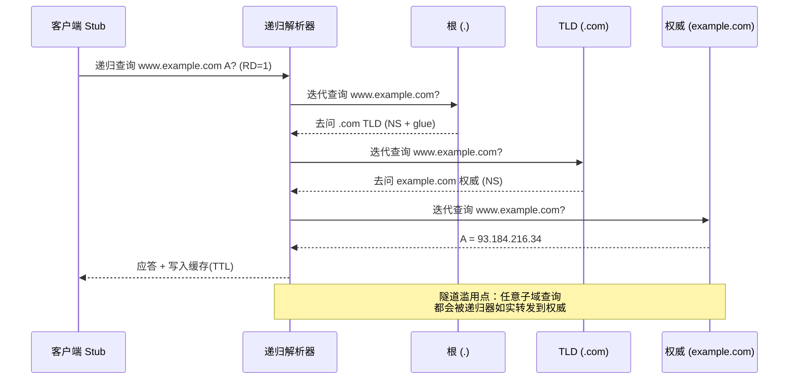
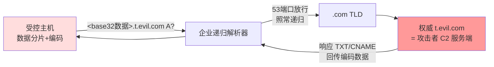
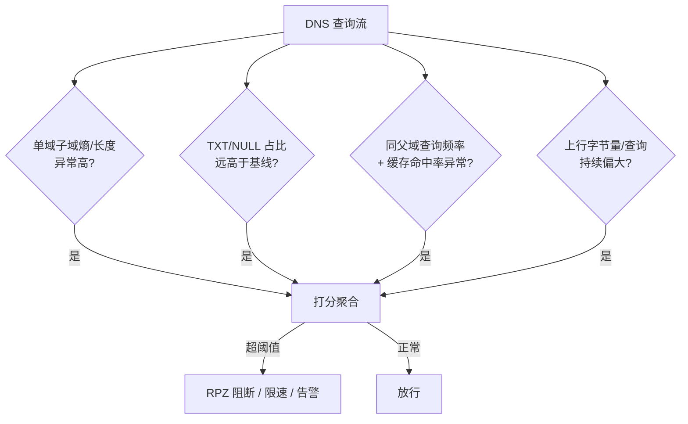

# DNS 攻防与隧道

> 从 DNS 报文与递归解析链路出发，梳理常见攻击面（缓存投毒、反射放大、随机子域水刷、域前置）与 DNS 隧道的编码/外带原理，落脚在**检测特征与防御**。

::: warning 用途声明
本文站在**防御与检测**视角组织内容。DNS 隧道部分只讲协议原理、编码方式与可观测的检测特征，用于帮助工程师识别并阻断异常流量，**不提供可直接武器化的攻击步骤或工具参数**。
:::

## 场景问题

DNS 是互联网的"电话簿"，几乎所有业务的第一跳都要经过它。它有几个天然属性让它同时成为**攻击目标**和**攻击载体**：

- **明文 UDP、无连接、无认证**：报文可被伪造，无状态使得响应难以严格绑定请求。
- **53 端口几乎全网放行**：即便内网出口有严格防火墙策略，DNS 解析通常必须放通（否则业务无法上网），这就给隐蔽信道留了一扇门。
- **递归解析天然具备"代理"能力**：一次查询会由本地递归服务器代替客户端去访问权威服务器，这条链路可被滥用来把数据"驮"到外部权威服务器。

我们要回答三类问题：DNS 报文长什么样、解析链路怎么走？攻击者能在链路的哪些环节做手脚？作为防御方，如何从流量里把异常"看"出来并阻断？

## 实现方案

### DNS 报文结构（RFC 1035）

DNS 报文由固定 12 字节头部 + 若干可变区段（Question / Answer / Authority / Additional）组成。头部结构：

```
                                1  1  1  1  1  1
  0  1  2  3  4  5  6  7  8  9  0  1  2  3  4  5
+--+--+--+--+--+--+--+--+--+--+--+--+--+--+--+--+
|                      ID                       |   16-bit 事务 ID（请求/响应配对）
+--+--+--+--+--+--+--+--+--+--+--+--+--+--+--+--+
|QR|   Opcode  |AA|TC|RD|RA|   Z    |   RCODE   |   标志位
+--+--+--+--+--+--+--+--+--+--+--+--+--+--+--+--+
|                    QDCOUNT                     |   Question 数
+--+--+--+--+--+--+--+--+--+--+--+--+--+--+--+--+
|                    ANCOUNT                     |   Answer 数
+--+--+--+--+--+--+--+--+--+--+--+--+--+--+--+--+
|                    NSCOUNT                     |   Authority 数
+--+--+--+--+--+--+--+--+--+--+--+--+--+--+--+--+
|                    ARCOUNT                     |   Additional 数
+--+--+--+--+--+--+--+--+--+--+--+--+--+--+--+--+
```

关键字段与安全含义：

- **ID + 源端口（16 bit + 16 bit）**：这是 UDP DNS 唯一的"防伪"熵。响应必须匹配请求的 ID、源/目的端口、Question 才被接受。若可预测，攻击者就能伪造抢答（见缓存投毒）。
- **QR**：0 请求 / 1 响应。**TC**：截断标志，UDP 超 512 字节（或 EDNS0 协商的更大值）置位，客户端应改用 TCP 重试。
- **Question 区段的域名**采用 label 序列编码：`3www7example3com0`，每个 label 前一字节长度，`0` 结尾。**攻击者正是把数据藏进这些 label。**
- **RR 类型**：A / AAAA / CNAME / **TXT**（任意文本，隧道常用）/ **NULL**（RFC 弃用但可携带任意二进制，老式隧道用）/ MX 等。

### 递归解析链路



**要点**：客户端对递归器用**递归查询**（RD=1，"帮我查到底"）；递归器对根/TLD/权威用**迭代查询**（每步返回下一跳 NS）。缓存以 TTL 为界。**这条"任意子域都会被转发到对应权威服务器"的特性，正是 DNS 隧道成立的物理基础。**

### 常见攻击面

**1）缓存投毒 / Kaminsky 攻击**

原理：递归器缓存未命中时会去问权威，攻击者抢在真实权威之前伪造一个响应。UDP DNS 的"防伪熵"只有 16-bit ID（若源端口固定，就只有 6.5 万种可能）。Kaminsky 的放大点在于：不停查询 `随机1.bank.com`、`随机2.bank.com`……每次 miss 都触发一次向权威的查询，从而获得海量"抢答"窗口，一旦某次伪造响应里用 Additional 区段塞进 `bank.com` 的 NS/glue 记录，就能污染整个域。

::: tip 防御
**源端口随机化 + 0x20 大小写混淆 + DNSSEC**。前两者把可猜测熵从 16-bit 提到 30+ bit；DNSSEC 用签名从根本上让伪造响应无法通过验证。
:::

**2）DDoS 反射放大**

DNS 响应远大于请求（一个 60 字节的 `ANY` 查询可换来数千字节响应，放大比几十倍）。攻击者伪造受害者源 IP，向大量开放递归器/权威发查询，响应洪水涌向受害者。防御：**关闭开放递归、Response Rate Limiting（RRL）、禁用/限制 ANY、uRPF 反向路径校验、BCP38 源地址过滤**。

**3）随机子域水刷（Water Torture / NXDOMAIN 攻击）**

攻击者构造大量 `<随机>.victim.com` 查询打向递归器。这些子域必然缓存 miss，递归器被迫全部转发给 `victim.com` 权威，既打满权威也撑爆递归器的解析队列（outstanding query）。特征是**同一父域下海量互不重复、无意义的子域 + 高 NXDOMAIN 比例**。

**4）域前置（Domain Fronting）**

利用 CDN 上 TLS SNI（明文域名）与 HTTP Host 头（加密）可以不一致：DNS/SNI 声称访问一个"干净"的大站，实际 Host 指向同一 CDN 上的隐蔽后端。严格说这偏 TLS/CDN 层，但常与 DNS 侧的伪装配合。主流 CDN 已陆续禁止 SNI≠Host。

### DNS 隧道原理（检测视角）

隧道的本质：**把要外带的数据编码进域名的子域部分或 TXT/NULL 记录，借递归链路让权威服务器（攻击者控制）收到并解码，再把回传数据编码进响应**。



编码与分片的可观测特征（**不含参数级细节**）：

- 上行数据被 base32/base64 后切片塞进多级子域 label（单个 label ≤63 字节、整名 ≤253 字节，所以隧道必然**高频、小分片**）。
- 下行用 TXT / NULL / CNAME 携带二进制，QTYPE 分布明显偏离正常业务（正常流量以 A/AAAA 为主）。
- 为绕过缓存，隧道**每次查询子域都不同**（不可缓存），导致缓存命中率异常低。

**为什么能穿透多数防火墙**：企业出口通常放行 53 端口且不深度检查 DNS 内容；即便封了直连，内网主机→内网递归器→外部权威这条"合法"链路依然通畅，隧道数据被"驮"出去。

### 检测特征与防御



检测信号小结：

| 维度 | 正常 | 隧道嫌疑 |
|---|---|---|
| 子域长度/熵 | 短、可读、低熵 | 长、高熵（编码后近似随机） |
| QTYPE 分布 | A/AAAA 为主 | TXT/NULL/CNAME 占比高 |
| 缓存命中率 | 高 | 极低（每次子域不同） |
| 每查询数据量 | 小 | 上行 label 持续接近上限 |
| 单域查询频率 | 平稳 | 突发高频、长时会话 |

防御手段：**RPZ（Response Policy Zone）** 按域/正则阻断已知恶意域并给出 sinkhole 应答；**查询限速（RRL）**；**深度包检测 / DGA 分类器**对子域做熵与词法分析；**只允许经受控递归器出网、封堵直连 53**；权威侧启用 DNSSEC。

## 为什么这么做

- **为什么防伪只能靠 ID+端口+0x20+DNSSEC**：UDP DNS 无连接、无握手，唯一能绑定"请求-响应"的就是这几个字段的熵。加大熵（端口随机、大小写混淆）只是提高伪造成本，**DNSSEC 才是密码学层面的根治**——用链式签名让任何篡改在验证时暴露。
- **为什么隧道检测偏统计而非签名**：隧道工具的编码字母表、分片大小可任意调整，静态签名容易被绕过；而"高熵子域 + 低缓存命中 + 异常 QTYPE 分布 + 长会话"这些**行为统计特征**是隧道为了传输效率与穿透性付出的代价，难以同时消除，因而更鲁棒。
- **为什么在递归器/出口做管控最有效**：递归器是内网所有 DNS 的必经汇聚点，天然是最佳观测与阻断位置；封堵主机直连 53 则消除了绕过递归器的旁路。

## 为什么别的选择不行

- **只靠端口封堵不行**：53 端口通常业务必需，一封业务全断；且隧道也可走 DoH/DoT（443/853）伪装成 HTTPS，纯端口策略失效。需要的是**内容与行为层面**的检测。
- **只靠静态黑名单（域名 IoC）不行**：隧道域名可无限翻新、可租用一次性域名，黑名单永远滞后。必须辅以**行为/统计检测**捕获未知域。
- **不上 DNSSEC 只靠端口随机化不行**：0x20 与端口随机化只是提升伪造成本，面对能大量重试或抢占路径的攻击者仍可能被打穿；DNSSEC 才提供可验证的完整性保证。
- **在应用层做 DPI 而放任 UDP 直出不行**：若主机可直连外部递归器/权威，所有出口检测都被旁路。**必须先收敛出网路径**，再谈检测。

## 沉淀结论

1. **DNS 的三大原罪**：明文 UDP 无认证、53 全网放行、递归天然具备代理能力——分别对应可伪造、可隐蔽、可外带。
2. **攻击面记忆锚点**：投毒靠猜 ID（→端口随机化/DNSSEC）、反射靠放大比（→关递归/RRL/禁 ANY）、水刷靠缓存 miss（→随机高熵子域是特征）、隧道靠子域/TXT 编码（→高熵+低命中+异常 QTYPE）。
3. **检测哲学**：签名易绕，**统计与行为特征才鲁棒**；管控点选在**递归器与出口**，先收敛路径再做 DPI。
4. **防御纵深**：DNSSEC（完整性）→ RPZ + 限速（策略阻断）→ 熵/词法分类器（未知威胁）→ 出网收敛（消除旁路），逐层叠加而非单点依赖。

## 内容来源

综合整理。主要参考方向：RFC 1035（DNS 报文与解析）、RFC 4033-4035（DNSSEC）、RFC 5452（DNS 抗欺骗弹性、端口随机化）、Kaminsky 缓存投毒公开分析、DNS Response Rate Limiting（RRL）与 RPZ 规范、各厂商 DNS 隧道检测白皮书中公开的行为特征（高熵子域 / QTYPE 分布 / 缓存命中率）。
