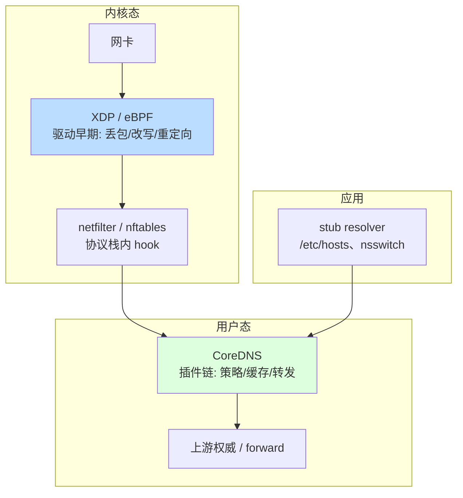
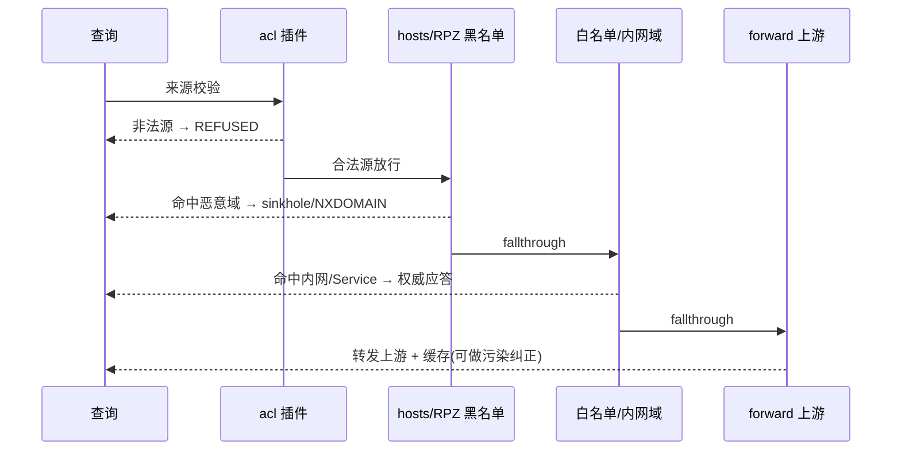

# DNS 清洗拦截与 CoreDNS

> DNS 拦截可以发生在三个层次——应用层解析器、CoreDNS 插件链、内核态（XDP-eBPF / netfilter）。本文讲清各层的取舍、内核态为什么快、CoreDNS 的插件化架构，以及为什么它取代了 kube-dns / dnsmasq。

::: tip 一句话结论
XDP 挡洪水、CoreDNS 插件链做策略、应用层兜底——分层协同各司其职。
:::

## 场景问题

无论是**安全清洗**（拦截恶意域、纠正污染）还是**基础设施解析**（K8s 集群内 Service 发现），我们都需要在 DNS 链路上"插一脚"：对某些查询直接返回预设答案、阻断、改写或转发到不同上游。

问题在于：这一脚该插在哪一层？

- 插在**内核最前端（XDP）**：拦截每秒千万级洪水最省 CPU，但表达能力弱，只能做丢包/改写等简单动作。
- 插在**用户态服务（CoreDNS）**：表达能力强、可编排复杂策略、可观测，但每个包要经历内核→用户态拷贝，吞吐受限。

> **打个比方**：在 DNS 链路上拦截，就像给小区设两道关卡。**XDP（内核最前端）**是杵在大门口的保安——只会照黑名单干粗活："这人有前科，拦！其余放行"，动作糙、判断浅，但快得离谱、再汹涌的人潮也扛得住。**CoreDNS（用户态）**是物业办公室——能查复杂规则、按部门转办、还留台账（可观测、可编排），但每个人都得进屋排队办手续，慢。聪明的做法是**分层协同**：门口保安先把洪水般的明显坏人挡掉（DDoS、已知恶意域），复杂的事进办公室慢慢办，应用层解析器再做最后兜底。**类比失效边界**：别贪心把所有策略都塞给门口保安——XDP 连"这个域名归哪个上游、匹配哪条正则"这种需要访问复杂状态的判断都做不了（表达能力弱）；可反过来要是把每秒千万级的查询洪水全赶进办公室排队，CoreDNS 当场就被拖垮。两道关卡各有各的活，谁也替不了谁。
- 插在**应用层解析器（stub / libc resolver）**：最灵活但只影响本机、无法集中管控。

一个成熟的方案往往是**分层协同**：XDP 挡洪水，CoreDNS 做策略，应用层做兜底。

## 实现方案

### 三个拦截层次



| 层次 | 位置 | 擅长 | 局限 |
|---|---|---|---|
| 应用层解析器 | 进程内 / 本机 | 灵活、hosts 覆盖 | 只影响本机，无集中管控 |
| CoreDNS 插件链 | 用户态服务 | 复杂策略、可观测、可编排 | 用户态拷贝，吞吐上限低于内核 |
| 内核态 XDP/eBPF | 网卡驱动 / 协议栈 | 极高 PPS、抗 DDoS、低延迟 | 表达能力弱、开发/调试门槛高 |

### 内核态拦截为什么快

XDP（eXpress Data Path）把 eBPF 程序挂在**网卡驱动收包的最早期**（甚至 NIC 支持时可 offload 到网卡），在 `sk_buff` 分配之前就处理裸帧，可返回 `XDP_DROP` / `XDP_TX`（原路发回）/ `XDP_REDIRECT` / `XDP_PASS`。

```c
/* XDP 伪码：早期丢弃/应答被封禁域的 DNS 查询（示意，非完整可运行程序） */
SEC("xdp")
int dns_filter(struct xdp_md *ctx) {
    void *data     = (void *)(long)ctx->data;
    void *data_end = (void *)(long)ctx->data_end;

    /* 1. 边界校验 + 解析 eth/ip/udp（verifier 强制边界检查）*/
    struct ethhdr *eth = data;
    if ((void*)(eth + 1) > data_end) return XDP_PASS;
    if (eth->h_proto != bpf_htons(ETH_P_IP)) return XDP_PASS;

    struct iphdr *ip = (void*)(eth + 1);
    if ((void*)(ip + 1) > data_end) return XDP_PASS;
    if (ip->protocol != IPPROTO_UDP) return XDP_PASS;

    struct udphdr *udp = (void*)ip + ip->ihl * 4;
    if ((void*)(udp + 1) > data_end) return XDP_PASS;
    if (udp->dest != bpf_htons(53)) return XDP_PASS;

    /* 2. 提取 QNAME，查 eBPF map（内核态黑名单哈希表）*/
    __u64 key = qname_hash(udp, data_end);      /* 示意函数 */
    __u8 *blocked = bpf_map_lookup_elem(&blacklist, &key);

    /* 3. 命中即在驱动早期丢弃，绝不进入协议栈/用户态 */
    if (blocked && *blocked) {
        __sync_fetch_and_add(&stats_dropped, 1);
        return XDP_DROP;                         /* 或改写为 sinkhole 后 XDP_TX */
    }
    return XDP_PASS;
}
```

快在四点：**① 绕过用户态拷贝**（不经 socket、不 copy_to_user）；**② 早期丢包**——在 `sk_buff` 分配、协议栈遍历之前就决策，省下最贵的内存分配与栈处理；**③ map 查表 O(1)**；**④ 可 NIC offload**。因此清洗洪水（如反射放大、水刷）用 XDP 每核可达千万 PPS 级。

### CoreDNS 架构与插件链

CoreDNS 是 Go 编写的 DNS 服务器，核心是**插件链（plugin chain）**：一次查询像流水线一样依次经过 Corefile 里声明的插件，每个插件可以处理并返回、也可以透传给下一个。

```
# Corefile 示例：K8s 集群 DNS + 安全清洗
.:53 {
    # ── 安全/策略层 ──
    acl {                      # 来源 ACL：只允许集群内网段查询
        allow net 10.0.0.0/8
        block
    }
    hosts /etc/coredns/blocklist.hosts {   # 黑名单 sinkhole
        fallthrough                        # 未命中则继续下一插件
    }
    rewrite name suffix .internal.example .svc.cluster.local   # 域名改写

    # ── 集群解析层 ──
    kubernetes cluster.local in-addr.arpa ip6.arpa {           # 承接 Service 解析
        pods insecure
        fallthrough in-addr.arpa ip6.arpa
    }

    # ── 缓存/转发层 ──
    template ANY AAAA sink.example.com {   # 对某域强制返回空 AAAA
        rcode NOERROR
    }
    cache 30                               # 30s 正/负缓存
    forward . 8.8.8.8 1.1.1.1 {            # 上游递归
        policy sequential
        health_check 5s
    }
    prometheus :9153                       # 可观测：暴露指标
    log
    errors
}
```

插件链的顺序在编译期由 `plugin.cfg` 固定优先级（不是 Corefile 里的书写顺序），运行时按该链依次调用。常用插件：`forward`（上游转发）、`cache`（缓存）、`hosts`（静态覆盖）、`rewrite`（改写请求/响应）、`template`（按模板合成应答）、`acl`（来源过滤）、`kubernetes`（Service 解析）、`rewrite`/`view`（分流）。

### 清洗策略



- **黑白名单**：`hosts` / `acl` / RPZ（Response Policy Zone）按域或正则给出 sinkhole 应答或直接 NXDOMAIN。
- **RPZ**：把"策略"表达为一个特殊 DNS zone，命中即改写响应，规则可从威胁情报动态同步。
- **污染检测与纠正**：对疑似被投毒/劫持的响应（如返回明显不属于该域的 IP、或与多上游交叉验证不一致）丢弃并从可信上游（DoH/DoT）重取。

## 为什么这么做

- **为什么分层**：DDoS 洪水量级下，用户态每包拷贝是不可承受之重，必须用 XDP 在驱动层"削峰"；而复杂策略（K8s Service 解析、RPZ、改写、可观测）在内核里表达代价极高，交给 CoreDNS 最合适。**各层做自己最擅长的事**。
- **为什么内核态用 eBPF 而非改内核**：eBPF 程序经 verifier 校验后安全地跑在内核里，可热加载、可观测、无需重编译内核模块，兼顾内核态性能与用户态的迭代速度。
- **为什么 CoreDNS 用插件链**：DNS 策略本质是"对查询做一串有序处理"，链式模型让每个关注点（缓存/转发/改写/过滤）独立成插件、可自由组合、可单独测试与替换，符合 Unix 管道哲学。

## 为什么别的选择不行

- **为什么用 CoreDNS 取代 kube-dns**：kube-dns 是 `dnsmasq + kube-dns + sidecar` 三容器拼装，职责分散、扩展要改多处、可观测差。CoreDNS **单二进制 + 插件化**，加一个能力只需启用一个插件；原生 Prometheus 指标；Go 生态与 K8s 同源，社区维护统一。CNCF 因此将其定为 K8s 默认集群 DNS。
- **为什么不用 dnsmasq 承接集群 DNS**：dnsmasq 面向家用/小型网络，配置是扁平指令、无插件体系、无原生 Service 发现、可观测薄弱；面对 K8s 动态 Service/Endpoint 的规模与变更频率力不从心。
- **为什么不把所有清洗都放 XDP**：XDP 表达能力弱（无完整解析器、map 大小与栈深受 verifier 限制），做复杂策略、日志、上游转发、缓存都极其笨重；它只应承担"高 PPS 的简单丢包/改写"。
- **为什么不只靠应用层 hosts**：`/etc/hosts` 只影响本机、无法集中下发与观测、无策略引擎；规模化管控必须有一个集中的 DNS 服务层（CoreDNS）。

## 沉淀结论

1. **三层拦截各司其职**：XDP 挡洪水（PPS）、CoreDNS 做策略（表达力+可观测）、应用层 hosts 兜底（本机）。
2. **内核态快的本质**：绕过用户态拷贝 + 在 `sk_buff` 分配前早期决策 + map O(1) 查表 +（可）NIC offload。
3. **CoreDNS = 单二进制 + 插件链**：Corefile 声明式编排 `acl/hosts/rewrite/kubernetes/cache/forward`，链式处理，天然可观测（prometheus 插件）。
4. **取代 kube-dns/dnsmasq 的理由**：插件化扩展、Go 生态同源、原生指标——用一句话记：**"配置即插件，观测即内建"**。
5. **清洗策略骨架**：来源 ACL → 黑名单 sinkhole → 白名单/内网权威 → 上游转发+缓存+污染纠正。

### 记忆口诀

**三层**：XDP 挡洪水 / CoreDNS 做策略 / hosts 兜底
**内核快**：免拷贝 / sk_buff 前决策 / map O(1) / NIC offload
**CoreDNS**：单二进制 / 插件链 / Corefile 编排 / prometheus 内建
**取代理由**：配置即插件 / 观测即内建 / Go 同源

## 内容来源

综合整理。主要参考方向：CoreDNS 官方文档与插件手册（Corefile、plugin.cfg 链序、forward/cache/hosts/rewrite/template/acl/kubernetes 插件）、Linux 内核 XDP/eBPF 文档（`Documentation/networking/`、eBPF verifier 与 XDP action）、Kubernetes 集群 DNS 演进（kube-dns → CoreDNS）设计说明、RPZ（Response Policy Zone）规范。

## 自测：合上资料能说清楚吗？

DNS 拦截的三个层次分别在哪里、各自擅长与局限是什么？

<details><summary>参考答案</summary>

**应用层解析器**（进程/本机）：灵活、hosts 覆盖，但只影响本机无集中管控；**CoreDNS 插件链**（用户态）：复杂策略、可观测、可编排，但用户态拷贝吞吐上限低；**内核态 XDP/eBPF**（网卡驱动）：极高 PPS、抗 DDoS，但表达能力弱、调试门槛高。

</details>

为什么内核态（XDP）拦截 DNS 比用户态快？请说出关键机制。

<details><summary>参考答案</summary>

四点：**① 绕过用户态拷贝**（不经 socket、无 copy_to_user）；**② 早期丢包**——在 `sk_buff` 分配、协议栈遍历之前决策，省最贵的内存分配与栈处理；**③ map 查表 O(1)**；**④ 可 NIC offload**。因此清洗洪水每核可达千万 PPS 级。

</details>

CoreDNS 的插件链是怎么工作的？其顺序由什么决定？

<details><summary>参考答案</summary>

一次查询像**流水线**依次经过 Corefile 声明的插件，每个插件可处理返回或透传下一个。链序在**编译期由 `plugin.cfg` 固定优先级**决定，**不是** Corefile 书写顺序。常用：`acl/hosts/rewrite/kubernetes/cache/forward/template`。

</details>

对比 CoreDNS 与 kube-dns / dnsmasq，为什么 K8s 选 CoreDNS 作默认集群 DNS？

<details><summary>参考答案</summary>

**kube-dns** 是 dnsmasq+kube-dns+sidecar 三容器拼装，职责分散、可观测差；**dnsmasq** 面向家用、扁平配置无插件、无原生 Service 发现。**CoreDNS** 单二进制+插件化，加能力只需启用一插件，原生 Prometheus 指标，Go 生态与 K8s 同源——「配置即插件，观测即内建」。

</details>

一条完整的 DNS 清洗策略链应包含哪些环节？

<details><summary>参考答案</summary>

骨架：**来源 ACL**（非法源 REFUSED）→ **黑名单 sinkhole/NXDOMAIN**（hosts/RPZ）→ **白名单/内网权威**（kubernetes Service 解析）→ **上游 forward + cache + 污染纠正**（交叉验证不一致则从 DoH/DoT 可信上游重取）。

</details>
