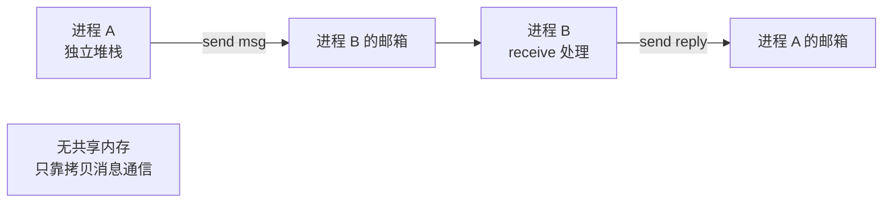
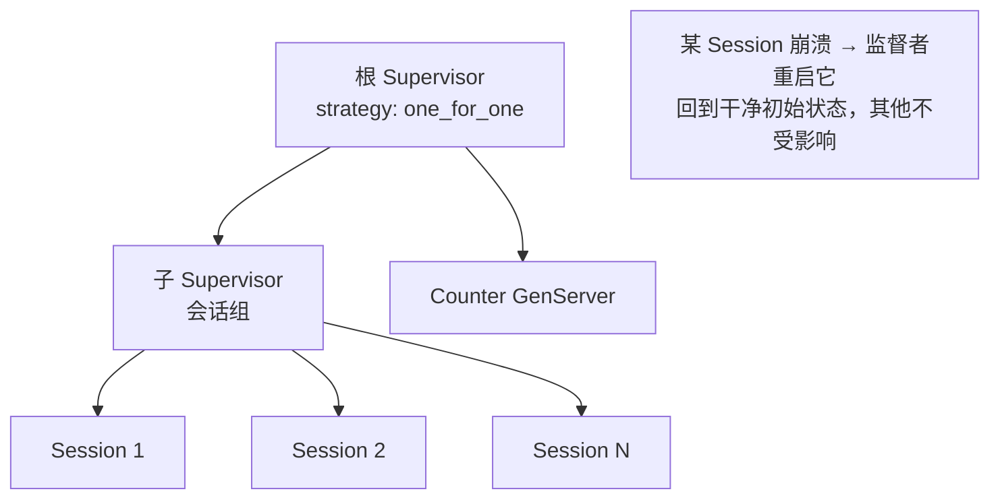

# Elixir 与函数式 / BEAM

> 为什么电信设备能做到"九个九"的可用性、单机扛百万连接？答案是 BEAM 上的轻量进程 + Actor 模型 + OTP 监督树，加上"let it crash"这套反直觉的容错哲学。Elixir 是这套 30 年老底子的现代语法外壳。

## 场景问题

某些系统对**高并发 + 软实时 + 容错**的要求是普通线程模型难以满足的：

- **海量并发连接**：即时通讯、推送网关、IoT 接入，单机几十万到百万长连接，每个连接需要独立、隔离的状态。
- **软实时**：不是硬实时（不保证微秒级），但要求延迟稳定、无长时间停顿（GC 不能 Stop-The-World 卡全局）。
- **电信级容错**：某个连接/会话崩了，绝不能影响其他连接；系统要能自愈，可用性逼近 99.9999999%。
- **热更新**：电信设备不能停机升级。

传统"共享内存 + 锁 + 大线程"模型在这里处处碰壁：线程重（MB 级栈）、锁竞争、一个线程崩溃可能带崩进程、全局 GC 停顿。BEAM（Erlang 虚拟机）+ 函数式 + Actor 就是为这类问题从头设计的运行时。

## 实现方案

### 函数式基石：不可变数据 + 模式匹配 + 递归

```elixir
# 不可变：更新 map 不改原值，返回新值
person = %{name: "Ada", age: 36}
older = %{person | age: 37}    # person 不变，older 是新 map

# 模式匹配：解构 + 断言合一
{:ok, value} = {:ok, 42}       # 匹配成功，value = 42
{:ok, value} = {:error, :nope} # 匹配失败 → 抛异常（fail fast）

# 用递归 + 模式匹配替代 for 循环（函数多子句按模式分派）
def sum([]), do: 0                      # 边界：空列表
def sum([head | tail]), do: head + sum(tail)  # 拆头递归

# 尾递归 + 累加器，避免爆栈（BEAM 对尾调用优化）
def sum_tr(list, acc \\ 0)
def sum_tr([], acc), do: acc
def sum_tr([h | t], acc), do: sum_tr(t, acc + h)
```

- **不可变数据**：数据一旦创建不可修改，"修改"即产生新值。天然无数据竞争——多个进程读同一份数据无需加锁。
- **无副作用**：函数输入决定输出，易测试、易推理、可安全并行。
- **模式匹配 + 递归替代循环**：函数式没有可变循环变量，用递归（尤其尾递归）+ 多子句模式匹配表达迭代，代码声明式、清晰。

### Actor 模型：轻量进程 + 消息传递



BEAM 的并发单位是**轻量进程**（不是 OS 线程/进程）：

- **极轻**：初始几 KB 内存，创建微秒级，单机可跑**数百万**个。
- **完全隔离**：每个进程有**独立的堆和 GC**，进程间**不共享任何内存**，只能通过**消息传递**（消息被拷贝到对方邮箱）通信。
- **抢占式调度**：BEAM 调度器（每 CPU 核一个）在进程间公平抢占调度（按 reduction 计数），单个进程无法饿死别人。
- **独立 GC**：每个进程单独 GC，**没有全局 Stop-The-World**，所以延迟稳定——这是"软实时"的关键。

```elixir
# 裸进程：spawn + send + receive
pid = spawn(fn ->
  receive do
    {:hello, from} -> send(from, {:reply, "hi"})
  end
end)
send(pid, {:hello, self()})
```

### OTP：GenServer + Supervisor 监督树

裸 `spawn/send/receive` 很少直接用，生产用 **OTP** 抽象。GenServer 封装"有状态服务进程"的通用模式：

```elixir
defmodule Counter do
  use GenServer

  # ---- 客户端 API（在调用者进程里执行）----
  def start_link(init), do: GenServer.start_link(__MODULE__, init, name: __MODULE__)
  def inc, do: GenServer.cast(__MODULE__, :inc)        # 异步，不等回复
  def get, do: GenServer.call(__MODULE__, :get)        # 同步，等回复

  # ---- 服务端回调（在 GenServer 进程里串行执行，天然无锁）----
  @impl true
  def init(init), do: {:ok, init}                       # 初始化状态

  @impl true
  def handle_cast(:inc, state), do: {:noreply, state + 1}

  @impl true
  def handle_call(:get, _from, state), do: {:reply, state, state}
end
```

::: tip GenServer 为什么无需加锁
一个 GenServer 进程的状态只被它自己**串行**处理消息时访问，消息在邮箱里排队逐个处理。没有并发访问同一状态，自然不需要锁——这就是 Actor 模型消解锁的方式：**用"串行处理 + 隔离"替代"并行访问 + 加锁"**。
:::

**Supervisor 监督树 + let-it-crash**：

```elixir
defmodule App.Supervisor do
  use Supervisor
  def start_link(arg), do: Supervisor.start_link(__MODULE__, arg, name: __MODULE__)

  @impl true
  def init(_) do
    children = [
      {Counter, 0},
      {SessionRegistry, []},
    ]
    # 重启策略：one_for_one（谁崩重启谁）
    Supervisor.init(children, strategy: :one_for_one, max_restarts: 3, max_seconds: 5)
  end
end
```



- **let it crash（放任崩溃）**：不写防御性 try/catch 兜住所有异常。进程遇到未预期错误就让它崩，监督者**把它重启回一个已知的干净状态**。因为进程隔离，一个崩溃不扩散。
- **监督策略**：`one_for_one`（崩谁重启谁）、`one_for_all`（一个崩全部重启）、`rest_for_one`（崩它及其后启动的）。
- **重启上限**：`max_restarts/max_seconds` 内崩太频繁则监督者自己也崩，向上冒泡——避免无限重启掩盖真 bug。

### 为什么这套能做电信级容错


崩溃被隔离在单个轻量进程内，监督者秒级重启回干净状态，故障不扩散、系统自愈——这就是 Erlang/OTP 在电信设备上做到"九个九"的机制。

## 为什么这么做

### 为什么不可变 + 无共享让并发变简单

并发 bug 的根源是**多个执行流并发修改共享的可变状态**（数据竞争）。函数式的不可变数据 + Actor 的无共享内存**从根上消灭了这个前提**：没有共享可变状态，就没有数据竞争，就不需要锁，也就没有死锁、锁竞争、内存可见性这些问题。状态被封在各自的进程里，只能通过消息改变。这让"写正确的高并发程序"从"如履薄冰"变成"默认安全"。

### 为什么 let-it-crash 反而更可靠

传统思路是"预判所有错误并防御"。但错误组合无穷，防御代码本身也可能有 bug，还把主逻辑搞得面目全非。OTP 的思路是：**只处理你预期的正常路径，异常就崩，交给监督者重启到已知好状态**。因为：

- 进程隔离 + 状态外置（监督者持有重启逻辑），重启代价极低。
- 大量瞬时错误（网络抖动、偶发脏数据）重启一次就好了，无需精心处理每种。
- 主逻辑保持干净，可靠性反而更高。

### 为什么独立 GC 支撑软实时

每个进程独立小堆、独立 GC，回收只停这一个进程（且它的堆很小，停顿微不足道），**永远没有全局 STW**。相比之下 JVM/Go 的全局 GC 即便优化得很好也会有全局停顿波动。这让 BEAM 的**尾延迟（P99/P999）异常稳定**，正是软实时要的。

## 为什么别的选择不行

### 为什么 Go/Java 的线程模型在此场景不如 BEAM

| 维度 | BEAM 进程 | Go goroutine | Java 线程 |
|---|---|---|---|
| 隔离性 | 完全隔离（独立堆/GC） | 共享内存（要 channel/锁自律） | 共享内存（要锁） |
| 崩溃影响 | 单进程崩不扩散 | panic 不 recover 会**带崩整个进程** | 未捕获异常影响所在线程/JVM |
| GC | 每进程独立、无全局 STW | 全局 GC（有 STW，虽短） | 全局 GC（STW 波动） |
| 容错模型 | 内建监督树/OTP | 需自己搭 | 需自己搭 |
| 热更新 | 内建（code reload） | 无 | 弱 |

- **Go**：goroutine 也很轻、调度也好，但 goroutine **共享内存**，仍需 channel/锁自律，且一个 goroutine 的 `panic` 未 recover 会带崩整个进程——没有 BEAM 那种"崩溃被隔离在单进程 + 监督树自愈"的内建容错。
- **Java**：线程重、共享内存靠锁、全局 GC 有 STW 波动，做百万连接和软实时都吃力。

BEAM 的杀手锏不是"更快"，而是**隔离 + 监督 + 无全局 STW** 这套为容错和软实时量身定做的组合，Go/Java 要自己费力拼凑且做不到同等隔离度。

### 为什么函数式 + Actor 不适合计算密集 / 大可变数组

- **计算密集（数值计算、加解密热循环）**：函数式的不可变意味着"改一个元素要生成新结构"，对**大数组的原地修改**极不友好；BEAM 的数值计算性能也远不如 C/Rust/Go。这类任务该用命令式语言 + 可变数组，或把热点用 NIF（原生 C）外挂。
- **需要可变大数组/矩阵**：不可变数据结构（持久化数据结构靠共享 + 部分拷贝）在"频繁原地写大数组"场景开销大。图像处理、科学计算、游戏物理这类应选可变内存模型的语言。

**结论**：Elixir/BEAM 的甜点是 **I/O 密集 + 海量并发连接 + 软实时 + 高容错**（聊天、推送、IoT 接入、Web 后端）；**不是** CPU 密集的数值计算。用错场景就是拿容错换性能的亏本买卖。

## 沉淀结论

**复习要点**

- **函数式三件套**：不可变数据（无数据竞争）、无副作用（易推理/并行）、模式匹配 + 递归（替代循环，尾递归防爆栈）。
- **BEAM 轻量进程**：几 KB、微秒创建、百万级、**独立堆 + 独立 GC + 无共享内存**，抢占式调度，靠**消息传递**通信 —— 即 Actor 模型。
- **OTP**：GenServer 封装有状态服务（消息串行处理，天然无锁）；Supervisor 监督树 + **let-it-crash**（崩了重启到干净状态，进程隔离故障不扩散）；重启策略 one_for_one/all/rest_for_one + 重启上限。
- **软实时**靠每进程独立 GC、**无全局 STW**，尾延迟稳定。
- vs Go/Java：BEAM 胜在**隔离 + 监督 + 无全局 STW** 的内建容错，非速度；Go 共享内存 + panic 会带崩进程，Java 线程重 + 全局 GC。
- **不适合**：CPU 密集数值计算、频繁原地改大数组——该用命令式/可变内存语言或 NIF。

**面试话术**

> "Elixir 跑在 BEAM 上，核心是函数式 + Actor。不可变数据和进程间无共享内存从根上消灭了数据竞争，所以不用锁；并发单位是几 KB 的轻量进程，单机能跑百万个，每个有独立堆和独立 GC，没有全局 STW，所以尾延迟稳定、能做软实时。容错靠 OTP 的监督树 + let-it-crash：进程遇到未预期错误就崩，监督者把它重启到干净状态，因为进程隔离故障不会扩散，这就是电信级九个九可用性的来源。相比 Go/Java，goroutine 和线程都共享内存、panic 或未捕获异常会带崩进程，也没有内建监督树——BEAM 赢在隔离和容错，不是赢在速度。所以它适合海量连接、软实时、高容错的 I/O 密集服务，不适合 CPU 密集的数值计算和大可变数组。"

::: warning 一句话记忆
BEAM 卖的不是"快"，是"崩得起、修得快、互不影响"——隔离 + 监督 + 无全局 GC 停顿。
:::


## BEAM 进程 vs PHP-FPM vs Go vs C++：本质差异全比较

> 直觉：「BEAM 轻量进程像不像 PHP-FPM 的 Worker 池？」——像皮不像骨。再往深问：vs Go goroutine、vs C++ 协程/线程，差在哪？

### 1. BEAM 进程 vs PHP-FPM Worker

**表象相似**

| 维度 | PHP-FPM Worker | BEAM 轻量进程 |
|------|---------------|---------------|
| 并发单位 | OS 进程 | VM 调度的轻量进程 |
| 隔离感 | 每请求一个 Worker | 每任务/连接一个进程 |
| Shared-Nothing | 请求间无共享（靠 DB/Redis） | 进程间无共享内存 |
| 崩溃隔离 | Worker 崩不扩散 | 进程崩不扩散 |

**本质不同**

| 维度 | PHP-FPM | BEAM 轻量进程 |
|------|---------|---------------|
| **进程开销** | MB 级（OS fork 真进程） | **几 KB**（VM 内调度，类似 goroutine） |
| **最大并发数** | 百~千级（受 OS 限制） | **百万级**（单机） |
| **状态持久性** | 无状态（请求结束即销毁，共享状态靠外存） | **有状态**（进程可长期存活，状态在进程堆里） |
| **调度** | OS 抢占 | BEAM 抢占（reduction 计数，公平） |
| **GC** | 请求结束整体释放，近似无 GC | 每进程独立 GC，无全局 STW |
| **通信** | 无（靠 DB/缓存/文件） | 消息传递（进程邮箱，内存拷贝） |
| **容错机制** | Nginx/FPM 重启 Worker | 内建 Supervisor 监督树，秒级自愈 |
| **长连接** | 不擅长（Worker 被占用） | 天然（每连接一进程，长期保活） |

**结论**：PHP-FPM 是"每请求一个 OS 进程"的**请求-响应短生命周期**模型，天花板在千级并发、无状态；BEAM 进程是"VM 内微秒创建的有状态 Actor"，天花板在百万级并发、长连接。两者都有隔离感，但开销相差 **100x~1000x**。

---

### 2. BEAM 进程 vs Go goroutine

Go goroutine 是 BEAM 进程最接近的对标，也是实际竞争最激烈的领域。

| 维度 | BEAM 轻量进程 | Go goroutine |
|------|--------------|--------------|
| **初始栈/堆** | ~2 KB | ~2~8 KB（可增长） |
| **创建速度** | 微秒级 | 微秒级 |
| **最大并发** | 百万级 | 百万级 |
| **内存模型** | **完全隔离**（无共享内存） | **共享内存**（需 channel/mutex 自律） |
| **panic 影响** | 进程崩，监督者重启，其他进程无感 | **未 recover 的 panic 带崩整个 OS 进程** |
| **GC** | 每进程独立，无全局 STW | **全局 GC**（tri-color，STW 很短但存在） |
| **尾延迟** | 极稳定（无全局 STW） | 稳定（GC 优化好，P99 有时有毛刺） |
| **容错模型** | 内建 OTP Supervisor | **需自己搭**（errgroup/watchdog 等） |
| **调度** | BEAM 抢占（reduction） | Go runtime 抢占（信号/函数序言） |
| **热更新** | 内建（code reload） | 无 |
| **生态/工具链** | Erlang/OTP 30 年积累 | 标准库丰富，社区活跃 |
| **原始计算性能** | 弱（解释执行 + 函数式不可变） | **强**（编译为原生机器码） |

**BEAM 赢在哪**：
- **隔离更彻底**：goroutine 共享内存，一个野指针/数据竞争会污染整个进程；BEAM 进程间物理隔离，数据竞争**物理上不存在**。
- **容错内建**：Supervisor 树是语言级机制，Go 需要自己拼 errgroup + recover + restart 逻辑，且做不到同等隔离度。
- **尾延迟更稳**：每进程独立 GC，永远无全局 STW；Go 的全局 GC 即便 1ms 也在高并发场景积累成 P999 毛刺。

**Go 赢在哪**：
- **原始性能**：Go 编译为机器码，计算密集型快 5x~20x。
- **内存效率**：BEAM 消息传递需拷贝数据，大消息开销显著；goroutine 通过共享指针传递大对象零拷贝。
- **生态广度**：Web 框架、微服务、云原生工具链 Go 更丰富。
- **学习曲线**：Go 的命令式语法门槛远低于 Erlang/Elixir 函数式思维。

---

### 3. BEAM 进程 vs C++ 线程/协程

C++ 是游戏后端、高性能计算的主力，与 BEAM 定位差距最大。

| 维度 | BEAM 轻量进程 | C++ 线程（OS Thread） | C++ 协程（stackless, C++20） |
|------|--------------|----------------------|------------------------------|
| **开销** | 几 KB，微秒创建 | MB 级栈，毫秒创建 | 极低（堆上帧，字节级） |
| **并发数** | 百万级 | 千级（OS 限制） | 百万级（无栈协程） |
| **内存模型** | 完全隔离 | **共享内存**（锁/原子操作） | **共享内存** |
| **调度** | BEAM 抢占 | OS 抢占 | **协作式**（需主动 co_await） |
| **GC** | 每进程独立 GC | **无 GC**（手动/RAII） | 无 GC |
| **性能上限** | 中等（BEAM 解释） | **极高**（裸机性能） | **极高** |
| **确定性** | 弱（GC 停顿不可控） | 强（无 GC 停顿） | 强 |
| **安全性** | 高（类型安全 + 隔离） | 低（数据竞争/野指针） | 低（同上） |
| **容错** | 内建 Supervisor | 需自己实现 watchdog | 需自己实现 |
| **适合场景** | 高并发 I/O、长连接、容错 | 游戏逻辑、物理、渲染 | 游戏网络层、异步 I/O |

**C++ 的核心优势**：
1. **零 GC 停顿**：没有 GC，延迟完全可控，适合帧同步逻辑（每帧 16ms/33ms 预算，GC 停顿直接穿帮）。
2. **裸机性能**：CPU 密集的碰撞检测、物理模拟、AI 寻路，C++ 比 BEAM 快一到两个数量级。
3. **内存布局可控**：手动管理内存、cache-friendly 数据结构（SoA/AoS），对游戏性能关键。
4. **无栈协程（C++20）**：`co_await` 协程几乎零开销，适合高并发网络 I/O，同时保留 C++ 的性能优势。

**BEAM 的核心优势**：
1. **隔离 + 容错**：C++ 一个野指针能崩整个服务器进程；BEAM 进程崩了只影响该连接，监督者秒级重启。
2. **开发效率**：函数式 + 模式匹配 + OTP，容错逻辑声明式，比 C++ 手写 watchdog/reconnect 少 10 倍代码量。
3. **长连接管理**：百万级长连接，每连接维护状态，BEAM 天然胜任；C++ 需要自己管理连接状态机。

---

### 4. BEAM 轻量进程的劣势总结

| 劣势 | 原因 | 影响场景 |
|------|------|----------|
| **消息传递开销** | 进程间通信需拷贝数据（无共享内存） | 大对象/高频传递时内存带宽压力大 |
| **计算性能弱** | BEAM 解释执行 + 函数式不可变，无法原地修改数组 | CPU 密集：数值计算、图像处理、物理模拟 |
| **内存放大** | 每进程独立堆，消息拷贝，进程数多时总内存高 | 百万进程场景内存消耗可观 |
| **调度延迟下限** | BEAM 调度有额外层，无法保证微秒级硬实时 | 游戏帧同步逻辑（需亚毫秒精度） |
| **生态相对小众** | 社区、框架、招聘市场均小于 Go/C++/Java | 业务快速迭代时人力成本高 |
| **函数式学习曲线** | 不可变、模式匹配、递归思维对 OOP 程序员不直觉 | 团队上手成本 |
| **NIFs 的双刃剑** | 用 C NIF 提速，但 NIF 崩溃会带崩整个 BEAM VM | 性能敏感 + 稳定性要求同时存在时需谨慎 |

---

### 5. 一图总览：选型定位

```
纯 I/O 密集 + 海量长连接 + 容错优先
  └─ BEAM/Elixir（百万连接、九个九、自愈）

通用 Web 后端 + 微服务 + 云原生
  └─ Go（性能/生态/简洁的最优均衡）

游戏逻辑 + 物理 + 帧同步 + 极致性能
  └─ C++（零 GC、裸机性能、内存可控）

游戏网络接入 + 高并发连接管理
  ├─ C++ 无栈协程（性能 + 并发兼顾）
  └─ Go（工程效率优先时）

PHP-FPM 适合
  └─ 无状态短请求 Web、低并发、快速开发（上限：千级并发）
```

---

## 内容来源

综合整理。主要参考方向：Elixir 官方文档、Erlang/OTP 设计原则（Supervisor / GenServer behaviour）、《Programming Erlang》(Joe Armstrong) 的 let-it-crash 哲学、BEAM 调度与 per-process GC 机制文档。
