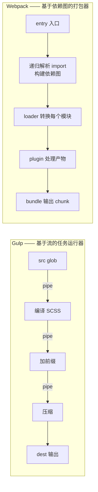
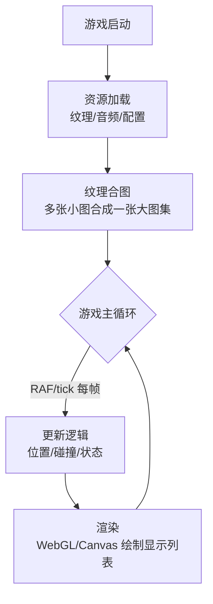

# 前端工程化与 Web 游戏引擎

> 从"手动拼 script 标签"到"依赖图驱动的模块打包"，前端工程化的主线是**用构建工具把开发期的模块化与运行期的加载性能解耦**。再往上，H5 游戏为什么要放弃 DOM、上专用渲染引擎，是同一逻辑在极端性能场景的延伸。

::: tip 一句话结论
构建工具用依赖图解耦模块化与加载性能，H5 游戏用 WebGL 渲染循环避开 DOM 重排。
:::

## 场景问题

现代前端项目面对几个绕不开的工程问题：

- **模块化 vs 加载性能**：开发时想按功能拆成成百上千个小模块（好维护）；但浏览器加载几百个文件 = 几百个请求，首屏慢到无法接受。
- **依赖管理**：模块间 `import` 关系复杂，谁依赖谁、加载顺序、循环依赖，手工管理不可能。
- **资源处理**：ES6+ 要转译成兼容语法、SCSS 要编译、图片要压缩、代码要压缩混淆——一堆重复的机械劳动。
- **缓存与更新**：想让浏览器长期缓存不变的代码，又要在代码更新时精确失效缓存。

> **打个比方（打包）**：开发时把代码拆成成百上千个小模块，像把家里东西分门别类装进几百个贴了标签的小盒子——好找、好维护。可真要"搬家"（浏览器加载）时，让搬运工一趟趟拉几百个小盒子（几百个 HTTP 请求）会累到首屏崩溃。打包工具就是搬家公司：先顺着 `import` 依赖图把小盒子按关系合并进几个大箱子（bundle），再给每个箱子贴上内容指纹标签（hash 文件名），一趟拉走、还能让浏览器长期缓存没变的箱子。**类比失效边界**：但要是贪心把全家当打成**一个巨箱**，又走到另一个极端——首屏必须等这个巨无霸整个下载完才能动弹（首屏白屏）。所以得按路由/懒加载做**代码分割**：常改的业务代码和几乎不动的第三方库分箱装，既让稳定箱长期命中缓存，又让改动只精确失效对应的那个箱子。
- **开发体验**：改一行代码想立刻看到效果，不想手动刷新丢失页面状态。
- **SPA 的首屏与 SEO**：单页应用交互流畅，但首屏白屏、爬虫抓不到内容。
- **H5 游戏性能**：几百个精灵每帧移动，DOM 根本扛不住。

工程化工具（Gulp → Webpack）和游戏引擎（Egret 等）就是分别解决"通用 Web 构建"和"高性能渲染循环"这两类问题的。

## 实现方案

### Gulp vs Webpack：流 vs 依赖图



- **Gulp**：任务运行器。核心是 `task` + Node **stream（流）**，`src → pipe(转换) → pipe(转换) → dest`。它关心的是"**对一批文件做一串处理步骤**"（编译、压缩、拷贝），本质是自动化脚本，**不理解模块依赖关系**。
- **Webpack**：模块打包器。从 `entry` 出发，**递归分析每个模块的 `import/require`**，构建一张依赖图，把所有模块打包成少数几个 `bundle`。它理解"谁依赖谁"，能做 Tree Shaking、Code Splitting 这些依赖图级别的优化。

### Webpack 核心配置

```javascript
// webpack.config.js
const path = require('path');
const HtmlWebpackPlugin = require('html-webpack-plugin');
const { CleanWebpackPlugin } = require('clean-webpack-plugin');

module.exports = {
  mode: 'production',                  // production 开启压缩 + Tree Shaking
  entry: './src/index.js',             // 入口：依赖图的根
  output: {
    path: path.resolve(__dirname, 'dist'),
    filename: '[name].[contenthash:8].js',  // contenthash：内容变才变名，长缓存关键
    clean: true,
  },
  module: {
    rules: [
      // loader：把非 JS 模块转换成 JS 能识别的模块
      { test: /\.js$/, exclude: /node_modules/, use: 'babel-loader' },
      { test: /\.scss$/, use: ['style-loader', 'css-loader', 'sass-loader'] },
      { test: /\.(png|jpg|svg)$/, type: 'asset', 
        parser: { dataUrlCondition: { maxSize: 8 * 1024 } } }, // 8K 以下转 base64 内联
    ],
  },
  plugins: [
    // plugin：作用于整个打包流程/产物
    new CleanWebpackPlugin(),
    new HtmlWebpackPlugin({ template: './src/index.html' }),
  ],
  optimization: {
    splitChunks: { chunks: 'all' },    // Code Splitting：抽公共依赖成独立 chunk
    runtimeChunk: 'single',            // 运行时单独抽出，业务代码变时它不变，利于缓存
  },
  devServer: {
    hot: true,                          // HMR：模块热替换，改代码不刷新整页
  },
};
```

**四大核心概念**：

| 概念 | 作用 |
|---|---|
| `entry` | 依赖图的起点 |
| `output` | 打包产物路径与命名规则（hash） |
| `loader` | 模块级转换器：让 Webpack 能"读懂" SCSS/图片/TS 等非 JS 资源 |
| `plugin` | 流程级扩展：作用于整个生命周期（生成 HTML、清理、抽 CSS、压缩） |

**关键能力**：

- **Tree Shaking**：基于 ES Module 的**静态**结构分析，删除未被引用的导出（dead code）。前提是 ESM 的 `import/export` 是静态可分析的（不能是动态 `require`）。
- **Code Splitting**：把代码切成多个 chunk，配合动态 `import()` 实现**按需加载**（路由懒加载），首屏只下载必需代码。
- **HMR（Hot Module Replacement）**：开发时只替换改动的模块，保留应用状态（如表单填了一半），不整页刷新。
- **hash 命名 + 长缓存**：产物用 `[contenthash]` 命名——内容不变 hash 不变，浏览器长期缓存命中；内容一变 hash 变，URL 变，强制拉新版本。**这是"长缓存 + 精确失效"的核心机制**。

::: tip 三种 hash 的区别
`hash`（整次构建一个，任何文件改都变）→ `chunkhash`（按 chunk，同 chunk 内改才变）→ `contenthash`（按文件内容，最精确）。要长缓存就用 `contenthash`，把不常变的第三方库（vendor）单独 split，可以做到"业务代码更新，库缓存不失效"。
:::

### SPA 前端路由原理

```javascript
// history 模式路由（无刷新切换视图）
window.history.pushState({}, '', '/about');   // 改 URL 但不触发浏览器请求
window.addEventListener('popstate', render);  // 监听前进/后退

// hash 模式路由（URL 带 #，改 hash 不发请求）
window.location.hash = '#/about';
window.addEventListener('hashchange', render);
```

SPA 只加载一个 HTML，后续视图切换由 JS 拦截路由、局部更新 DOM，**不重新请求整页**，所以交互流畅。两种模式：

- **hash 模式**：URL 带 `#`，`#` 后的变化不发请求；兼容性好，无需服务端配置。缺点是 URL 丑、SEO 差。
- **history 模式**：URL 干净（`/about`），用 `pushState`；但刷新时浏览器会真的请求 `/about`，**需要服务端把所有路由回退到 `index.html`**（否则 404）。

**首屏与 SEO 的取舍**：

- **CSR（客户端渲染）**：白屏时间 = 下载 JS + 执行 + 请求数据；爬虫拿到空 HTML，SEO 差。
- **SSR（服务端渲染）**：服务端直出 HTML，首屏快、SEO 好；代价是服务端有渲染压力、开发复杂度高。
- **预渲染（Prerender）**：构建时把静态页面提前渲染成 HTML；适合内容不常变的营销页，比 SSR 轻。

### Web 游戏引擎（白鹭 Egret）的渲染循环



```javascript
// 引擎主循环骨架（伪代码，对标 Egret/PixiJS 的 tick 机制）
class GameLoop {
  start() {
    const tick = (timestamp) => {
      const dt = timestamp - this.lastTime;   // 帧间隔，用于帧率无关的物理计算
      this.lastTime = timestamp;
      this.update(dt);                          // 1. 更新所有对象状态
      this.renderer.render(this.stage);         // 2. 遍历显示列表批量绘制
      requestAnimationFrame(tick);              // 3. 交给浏览器下一帧再调（约 60fps）
    };
    requestAnimationFrame(tick);
  }
}
```

引擎核心机制：

- **渲染后端**：优先 **WebGL**（GPU 加速、批量绘制），降级 **Canvas 2D**。
- **主循环 tick**：用 `requestAnimationFrame(RAF)` 驱动，与屏幕刷新同步（约 60fps），每帧 `update`（逻辑）+ `render`（绘制）。
- **资源加载**：预加载纹理/音频，避免游戏中卡顿。
- **纹理合图（Texture Atlas）**：把大量小图合成一张大图集，**大幅减少 WebGL 的 draw call**（切换纹理是昂贵操作，合图后可批量绘制），这是 2D 游戏性能的关键优化。

## 为什么这么做

### 为什么 Webpack 取代 Gulp 做模块打包

Gulp 是**面向过程**的（"先编译、再压缩、再拷贝"），它把文件当成一堆需要流水线处理的素材，**不理解模块之间的依赖**。而现代前端的核心诉求是**模块化**——按 `import` 组织代码。Webpack 从 entry 出发构建依赖图，天然知道"打包哪些、不打包哪些、公共依赖是谁"，才能实现 Tree Shaking、Code Splitting、按需加载这些**依赖图级别的优化**。Gulp 做不了这些，因为它压根没有依赖图这个概念。

> 注意：二者不完全是替代关系。Gulp 仍适合做"与模块无关"的自动化任务（如批量压缩图片、生成 icon font）。但"模块打包"这件事上，Webpack（及 Vite/Rollup/esbuild）完胜。

### 为什么要 hash 命名 + Code Splitting

浏览器缓存是"以 URL 为 key"的。如果文件名固定（`app.js`），更新后浏览器可能用旧缓存（不知道变了）；若禁缓存则每次都重下（慢）。`contenthash` 让"URL 随内容变"，实现**内容不变则长期缓存命中、内容变则 URL 变强制更新**的最优解。Code Splitting 则解决"首屏不该下载全站代码"——把第三方库、路由页面拆成独立 chunk 按需加载。

### 为什么 H5 游戏用专用引擎的渲染循环

游戏是**每帧全量重绘**大量对象。专用引擎用 WebGL 批量绘制 + 纹理合图 + RAF 主循环，把渲染交给 GPU，几百上千精灵仍能 60fps。它还封装了显示列表、碰撞、动画、资源管理这些游戏专用抽象，开发者不必从零造轮子。

## 为什么别的选择不行

### 为什么 H5 游戏不直接用 DOM

- **性能**：DOM 的每次修改都可能触发**重排（reflow）/重绘（repaint）**，几百个元素每帧移动会让布局引擎崩溃，帧率暴跌。DOM 为"文档流式布局"设计，不是为"每帧全量重绘"设计。
- **绘制模型不匹配**：游戏需要自由坐标、旋转、缩放、粒子、混合模式，DOM/CSS 表达这些既笨重又慢。
- **无批量绘制**：DOM 无法像 WebGL 那样把成百上千个对象合并成少数 draw call。

Canvas/WebGL 是"立即模式"绘制（每帧自己画整个画面），才匹配游戏的重绘模型；WebGL 更能利用 GPU 并行。所以 H5 小游戏一律用专用引擎（Egret/Cocos/PixiJS/Laya），不碰 DOM。

### 为什么 SPA 首屏不总用 SSR

SSR 首屏快、SEO 好，但代价是：服务端要跑一套渲染（CPU 开销、需要 Node 服务）、开发要处理"同构"（同一份代码跑在服务端和客户端，要小心 `window` 等浏览器 API）、部署更复杂。对**后台管理系统**（无 SEO 需求、用户登录后使用）用 CSR 完全够；只有面向公众、需要 SEO 和极致首屏的页面（电商详情、营销页）才值得上 SSR 或预渲染。**用不用 SSR 取决于是否真的需要 SEO/首屏，不是越重越好。**

### 为什么开发环境用 HMR 而不是自动整页刷新（LiveReload）

LiveReload 改代码后刷新整个页面，会**丢失应用状态**（比如你调试的弹窗关了、表单清空了、路由回到首页）。HMR 只热替换改动的模块，保留其余状态，调试体验天差地别。代价是 HMR 实现更复杂（需要模块边界的接受逻辑），但开发期收益巨大。

## 沉淀结论

**复习要点**

- **Gulp = 基于流的任务运行器**（不懂模块依赖）；**Webpack = 基于依赖图的打包器**（从 entry 递归解析 import）。模块打包场景 Webpack 完胜，因为只有依赖图才能做 Tree Shaking / Code Splitting。
- Webpack 四概念：**entry / output / loader（模块级转换）/ plugin（流程级扩展）**。
- 关键能力：Tree Shaking（靠 ESM 静态分析删死代码）、Code Splitting（按需加载）、HMR（保状态热替换）、`contenthash` 命名（长缓存 + 精确失效）。
- SPA：hash 模式（带 `#`、兼容好、SEO 差）vs history 模式（URL 干净、需服务端 fallback 到 index.html）；首屏/SEO 用 CSR / SSR / 预渲染按需取舍。
- 游戏引擎：WebGL/Canvas 渲染后端 + RAF 主循环 tick（update→render）+ 纹理合图减少 draw call；H5 游戏不用 DOM，因 DOM 每帧重排重绘扛不住。

**面试话术**

> "前端工程化主线是用构建工具把'开发期模块化'和'运行期加载性能'解耦。Gulp 是基于流的任务运行器，只会顺序处理文件，不理解模块依赖；Webpack 从 entry 递归构建依赖图，才能做 Tree Shaking、Code Splitting 这些依赖图级优化，所以模块打包上取代了 Gulp。缓存靠 contenthash 命名——内容不变 hash 不变命中长缓存，一变就换 URL 强制更新。SPA 靠 history/hash 拦截路由做无刷新切换，首屏和 SEO 用 CSR/SSR/预渲染按需权衡，不是越重越好。H5 游戏不用 DOM，因为 DOM 每帧重排重绘扛不住几百精灵，专用引擎用 WebGL 批量绘制 + RAF 主循环 + 纹理合图减少 draw call 才能稳 60fps。"

::: warning 常见误区
Tree Shaking 依赖 **ES Module 的静态结构**，用 CommonJS 的动态 `require` 会让摇树失效。想让库可被摇树，要提供 ESM 版本并在 `package.json` 标 `"sideEffects": false`。
:::

### 记忆口诀

- **工具分工**：Gulp 流/任务 / Webpack 依赖图/打包 / Vite ESM+esbuild
- **Webpack 四件套**：entry 起点 / output 产物 / loader 模块转换 / plugin 流程扩展
- **四大能力**：Tree Shaking 摇死码 / Code Splitting 按需加载 / HMR 保状态热替 / contenthash 长缓存精失效
- **游戏引擎**：WebGL 批绘 / RAF 主循环 / 纹理合图省 draw call / 不碰 DOM 免重排

## 内容来源

综合整理。主要参考方向：Webpack 官方文档（concepts / guides / optimization）、Gulp 官方文档、MDN（History API / requestAnimationFrame / WebGL）、白鹭 Egret 引擎文档与 PixiJS 渲染机制，以及 SPA / SSR 通行实践。

## 自测：合上资料能说清楚吗？

Gulp 和 Webpack 都能处理前端资源，为什么"模块打包"这件事上 Webpack 完胜？

<details><summary>参考答案</summary>

Gulp 是**基于流的任务运行器**，只会顺序 pipe 处理一批文件，**不理解模块依赖**。Webpack 从 `entry` **递归解析 import 构建依赖图**，因此能做 **Tree Shaking**、**Code Splitting** 这些依赖图级优化——Gulp 没有依赖图概念，做不到。

</details>

`contenthash` 命名是怎么同时实现"长期缓存命中"和"更新精确失效"的？

<details><summary>参考答案</summary>

浏览器缓存**以 URL 为 key**。`contenthash` 让文件名随**内容**变：内容不变则 hash 不变、**URL 不变命中长缓存**；内容一变 hash 变、**URL 变强制拉新版本**。配合把 vendor 单独 split，可做到业务更新而库缓存不失效。

</details>

hash 模式和 history 模式的路由有什么区别？各自的代价是什么？

<details><summary>参考答案</summary>

**hash 模式**：URL 带 `#`，`#` 后变化不发请求，**兼容好、无需服务端配置**，但 URL 丑、SEO 差。**history 模式**：用 `pushState`，**URL 干净**，但刷新时浏览器真的请求该路径，**需服务端把所有路由 fallback 到 index.html**，否则 404。

</details>

H5 游戏为什么不直接用 DOM，而要上 WebGL 专用引擎？

<details><summary>参考答案</summary>

DOM 每次修改可能触发**重排/重绘**，几百精灵每帧移动会让布局引擎崩溃；DOM 为文档流布局设计，**无法批量绘制**。WebGL 是**立即模式**、GPU 并行，配合**纹理合图减少 draw call**、**RAF 主循环**，才能稳 60fps。

</details>

后台管理系统该用 CSR 还是 SSR？为什么不是"越重越好"？

<details><summary>参考答案</summary>

用 **CSR** 即可。SSR 首屏快、SEO 好，但代价是**服务端渲染开销**、**同构复杂度**（小心 `window` 等 API）、**部署更复杂**。后台系统**无 SEO 需求、登录后使用**，CSR 完全够；只有面向公众且需 SEO/极致首屏的页面才值得上 SSR 或预渲染。

</details>
