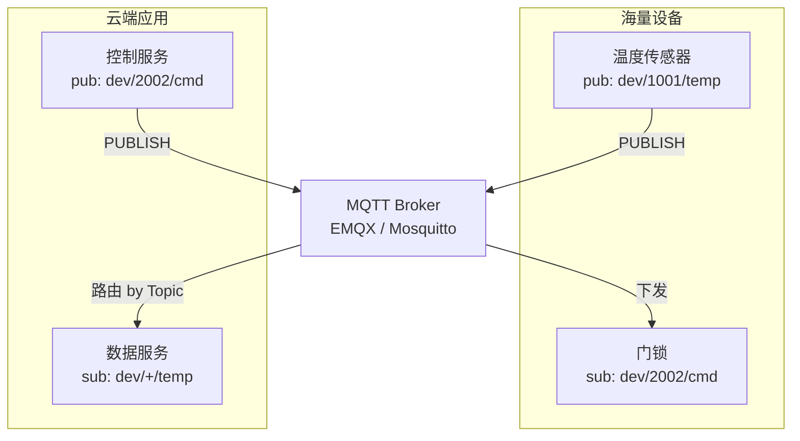
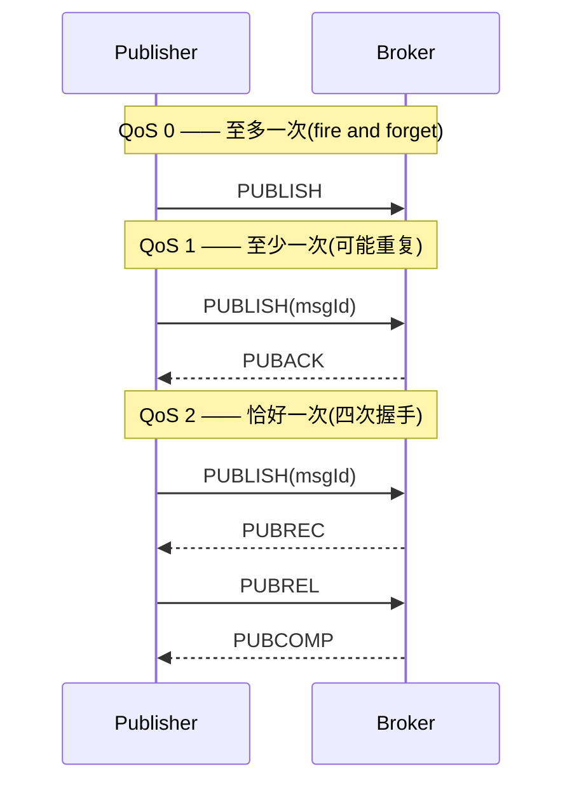

# IoT 私有协议设计与 MQTT

> 智能硬件后台的第一性问题：设备在弱网、低功耗、海量长连接下，怎么把一个字节都不浪费地把数据送上云。私有二进制协议解决"帧怎么设计"，MQTT 解决"海量设备怎么发布订阅"。

::: tip 一句话结论
设备侧用私有二进制 TLV 省字节，云侧用 MQTT 发布订阅扛海量弱网长连接。
:::

## 场景问题

智能硬件（智能灯、摄像头、门锁、传感器）的通信环境和 Web 后台完全不同：

- **带宽极窄 + 计费**：NB-IoT / 2G 模组，每字节都可能按流量计费；上行报文越小越好。
- **功耗敏感**：电池设备睡眠为主，唤醒发一帧就得立刻回睡；建连接、解析文本都费电。
- **算力弱**：MCU 只有几十 KB RAM，跑不动 JSON 解析、TLS 握手可能都吃力。
- **海量长连接**：一个 Broker 要挂几十万甚至百万设备的常连接，靠心跳保活。
- **弱网**：信号时断时续，需要断线重连、消息不丢（至少一次）、去重。

核心矛盾：**既要省（带宽/功耗/算力），又要可靠（弱网不丢消息），还要规模（海量长连接）**。这决定了两件事——设备侧用**紧凑的私有二进制协议**，云侧用 **MQTT 的发布/订阅 + QoS** 承接海量连接。

## 实现方案

### 私有二进制协议：定长头 + TLV 变长体

```
私有协议帧结构（大端序 network byte order）

 0        1        2        3        4        5        6        7
+--------+--------+--------+--------+--------+--------+--------+--------+
| 魔数 MAGIC(2B)  | 版本  | 命令   |     序列号 SEQ (2B)             |
| 0xAB 0xCD       | VER   | CMD    |  用于请求-应答配对/去重         |
+--------+--------+--------+--------+--------+--------+--------+--------+
|          长度 LENGTH(4B) = 变长体字节数                            |
+--------+--------+--------+--------+--------+--------+--------+--------+
|  变长体 PAYLOAD (TLV 列表): [Type(1B)][Len(2B)][Value(N)] ...      |
+-------------------------------------------------------------------+
|          校验 CRC16 (2B)  覆盖头+体                                |
+--------+--------+--------+--------+--------+--------+--------+--------+
```

```c
// C 侧定长头（__attribute__((packed)) 禁止编译器对齐填充）
typedef struct __attribute__((packed)) {
    uint16_t magic;    // 0xABCD 魔数：快速识别帧起始/丢弃脏数据
    uint8_t  version;  // 协议版本：便于灰度升级、新旧共存
    uint8_t  cmd;      // 命令字：0x01 上报, 0x02 下发, 0x03 心跳...
    uint16_t seq;      // 序列号：应答配对 + 弱网去重
    uint32_t length;   // 变长体长度：解决 TCP 粘包/半包
} proto_header_t;      // 共 10 字节

// TLV：Type-Length-Value，可扩展字段而不破坏旧解析器
typedef struct __attribute__((packed)) {
    uint8_t  type;     // 字段类型：0x10 温度, 0x11 湿度, 0x12 电量...
    uint16_t len;      // Value 长度
    // uint8_t value[]; // 变长
} tlv_t;
```

设计要点：

- **魔数**：帧同步，收到乱码能立刻定位下一帧起点。
- **版本**：协议演进不断连，新老设备共存。
- **序列号**：请求-应答配对；弱网重发时用于**幂等去重**。
- **长度字段**：TCP 是字节流，靠 `length` 做**分帧**，解决粘包/半包。
- **CRC 校验**：链路误码检测（TCP 已有校验，但私有链路/串口/透传模组常需应用层再校验）。
- **字节序**：统一大端（网络字节序），避免不同 CPU 架构解析错乱。
- **TLV 变长体**：新增字段只加新 Type，旧设备遇到不认识的 Type 直接跳过 `len` 字节，**向前兼容**。

### MQTT：海量设备的发布/订阅



MQTT 是发布/订阅模型，设备与设备之间**不直连**，全部经 Broker 按 **Topic** 路由，天然解耦。

**Topic 通配**（订阅端可用，发布端不可用）：

- `+` 单层通配：`dev/+/temp` 匹配 `dev/1001/temp`、`dev/2002/temp`，不匹配 `dev/1001/sub/temp`。
- `#` 多层通配：`dev/1001/#` 匹配该设备下所有子 Topic。

**QoS 三个等级**（可靠性 vs 开销的权衡）：



| QoS | 语义 | 握手 | 代价 | 场景 |
|---|---|---|---|---|
| 0 | 至多一次，可能丢 | 无 | 最省 | 高频传感器数据、丢一帧无所谓 |
| 1 | 至少一次，可能重复 | PUBLISH/PUBACK | 中 | 大多数上报，配 `seq` 去重 |
| 2 | 恰好一次，不丢不重 | 四次握手 | 最贵 | 计费、支付、门锁开关等关键指令 |

::: warning QoS 1 一定要配去重
QoS 1 承诺"至少一次"意味着**可能收到重复消息**（ACK 丢失会触发重发）。业务侧必须靠消息里的序列号/唯一 ID 做幂等，否则会出现"温度上报两次""指令执行两遍"。QoS 2 用四次握手换"恰好一次"，但延迟和 Broker 状态开销大，只给关键指令用。
:::

**其余核心机制**：

```bash
# CONNECT 报文携带的关键字段（伪示意）
CONNECT {
  clientId:  "dev-1001",
  keepAlive: 60,              # 60s 内无报文则设备须发 PINGREQ 保活
  cleanSession: false,        # false=持久会话，断线期间的 QoS1/2 消息 Broker 暂存
  will: {                     # 遗嘱 LWT：设备异常掉线时 Broker 代发
    topic: "dev/1001/status",
    payload: "offline",
    qos: 1, retain: true
  },
  username: "dev-1001",
  password: "<hmac_sign>"     # 一机一密签名
}
```

- **Keepalive + PINGREQ/PINGRESP**：设备在 keepalive 周期内没数据也要发 PINGREQ，Broker 借此判断死活；超过 1.5×keepalive 无报文即判定掉线。
- **遗嘱 LWT**：设备异常断线（没走正常 DISCONNECT）时，Broker **代替它**向遗嘱 Topic 发一条"离线"消息，让云端及时感知。
- **保留消息 retain**：Broker 为每个 Topic 保存最后一条 retain 消息，新订阅者一订阅立刻收到当前状态（如设备"当前开关状态"），无需等下一次上报。
- **Clean Session / 持久会话**：`cleanSession=false` 时 Broker 记住订阅关系和离线期间的 QoS1/2 消息，重连后补发——弱网设备必备。

### 鉴权与 TLS

```
一型一密：同型号所有设备烧录相同 ProductKey + ProductSecret
          首次激活时用它换取"一机一密"的 DeviceSecret（动态注册）
一机一密：每台设备唯一 DeviceSecret，连接时算签名
          sign = HMAC-SHA256(clientId+deviceName+timestamp, DeviceSecret)
          泄露一台不影响其他设备 —— 安全性最高，量产烧录成本高
```

TLS：MCU 弱则用 **PSK-TLS**（预共享密钥，省掉证书链验证的算力）或在网关侧终结 TLS；关键设备用完整证书双向认证。

## 为什么这么做

### 为什么私有协议用二进制 TLV 而不是 JSON/HTTP

- **带宽**：一次温度上报，JSON `{"deviceId":"1001","temp":25.5,"humidity":60}` 约 45 字节；二进制 TLV 里温度是 `0x10 0x00 0x02 <2字节>`，整帧十几字节。窄带 + 流量计费下，**体积差几倍就是钱和电**。
- **功耗**：报文越小，射频发送时间越短，耗电越少；解析越简单（无需字符串解析、无需分配内存），MCU 唤醒时间越短。
- **解析成本**：JSON 要词法分析、动态内存、浮点转字符串，几十 KB RAM 的 MCU 吃不消；TLV 是 `memcpy` + 位移，几乎零开销。
- **HTTP 的头开销**：一个 HTTP 请求光 header（Host、User-Agent、Content-Type…）就几百字节，比 payload 大一个数量级，对 IoT 是纯浪费。

### 为什么设备侧私有协议 + 云侧 MQTT 组合

私有协议解决"**单帧怎么紧凑可靠**"，MQTT 解决"**海量连接怎么组织路由**"。很多方案是设备用私有二进制协议连到**接入网关**，网关做协议转换后以 MQTT 接入云平台；或直接把私有 TLV 塞进 MQTT 的 payload（MQTT 只管路由，不关心 payload 格式）。两层各司其职。

### 为什么 MQTT 适合海量长连接

MQTT 的固定报文头最小只有 **2 字节**，PINGREQ/PINGRESP 各 2 字节，保活成本极低；发布/订阅解耦让百万设备无需互相知道彼此；QoS + 持久会话在弱网下保证消息可达。Broker（EMQX 等）专门为百万级连接优化（epoll + 连接状态压缩）。

## 为什么别的选择不行

### 为什么不用 HTTP 轮询

要拿到设备状态或下发指令，HTTP 只能靠设备**轮询**（周期性请求）。问题：

- **延迟 vs 功耗不可兼得**：轮询间隔短则实时但费电费流量，间隔长则省电但指令下发延迟高（设备下次轮询才拿到）。
- **无法服务端主动推送**：门锁要"立刻开"，HTTP 做不到即时下发。
- **每次建连开销**：TCP 握手 + TLS 握手 + HTTP 头，对偶发小数据是巨大浪费。

MQTT 长连接 + 推送天然解决"服务端主动下发"和"低功耗保活"，这是 HTTP 轮询无法企及的。

### 为什么不用 CoAP（虽然它也很省）

CoAP 是基于 **UDP** 的 REST 风格轻量协议，报文比 MQTT 还小，适合极端受限设备（如 6LoWPAN 传感网）。但：

- **UDP 无连接**：可靠性要自己在应用层重建（CoAP 有 CON/ACK 但弱于 TCP 的完整机制），NAT 穿透和长连接保活麻烦。
- **推送模型弱**：CoAP 的 Observe 观察机制不如 MQTT 发布/订阅成熟，海量 fan-out 场景生态不如 MQTT。
- **生态**：云端 IoT 平台、Broker、可视化工具对 MQTT 支持远比 CoAP 完善。

**取舍**：局域受限网状网（Zigbee/6LoWPAN 内部）用 CoAP，跨公网到云平台的海量设备接入用 MQTT。二者是不同网络层次的选择。

### 为什么不用纯 TCP 自定义协议全套自己造

私有 TCP 协议能做到极致紧凑，但发布/订阅路由、QoS 重传、持久会话、遗嘱、通配订阅这些**通用能力全要自己实现和维护**，等于重造一个 MQTT。除非有极特殊约束（如超低带宽必须自定义帧），否则站在 MQTT 生态上（payload 里放私有 TLV）性价比最高。

## 沉淀结论

**复习要点**

- 私有二进制帧 = **定长头（魔数+版本+命令+序列号+长度+校验）+ TLV 变长体**；大端序；长度字段解决粘包/半包；TLV 保证字段向前兼容。
- 不用 JSON/HTTP 的三条硬理由：**带宽、功耗、解析算力**。
- MQTT 核心：发布/订阅经 Broker 解耦；Topic 通配 `+`（单层）`#`（多层）；QoS 0/1/2 = 至多一次/至少一次(要去重)/恰好一次(四次握手)；retain 保留消息；LWT 遗嘱；Keepalive+PINGREQ 保活；`cleanSession=false` 持久会话弱网补发。
- 鉴权：一型一密（动态注册换一机一密）< 一机一密（最安全）；MCU 弱用 PSK-TLS。
- MQTT vs HTTP 轮询：MQTT 能服务端主动推送 + 长连接低功耗；HTTP 轮询实时性与功耗不可兼得。
- MQTT vs CoAP：跨公网海量接入选 MQTT（TCP、生态好）；局域受限网选 CoAP（UDP、更省）。

**面试话术**

> "IoT 后台的第一约束是弱网、低功耗、窄带、海量长连接。设备侧我们用私有二进制协议——定长头带魔数版本序列号长度校验，加 TLV 变长体，因为 JSON/HTTP 在带宽、功耗、MCU 解析算力上都太奢侈，一次上报字节数差好几倍就是流量费和电量。云侧用 MQTT 承接海量连接：发布订阅经 Broker 解耦，QoS 1 配序列号去重保证不丢，关键指令用 QoS 2 恰好一次，Keepalive + 遗嘱管设备死活，持久会话在弱网重连时补发离线消息。不用 HTTP 轮询是因为它没法服务端主动推送、实时性和功耗不可兼得；不用 CoAP 是因为跨公网海量接入 MQTT 的 TCP 可靠性和生态更好。"

::: tip 一句话记忆
省字节靠私有二进制 TLV，管海量长连接靠 MQTT 发布订阅——一个解决"帧"，一个解决"网"。
:::

### 记忆口诀

**私有帧**：魔数同步 / 版本演进 / 序列号去重 / 长度分帧 / CRC 校验 / TLV 向前兼容

**不用JSON**：省带宽 / 省功耗 / 省MCU解析算力

**MQTT**：发布订阅解耦 / Topic 通配 +# / QoS 0-1-2 至多-至少-恰好 / retain 保留 / LWT 遗嘱 / Keepalive 保活 / 持久会话补发

**选型**：HTTP轮询不能主动推 / CoAP 局域省(UDP) / MQTT 公网稳(TCP+生态)

## 内容来源

综合整理。主要参考方向：MQTT 3.1.1 / 5.0 官方规范（OASIS）、EMQX / Mosquitto Broker 文档、阿里云/AWS IoT 平台一机一密/一型一密鉴权文档、CoAP RFC 7252，以及嵌入式二进制协议设计惯例。

## 自测：合上资料能说清楚吗？

私有二进制协议的定长头里，为什么必须有"长度"字段？没有它会怎样？

<details><summary>参考答案</summary>

TCP 是**字节流**没有消息边界，会**粘包/半包**。靠 `length` 字段做**分帧**：先读定长头拿到体长度，再精确读取 N 字节，才知道一帧到哪结束。没有它就无法从连续字节流中切出完整的一条报文。

</details>

IoT 设备为什么不直接用 JSON/HTTP，而要自造二进制 TLV？

<details><summary>参考答案</summary>

三条硬理由：**带宽**（JSON 一次上报 45B，TLV 十几字节，窄带计费下就是钱和电）；**功耗**（报文小则射频发送短、解析简单唤醒短）；**解析算力**（JSON 要词法分析+动态内存+浮点转字符串，几十 KB RAM 的 **MCU** 吃不消，TLV 只需 memcpy+位移）。

</details>

MQTT 的 QoS 1 和 QoS 2 有什么区别？各自适合什么场景？

<details><summary>参考答案</summary>

**QoS 1** "至少一次"，PUBLISH/PUBACK 两次握手，ACK 丢失会**重发导致重复**，需业务侧用**序列号去重**，适合大多数上报。**QoS 2** "恰好一次"，四次握手（PUBREC/PUBREL/PUBCOMP）不丢不重，但延迟和 Broker 状态开销大，只给**计费、门锁开关**等关键指令用。

</details>

设备异常掉线（没走正常 DISCONNECT）时，云端怎么及时感知？

<details><summary>参考答案</summary>

两个机制：**Keepalive + PINGREQ**——设备周期内无数据也发心跳，Broker 超过 **1.5×keepalive** 无报文即判掉线；**遗嘱 LWT**——设备连接时预设遗嘱消息，异常断线时 Broker **代它**向遗嘱 Topic 发"offline"，配 retain 让新订阅者也能立刻看到离线状态。

</details>

同样是省电轻量，MQTT 和 CoAP 该怎么选？

<details><summary>参考答案</summary>

看**网络层次**。**CoAP** 基于 **UDP**、报文更小，但可靠性/保活要应用层重建、NAT 穿透与推送模型弱，适合**局域受限网状网**（Zigbee/6LoWPAN 内部）。**MQTT** 基于 **TCP**、发布订阅成熟、云端生态完善，适合**跨公网到云平台的海量设备接入**。

</details>
