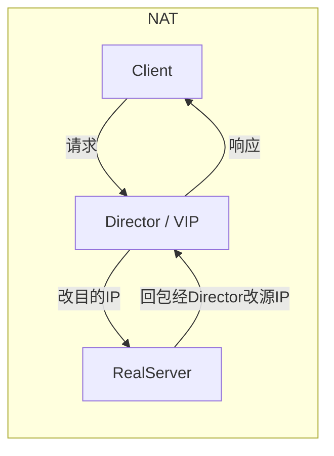
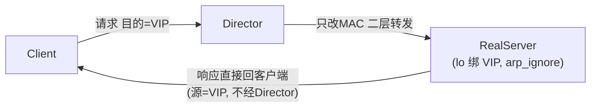
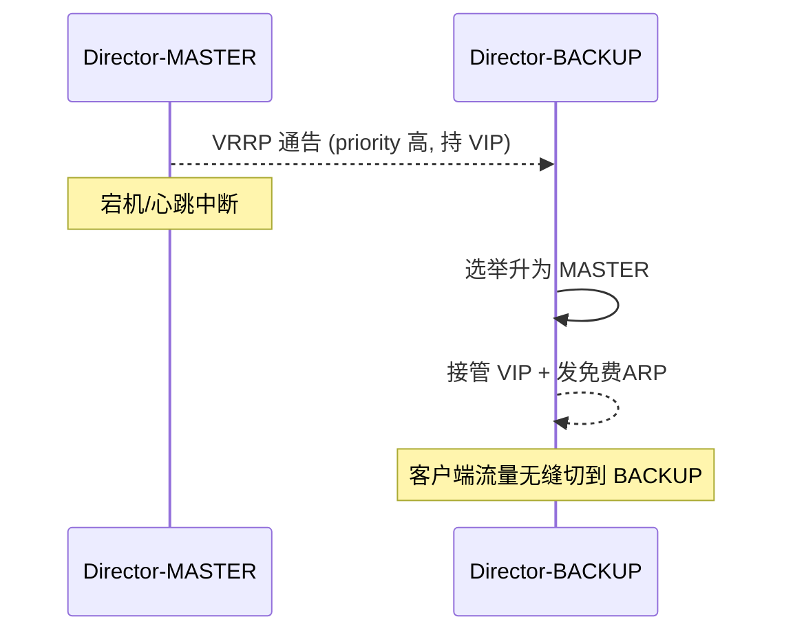
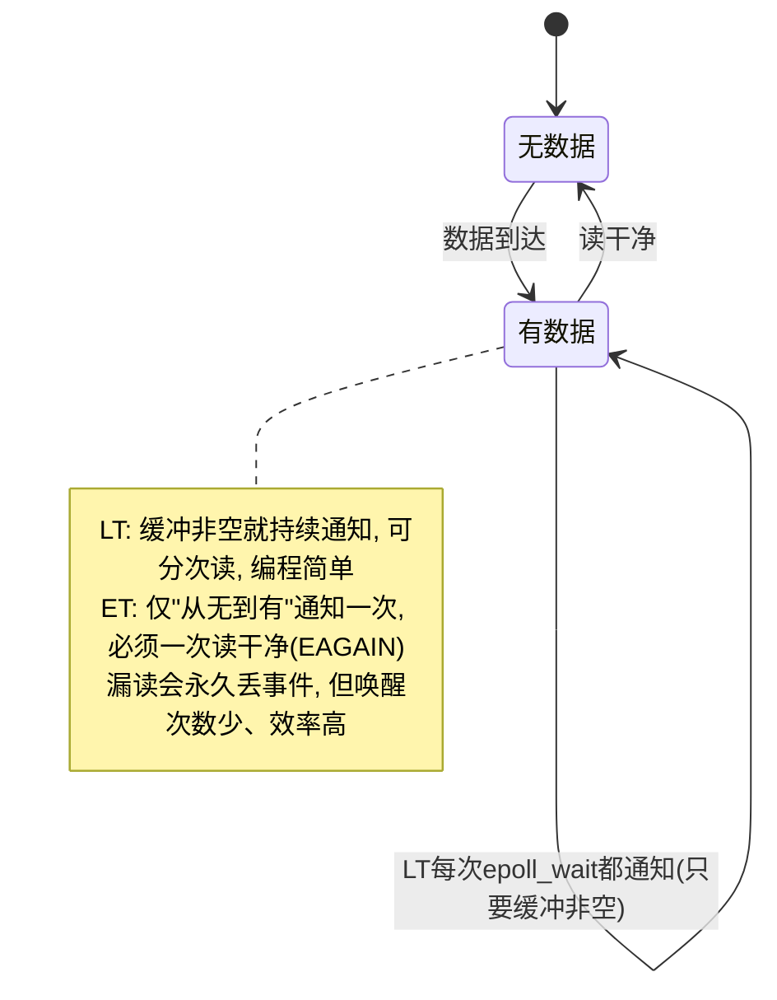

# LVS 与 epoll

> 四层负载 LVS（内核 IPVS）与用户态事件模型 epoll，是高并发接入层的两块基石。本文讲清 LVS 三种转发模式（尤其 DR 为什么最快）、调度算法、Keepalived 高可用，以及 epoll 为什么碾压 select/poll、LT/ET 与惊群的取舍，并说明 LVS 与七层 Nginx 如何分层配合。

## 场景问题

一个千万级并发的接入层要同时解决两件事：

1. **横向扩展**：单机扛不住，需要把流量均匀分给一组后端（Real Server），且这一分发本身不能成为瓶颈或单点。
2. **单机高并发**：每台机器要用尽可能少的线程管住尽可能多的连接（C10K → C10M），不能"一连接一线程"。

前者是 **LVS**（负载均衡）要解的，后者是 **epoll**（I/O 多路复用）要解的。二者常配合出现：LVS 在四层把连接均分给多台 Nginx/后端，每台后端内部用 epoll 单线程管住海量连接。

## 实现方案

### LVS 三种转发模式

LVS 工作在内核的 **IPVS** 模块，只做四层（IP + 端口）转发，不解析应用层。三种模式：





| 模式 | 数据路径 | 改写 | 性能 | 约束 |
|---|---|---|---|---|
| **NAT** | 请求、响应都过 Director | 改目的/源 IP（DNAT/SNAT） | 最低（响应也压 Director） | RS 网关须指向 Director |
| **DR**（直接路由） | 请求过 Director，**响应直连客户端** | **只改目的 MAC** | **最高** | RS 与 Director 同二层网段，RS 的 lo 绑 VIP |
| **TUN**（IP 隧道） | 请求过 Director（IPIP 封装），响应直连客户端 | IPIP 封装 | 高 | RS 需支持隧道，可跨网段 |

**DR 为什么性能最高**：
- Director **只处理入向请求包，且只改二层 MAC 地址**（把目的 MAC 改成选中的 RS），不改 IP、不做连接跟踪级重写。
- **响应包由 RS 直接发回客户端**（源 IP 仍是 VIP），完全不经过 Director。而真实流量绝大部分是响应（下行远大于上行），DR 让 Director 只承担了最小的那部分流量，因此吞吐最高。
- 代价：RS 必须在 `lo` 上绑 VIP 并抑制 ARP（`arp_ignore=1`、`arp_announce=2`），保证只有 Director 应答 VIP 的 ARP。

```bash
# Director 上配置 DR 模式（ipvsadm）
ipvsadm -A -t 10.0.0.1:80 -s wlc          # 添加虚拟服务 VIP:80，调度算法 wlc
ipvsadm -a -t 10.0.0.1:80 -r 10.0.0.11 -g -w 3   # -g=DR(gateway), 权重3
ipvsadm -a -t 10.0.0.1:80 -r 10.0.0.12 -g -w 1
ipvsadm -Ln                                # 查看连接与规则

# 每台 Real Server 上（DR 必需）
ip addr add 10.0.0.1/32 dev lo             # lo 绑 VIP
sysctl -w net.ipv4.conf.all.arp_ignore=1   # 不响应非本接口目标的 ARP
sysctl -w net.ipv4.conf.all.arp_announce=2 # 通告时用真实接口地址
```

### 调度算法

- **rr**（轮询）/ **wrr**（加权轮询）：静态均分，忽略实际负载。
- **lc**（最少连接）/ **wlc**（加权最少连接）：按当前活动连接数分，能力强的机器权重高。**wlc 是通用默认最优选择**。
- **sh**（源地址哈希）：同源 IP 固定打到同一 RS，用于会话保持。

### Keepalived + LVS 高可用（VRRP）

Director 是单点，用 **Keepalived** 跑 **VRRP** 做主备：主备通过组播/单播互发心跳竞选，VIP 漂在 MASTER 上；主挂了备接管 VIP（发免费 ARP 更新交换机 MAC 表）。Keepalived 同时对 RS 做健康检查，摘除故障后端。



### epoll 事件模型

epoll 是 Linux 的 I/O 多路复用机制，内核维护两个结构：**红黑树**（存所有被监听的 fd，`epoll_ctl` 增删改，O(log n)）+ **就绪链表**（rdllist，就绪 fd 的双向链表，`epoll_wait` 直接摘取，O(1)）。fd 就绪时由内核回调把它挂到就绪链表，无需遍历全部 fd。

```c
int epfd = epoll_create1(0);
struct epoll_event ev, events[MAX];

ev.events  = EPOLLIN | EPOLLET;         // 监听可读 + 边沿触发(ET)
ev.data.fd = listen_fd;
epoll_ctl(epfd, EPOLL_CTL_ADD, listen_fd, &ev);   // 注册到红黑树

for (;;) {
    int n = epoll_wait(epfd, events, MAX, -1);     // O(1) 取就绪, 只返回就绪 fd
    for (int i = 0; i < n; i++) {
        int fd = events[i].data.fd;
        if (fd == listen_fd) {
            // ET 下必须循环 accept 直到 EAGAIN，否则漏连接
            for (;;) {
                int c = accept4(listen_fd, NULL, NULL, SOCK_NONBLOCK);
                if (c < 0) { if (errno == EAGAIN) break; else break; }
                ev.events = EPOLLIN | EPOLLET;
                ev.data.fd = c;
                epoll_ctl(epfd, EPOLL_CTL_ADD, c, &ev);
            }
        } else if (events[i].events & EPOLLIN) {
            // ET 下必须把内核缓冲一次读干净(读到 EAGAIN)
            for (;;) {
                ssize_t r = read(fd, buf, sizeof buf);
                if (r > 0)      handle(buf, r);
                else if (r == 0){ close(fd); break; }        // 对端关闭
                else { if (errno == EAGAIN) break; else { close(fd); break; } }
            }
        }
    }
}
```

**LT（水平触发）vs ET（边沿触发）**：



- **LT**：只要缓冲区还有数据/可写，每次 `epoll_wait` 都会返回该 fd。编程简单、不易丢事件，但可能重复唤醒。
- **ET**：仅在状态**从无到有变化时通知一次**，必须循环读/写到 `EAGAIN` 把缓冲处理干净，否则事件丢失。唤醒次数少、效率高，但编程复杂，且 fd 必须为**非阻塞**。

**惊群与 EPOLLEXCLUSIVE**：多个进程/线程用各自 epoll 监听同一 listen fd，一个连接到来会唤醒所有等待者，只有一个 accept 成功，其余空转——即惊群。内核提供 `EPOLLEXCLUSIVE` 标志，让内核每次只唤醒一个等待者，缓解惊群（Nginx 也可用 `SO_REUSEPORT` 让内核直接把连接哈希分发到各 worker 的独立监听队列，从根上消除惊群）。

## 为什么这么做

- **为什么四层比七层快**：LVS/IPVS 只看 IP + 端口做转发决策，**不解析 HTTP、不建立到后端的独立连接、不做内容缓冲**，在内核里查连接表即可转发；七层网关要完整解析应用层、维护双向连接、可能缓冲请求体，CPU 与内存开销高一个量级。
- **为什么 epoll 是 O(1) 通知**：`select/poll` 每次调用都要把**全量** fd 集合从用户态拷进内核、内核**线性遍历**所有 fd 找就绪的、再拷回用户态——复杂度 O(n) 且反复拷贝。epoll 把"注册"和"等待"分离：fd 一次性注册进红黑树常驻内核，就绪由回调挂入就绪链表，`epoll_wait` **只返回就绪的那些**，与总连接数无关。
- **为什么 DR 让响应绕开 Director**：真实业务下行流量远大于上行，只要 Director 不碰响应包，它的负载就只与"新连接建立速率"相关，而非总带宽，扩展性天花板极高。

## 为什么别的选择不行

- **为什么不用 select/poll 扛高并发**：`select` 有 `FD_SETSIZE`（通常 1024）硬上限；`poll` 无上限但仍 O(n) 全量拷贝+遍历。10 万连接下每次 `epoll_wait`/`poll` 都遍历 10 万 fd，绝大多数空闲，CPU 全耗在无效扫描上。epoll 消除了"拷贝全集"和"遍历全集"两个 O(n)。
- **为什么不用 NAT 模式做大流量**：NAT 下响应包也要回 Director 做 SNAT，Director 成为**全双工带宽瓶颈**；DR 只承担上行请求，吞吐高得多。
- **为什么不直接用七层网关做第一层**：七层单机吞吐有限、成本高，无法承接超大流量入口；用 LVS 四层先把海量连接**廉价均分**到一排七层网关，才能兼顾规模与能力。
- **为什么不用一连接一线程**：线程栈（默认 MB 级）+ 上下文切换成本使得万级线程就把内存与调度器压垮；epoll 单线程事件循环用一个线程管十万连接，内存与切换开销恒定。

## 沉淀结论

1. **LVS 三模式选型**：跨网段用 TUN、同网段极致性能用 **DR**、简单场景用 NAT。DR 快在"只改 MAC + 响应直连客户端"。
2. **调度默认 wlc**；需要会话保持用 sh；纯均分用 rr/wrr。
3. **高可用靠 Keepalived + VRRP**：主备竞选 VIP，故障发免费 ARP 秒级切换，并做 RS 健康检查。
4. **epoll 胜出的两句话**：**注册与等待分离**（红黑树常驻 + 就绪链表 O(1)），**只返回就绪 fd**（消除 select/poll 的全量拷贝与遍历）。
5. **LT vs ET**：LT 简单稳妥，ET 高效但必须非阻塞 + 读写到 EAGAIN；惊群用 `EPOLLEXCLUSIVE` 或 `SO_REUSEPORT` 解。
6. **分层配合**：LVS(四层，均分连接) → Nginx(七层，内容路由/TLS/缓存) → 应用后端，各取所长。

## 内容来源

综合整理。主要参考方向：Linux Virtual Server 官方文档（IPVS、NAT/DR/TUN 模式与 ipvsadm）、`ipvsadm(8)` 手册、Keepalived 官方文档与 VRRP（RFC 3768/5798）、Linux 内核 `epoll(7)`/`epoll_ctl(2)`/`epoll_wait(2)` man page 与内核 `fs/eventpoll.c` 实现（红黑树 + rdllist）、C10K/C10M 问题综述、Nginx `SO_REUSEPORT`/`EPOLLEXCLUSIVE` 惊群处理文档。
