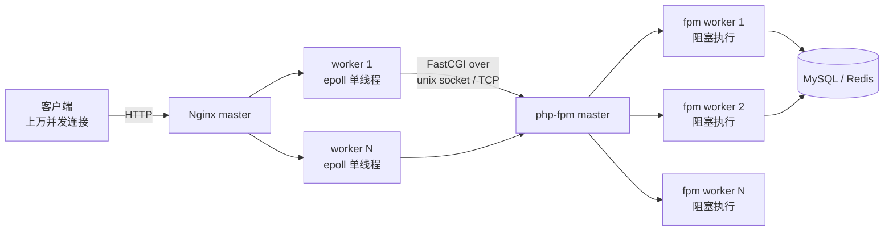
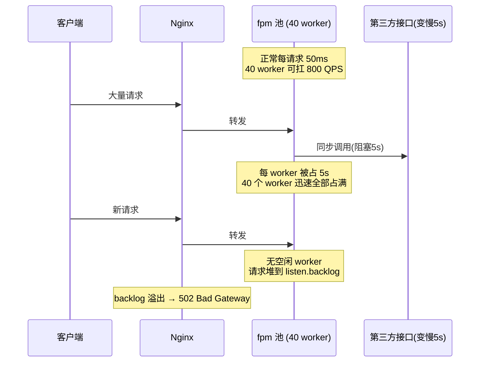

# php-fpm + Nginx 多进程异步 I/O

> 一个请求打进来，Nginx 用单线程 epoll 扛住上万并发连接，php-fpm 用多个阻塞式 worker 逐个执行 PHP。两种截然相反的并发模型为什么要配在一起，才是这个专题的核心。

::: tip 一句话结论
Nginx 单线程事件驱动扛连接、fpm 多进程阻塞扛计算，负载相反所以模型相反。
:::

## 场景问题

典型 LNMP 站点要同时回答两类矛盾的需求：

- **海量并发连接**：C10K 甚至 C100K，大部分连接是慢客户端（移动网络、keep-alive 空闲），如果一个连接占一个线程/进程，内存和上下文切换会直接爆炸。
- **CPU 密集的动态计算**：PHP 脚本要连数据库、渲染模板、跑业务逻辑，是同步阻塞代码，单个请求可能耗时几十到几百毫秒。

如果全用 Nginx 的事件模型跑 PHP，一个慢查询会卡住整个 event loop；如果全用一请求一进程，几千并发就把机器压垮。于是分工：**Nginx 负责"连接层"（I/O 密集、要高并发），php-fpm 负责"计算层"（CPU 密集、要隔离）**，中间用 FastCGI 协议解耦。

面试常问的痛点场景：某个下游接口变慢（比如第三方支付超时 5s），为什么会导致**整站 502**？答案就藏在 php-fpm 的进程池模型里。

## 实现方案

### 分工架构



- **Nginx**：`master` 进程只管配置和信号，`worker` 进程数一般等于 CPU 核数，每个 worker 是**单线程 + epoll 非阻塞**，一个 worker 可以同时持有几万个连接。
- **php-fpm**：`master` 管理进程池，一组 `worker` 进程，每个 worker 一次只处理一个请求、执行完才接下一个（**阻塞式**）。并发处理能力 = worker 数量。

### Nginx 关键配置

```nginx
# nginx.conf
worker_processes auto;          # 通常 = CPU 核数
worker_rlimit_nofile 65535;

events {
    worker_connections 10240;   # 单 worker 最大连接数
    use epoll;                  # Linux 事件驱动
    multi_accept on;
}

http {
    upstream php_backend {
        server unix:/run/php/php-fpm.sock;   # 同机走 unix socket，省掉 TCP 三次握手
    }

    server {
        listen 80;
        location ~ \.php$ {
            fastcgi_pass   php_backend;
            fastcgi_index  index.php;
            include        fastcgi_params;
            fastcgi_param  SCRIPT_FILENAME $document_root$fastcgi_script_name;

            # 关键超时：下游 PHP 慢时不要无限等
            fastcgi_connect_timeout 2s;
            fastcgi_read_timeout    30s;   # 读 fpm 响应的超时，触发即 504
            fastcgi_buffers 16 16k;
        }
    }
}
```

### php-fpm 进程池配置

```ini
; /etc/php-fpm.d/www.conf
[www]
listen = /run/php/php-fpm.sock
listen.backlog = 1024          ; 等待队列长度，worker 满时请求在此排队

; 进程管理策略：static / dynamic / ondemand
pm = dynamic
pm.max_children = 40           ; 最大 worker 数 —— 决定最大并发
pm.start_servers = 10
pm.min_spare_servers = 5
pm.max_spare_servers = 15
pm.max_requests = 500          ; 每 worker 处理 N 个请求后重启，防内存泄漏累积

; 慢请求排查
request_terminate_timeout = 30s        ; 单请求硬超时，超时杀掉 worker
slowlog = /var/log/php-fpm/slow.log
request_slowlog_timeout = 5s           ; 超过 5s 打印 PHP 调用栈到 slowlog
```

### pm.max_children 的内存换算

这是上线前必算的一道题：

```
pm.max_children = (可用内存 - 系统&其他进程预留) / 单个 PHP 进程平均内存

例：机器 8G，预留 2G 给系统/MySQL/Nginx，单进程实测 40MB
   max_children = (8192 - 2048) / 40 ≈ 153
```

::: warning
`max_children` 设太大：并发一高就 OOM，内核 OOM Killer 随机杀进程，比 502 更难排查。设太小：worker 不够用，请求全堆在 `listen.backlog` 里排队，表现为响应变慢直至队列溢出报 502。用 `pm.status_path` 暴露 `active processes` / `max children reached` 观测。
:::

### 三种 pm 模式取舍

| 模式 | 行为 | 适用 |
|---|---|---|
| `static` | 启动即固定 `max_children` 个常驻 | 流量稳定、追求极致低延迟（无 fork 开销）、内存充足 |
| `dynamic` | 按 spare 上下限动态增减 | 通用默认，兼顾资源与突发 |
| `ondemand` | 无请求时 0 进程，按需 fork | 空闲多的小站/多租户共享机，省内存但首请求有 fork 延迟 |

### OPcache：绕开重复编译

PHP 是解释型，每次请求都要把 `.php` 源码 **词法→语法→编译成 opcode→执行**。OPcache 把编译好的 opcode 缓存在共享内存里，后续请求直接执行，省掉编译开销（通常提升 2~3 倍）。

```ini
; php.ini
opcache.enable=1
opcache.memory_consumption=256          ; opcode 缓存共享内存大小 (MB)
opcache.max_accelerated_files=20000     ; 缓存文件数上限，要大于项目文件总数
opcache.validate_timestamps=1           ; 生产可设 0，改代码后手动 reset 换取零 stat 开销
opcache.revalidate_freq=60
```

## 为什么这么做

### 为什么 PHP 用多进程阻塞，而不是协程/事件循环

PHP 的核心设计哲学是 **share-nothing（无共享）+ 每请求独立生命周期**：

- 请求进来 → fpm worker 初始化一套全新的 `$_GET/$_POST/$_SESSION`、连接、全局变量 → 执行脚本 → 请求结束 → **销毁所有资源、内存归零**。
- 这意味着**开发者不需要关心状态残留、内存泄漏、并发竞争**。一个请求崩了不影响其他请求（各在独立进程里）。这是 PHP "简单、稳、招人快" 的根基。

多进程阻塞正好匹配这个模型：一个进程一个请求，天然隔离，无锁无共享内存。代价是内存占用高（每进程一份解释器 + 扩展），但换来了心智负担极低。

### 为什么 Nginx 用单线程事件驱动

连接层的特点是 **I/O 密集、连接多、每连接工作量小**。epoll 让单线程能高效管理海量 fd：只在有事件（数据可读/可写）时才处理，空闲连接几乎不占 CPU。多进程/多线程模型在 C10K 场景下会被上下文切换和内存拖垮。

### 中间为什么用 FastCGI 而非 CGI

传统 CGI 是**每个请求 fork 一个新进程**执行脚本，fork + 加载解释器 + 初始化的开销巨大。FastCGI 把进程**常驻复用**（就是 fpm 的 worker 池），一次初始化、多次服务，省掉反复 fork。FastCGI 协议本身是二进制、支持多路复用记录（Record），Nginx 与 fpm 之间高效通信。

### 慢请求雪崩：为什么一个慢下游拖垮整站



一个下游变慢，把每个 worker 的占用时间从 50ms 拉到 5s，**吞吐直接掉 100 倍**，worker 秒满，新请求排队溢出 → 整站 502。这就是为什么必须配 `request_terminate_timeout`（硬杀慢请求，快速释放 worker）+ `slowlog`（定位是哪个函数慢）+ 对下游调用设置**客户端超时**（`curl` 的 `CURLOPT_TIMEOUT`）。治本是给外部调用加熔断/异步化。

## 为什么别的选择不行

### 为什么不直接用 Swoole/协程化 PHP 替代 fpm

Swoole 把 PHP 变成常驻内存、协程调度的服务，一个进程内跑成千上万协程，能做长连接、WebSocket、连接池。听起来更强，但：

- **打破 share-nothing**：进程常驻意味着全局变量、单例、连接在请求间**共享且残留**。一个请求污染了全局状态会影响后续请求；有内存泄漏会累积到 OOM。心智负担从"零"变成"要像写 Java 服务一样小心状态"。
- **生态与老代码不兼容**：大量传统框架/扩展假设"请求结束即销毁"，直接搬到常驻内存会漏内存或行为异常，需专门改造。

**结论**：Swoole 适合新写的高性能网关/长连接服务；传统业务 Web（CRUD 为主、追求稳定和快速迭代）用 fpm 模型更省心。两者是不同场景，不是替代。

### 为什么传统 CGI 模型不适合长连接/推送

FastCGI/CGI 的生命周期是**请求-响应即结束**——worker 处理完一个 HTTP 请求就释放去接下一个。它没有"连接保持"的概念，无法主动向客户端推送。

- **长轮询/SSE**：会长时间占住一个 fpm worker，几百个长连接就把 `max_children` 占满，其他请求全饿死。
- **WebSocket**：需要维持有状态的双向连接，与"无状态、短生命周期"的 fpm 模型根本冲突。

推送/长连接场景应交给**事件驱动常驻服务**（Swoole、Node、Go、Nginx 自己的 stream 模块），而非 fpm。这也是"连接层归 Nginx、计算层归 fpm、长连接另起服务"分层的深层原因。

### 为什么不把 Nginx 也做成多进程阻塞

如果 Nginx 每个连接占一个进程/线程，C10K 就需要一万个进程，光上下文切换和内存（每进程 MB 级栈）就把机器压垮。事件驱动 + epoll 用**一个线程管理所有 fd 的状态机**，是连接层的唯一正解。反过来，让 fpm 也事件驱动，就得放弃 share-nothing，回到上一节的问题。**两层用相反的模型，恰恰是因为两层的负载特征相反。**

## 沉淀结论

**复习要点**

- Nginx = 连接层：master-worker + 单线程 epoll 非阻塞，扛海量并发连接；worker 数 ≈ CPU 核。
- php-fpm = 计算层：多进程阻塞，一 worker 一请求，并发 = worker 数；靠 share-nothing 换隔离与低心智负担。
- 二者用 **FastCGI** 解耦，FastCGI 靠**进程常驻复用**打败 CGI 的每请求 fork。
- `pm.max_children` 由**内存换算**决定；`static/dynamic/ondemand` 分别对应稳流量/通用/省内存。
- 慢请求雪崩链路：下游慢 → worker 占用时间暴涨 → worker 秒满 → backlog 溢出 → 502。防线：`request_terminate_timeout` + `slowlog` + 下游调用超时 + 熔断。
- OPcache 缓存 opcode，省掉每请求的编译开销。

**面试话术**

> "LNMP 是两种相反并发模型的组合：Nginx 单线程事件驱动扛连接，fpm 多进程阻塞扛计算，中间 FastCGI 解耦。PHP 之所以不用协程而用多进程，是因为它 share-nothing、每请求独立生命周期，天然隔离、无锁、心智负担低——代价是内存换隔离。一个下游变慢会拖垮整站，是因为 fpm worker 是阻塞式的，慢请求会把有限的 worker 全占满，新请求在 listen.backlog 排队直至溢出报 502，所以生产必配 request_terminate_timeout 和 slowlog。要做长连接/推送就不能用 fpm，得换 Swoole/Node/Go 这类常驻事件驱动服务。"

::: tip 一句话记忆
连接层要"高并发"选事件驱动，计算层要"隔离稳"选多进程阻塞——负载特征相反，模型就该相反。
:::

### 记忆口诀

**Nginx**：单线程 / epoll / 非阻塞 / 扛连接

**php-fpm**：多进程 / 阻塞 / share-nothing / 扛计算

**解耦**：FastCGI / 进程常驻复用 / 打败 CGI 每请求 fork

**雪崩**：下游慢 / worker 秒满 / backlog 溢出 / 502

**防线**：terminate_timeout / slowlog / 下游超时 / 熔断

## 内容来源

综合整理。主要参考方向：Nginx 官方文档（events / fastcgi 模块）、PHP-FPM 官方配置手册（php.net FPM configuration）、PHP OPcache 文档、Swoole 官方文档，以及 FastCGI 协议规范。

## 自测：合上资料能说清楚吗？

为什么 Nginx 用单线程事件驱动，而 php-fpm 用多进程阻塞？这两种相反的模型分别对应什么样的负载特征？

<details><summary>参考答案</summary>

连接层是 **I/O 密集、连接多、每连接工作量小**，epoll 让**单线程**管海量 fd、空闲连接几乎不占 CPU；计算层是 **CPU 密集**且 PHP 是**同步阻塞**代码，多进程一 worker 一请求换来**天然隔离**。负载特征相反，模型就该相反。

</details>

为什么一个第三方接口变慢（如支付超时 5s）会导致整站 502，而不只是慢？

<details><summary>参考答案</summary>

fpm worker 是**阻塞式**，慢下游把每 worker 占用时间从 50ms 拉到 5s，**吞吐掉 100 倍**，有限的 `max_children` 秒满，新请求全堆到 `listen.backlog`，**队列溢出即 502**。防线：`request_terminate_timeout` + `slowlog` + 下游调用超时 + 熔断。

</details>

`pm.max_children` 应该怎么定？设太大或太小分别有什么后果？

<details><summary>参考答案</summary>

按内存换算：**(可用内存 − 系统预留) / 单进程平均内存**。设太大：并发一高就 **OOM**，OOM Killer 随机杀进程更难排查；设太小：worker 不够、请求堆在 backlog 排队，表现为**变慢直至 502**。用 `pm.status_path` 看 `active processes` / `max children reached`。

</details>

对比 Swoole（协程化 PHP）与传统 php-fpm，各适合什么场景？为什么不能无脑用 Swoole 替代 fpm？

<details><summary>参考答案</summary>

Swoole **常驻内存 + 协程**，适合新写的**高性能网关/长连接/WebSocket**；但它**打破 share-nothing**——全局变量、连接跨请求共享残留，内存泄漏会累积 OOM，老框架/扩展假设"请求结束即销毁"会出问题。传统 **CRUD 业务**追求稳定和快速迭代，fpm 心智负担更低。二者是**不同场景**，非替代。

</details>

FastCGI 相比传统 CGI 强在哪？为什么 fpm 不适合做长连接/推送？

<details><summary>参考答案</summary>

CGI **每请求 fork 新进程**加载解释器，开销巨大；FastCGI 让进程**常驻复用**（fpm worker 池），一次初始化多次服务。但 fpm 生命周期是**请求-响应即结束**、无连接保持概念，长轮询/SSE/WebSocket 会长期占住 worker 使 `max_children` 耗尽，应交给 **Swoole/Node/Go** 等常驻事件驱动服务。

</details>
