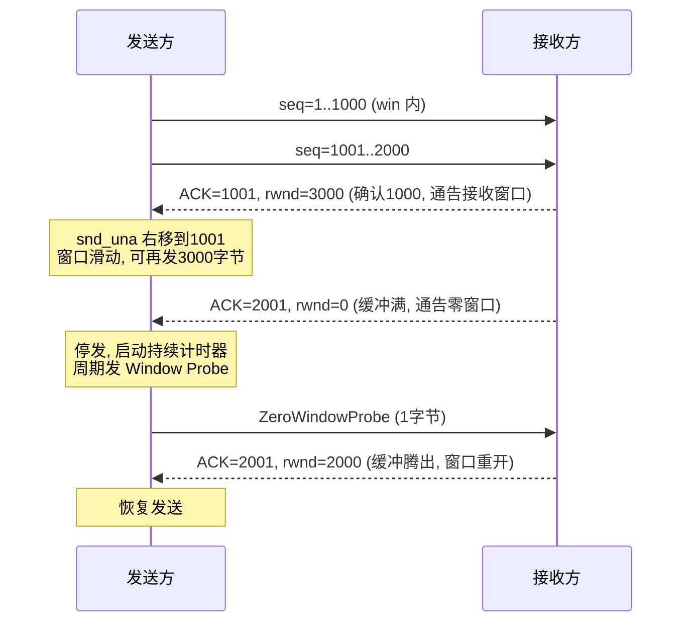
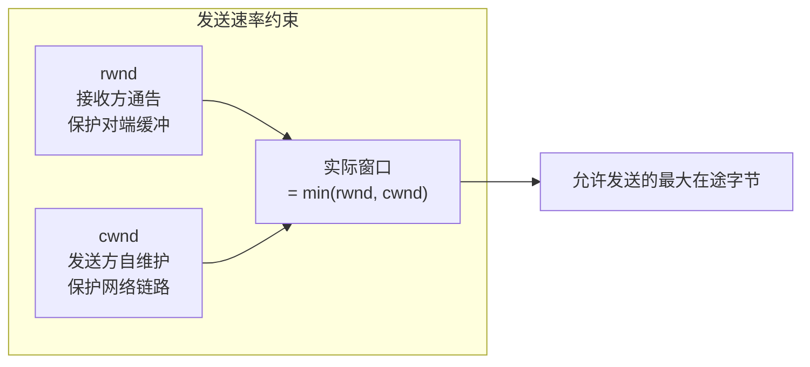
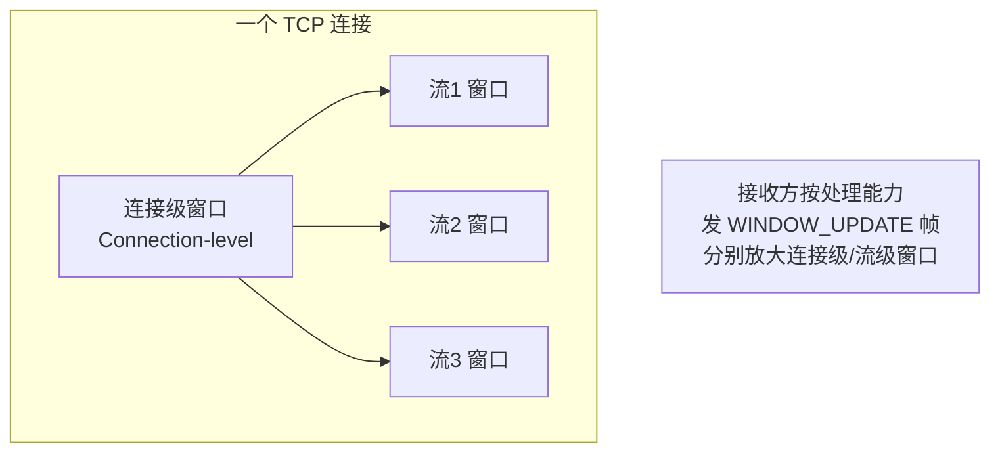

# TCP/HTTP 滑动窗口

> 滑动窗口是 TCP 流量控制的核心，`cwnd` 是拥塞控制的核心，二者共同约束发送速率。本文从 TCP 窗口机制（rwnd 通告、零窗口探测、糊涂窗口/Nagle/Delayed ACK）讲到 HTTP/2 的连接级+流级流控与 HTTP/3 QUIC 的流控，并说明为什么应用层还要自己限流。

::: tip 一句话结论
发送量取 min(rwnd, cwnd)，滑动窗口护缓冲与链路，业务另需应用层限流。
:::

## 场景问题

发送方能有多快地往网络里灌数据？这受两个独立约束：

1. **接收方处理得过来吗**？——接收缓冲区有限，灌太快会溢出丢包。这是**流量控制（flow control）**，靠**滑动窗口 + rwnd 通告**解决。
2. **网络中间路径扛得住吗**？——路由器队列有限，灌太快会拥塞丢包。这是**拥塞控制（congestion control）**，靠 **`cwnd`** 解决。

发送方实际可发送量 = `min(rwnd, cwnd)`。两个窗口分别护住"对端"和"链路"，缺一不可。而到了应用层（HTTP/2、HTTP/3），因为一个 TCP/QUIC 连接上跑多个逻辑流，还需要**流级流控**避免单个流饿死其他流；再往上，业务后端处理能力有限，TCP 窗口管不到，所以**应用层还得自己限流**。

> **打个比方**：发送方往网络灌数据，就像往水管里灌水，同时被两件事卡住流速：一是**接收方的桶有多大**（`rwnd`，桶满了再灌就溢出去丢包）；二是**水管本身有多粗**（`cwnd`，灌太猛会撑爆中间路由器的队列，也丢包）。所以实际流速只能取两者里更小的那个——桶再大、水管细也白搭；水管再粗、桶小了照样溢。**类比失效边界**：这两个窗口只管到"传输层的对端和这根水管"，却管不到水龙头后面接的那台**老爷机（应用层后端）**。TCP 以为对端把水收进桶里就万事大吉了，可这些数据可能只是堆在应用缓冲里、后端还没来得及处理——所以业务层非得自己再加一道限流闸，光靠 TCP 窗口护不住后端。

## 实现方案

### TCP 滑动窗口

发送方把字节流分成四个区间，窗口在已确认数据上"滑动"：

```
发送方视角（Send Window，窗口大小 = min(rwnd, cwnd)）:

  已发送已确认 | 已发送未确认 | 可发送未发送 | 不可发送
  ============ |============= |============= |========
               ^             ^             ^
             snd_una       snd_nxt      snd_una+win
               |<--------- 发送窗口 ------->|

收到 ACK(snd_una 右移) → 窗口右边界跟着右移 → "滑动"，腾出空间发新数据
```



关键机制：

- **rwnd 通告**：接收方在每个 ACK 里通过 window 字段告诉发送方"我还能收多少"，发送方据此约束发送窗口。大带宽高时延链路需 **Window Scaling 选项**把 16-bit window 放大（否则窗口封顶 64KB，填不满长肥管道）。
- **零窗口与窗口探测**：接收方缓冲满时通告 `rwnd=0`，发送方停发。但"窗口重开"的 ACK 本身可能丢失导致双方死锁，故发送方启动**持续计时器（persist timer）**，周期性发 1 字节 **Window Probe** 探测，直到收到非零窗口。
- **糊涂窗口综合征（SWS）**：接收方每腾出几字节就通告小窗口、发送方每有几字节就发小包，退化成大量小报文（40 字节头驮 1 字节数据）。两侧分别治理：
  - 接收方：**窗口不到 MSS 或缓冲一半就通告 0**（等攒够再开窗）。
  - 发送方：**Nagle 算法**——有未确认数据时，小数据先攒着，凑满 MSS 或收到 ACK 再发，减少小包。
- **Delayed ACK**：接收方延迟 ~40ms 再回 ACK，指望能捎带数据或合并多个 ACK。**Nagle + Delayed ACK 组合会互相等待**造成额外时延（发送方等 ACK 才发下一小包、接收方延迟发 ACK），交互式/请求-响应场景常需 `TCP_NODELAY` 关掉 Nagle。

### cwnd 与 rwnd 的区别与协同



- **`rwnd`**：接收方给的、随 ACK 通告，护住**对端缓冲**。
- **`cwnd`**：发送方自己维护、看不见网络内部，靠丢包/RTT 信号探测，护住**网络链路**。演进：慢启动（指数增）→ 拥塞避免（线性增）→ 丢包后快恢复/进入慢启动。现代算法如 BBR 用带宽×时延建模而非纯丢包。
- **协同**：`发送量 = min(rwnd, cwnd)`。任一为 0 都停发。两者正交：rwnd 大但 cwnd 小 = 网络是瓶颈；反之 = 接收方是瓶颈。

### HTTP/1.1 队头阻塞 → HTTP/2 流控

HTTP/1.1 一个 TCP 连接同一时刻只能处理一个请求-响应（即使 pipelining 也要求响应按序返回），慢响应堵住后面所有请求——**应用层队头阻塞**。

HTTP/2 在**一个 TCP 连接上多路复用多个 stream**（每个请求一个流，帧交错传输），解决了 HTTP 层队头阻塞。但多个流共享一个 TCP 连接，需要**两级流控**避免某个流占满：



- **连接级窗口 + 流级窗口**：接收方对整个连接和每个流分别维护窗口，发送方发 DATA 帧消耗两级窗口的配额，接收方处理完后发 **`WINDOW_UPDATE`** 帧补充配额。这本质是把 TCP 滑动窗口的思想搬到了应用层的每个流上。
- **局限**：HTTP/2 仍跑在 TCP 上，一旦**某个 TCP 段丢失，整个连接的所有流都要等重传**——TCP 层的队头阻塞，HTTP/2 无法消除。

### HTTP/3 / QUIC 的流控

HTTP/3 把传输层换成 **QUIC（跑在 UDP 上）**，每个 stream 有**独立的交付保证**，一个流丢包只阻塞该流，不影响其他流——彻底消除 TCP 层队头阻塞。QUIC 同样有**连接级 + 流级流控**（`MAX_DATA` / `MAX_STREAM_DATA` 帧对应 HTTP/2 的 WINDOW_UPDATE），且流控内置于 QUIC 自身而非依赖内核 TCP。

### 为什么应用层还要限流

TCP/QUIC 窗口只保证"数据能安全送达对端 socket 缓冲"，**它不知道后端业务处理得过来没有**。窗口很大时，海量请求照样涌入应用层，可能压垮数据库/下游。所以应用层需要独立限流：令牌桶/漏桶、并发信号量、排队 + 超时熔断。**窗口保护链路与 socket 缓冲，应用限流保护业务逻辑与依赖**，两者层次不同、不可互相替代。

```
# 令牌桶限流示意（应用层，protects backend, not the link）
capacity = 100          # 桶容量
rate     = 50           # 每秒补 50 个令牌
tokens   = capacity
last     = now()

def allow():
    global tokens, last
    tokens = min(capacity, tokens + (now() - last) * rate)   # 按时间补充
    last   = now()
    if tokens >= 1:
        tokens -= 1
        return True     # 放行
    return False        # 限流(拒绝/排队)
```

## 为什么这么做

- **为什么把流控和拥塞控制分成两个窗口**：它们防的是两类完全不同的溢出——rwnd 防**接收方缓冲**溢出（发送方能从 ACK 直接得知对端容量），cwnd 防**网络路径**拥塞（发送方看不见网络内部，只能靠丢包/RTT 反馈推测）。信息来源与反馈机制不同，必须分别建模，最终取 min 同时满足两个约束。
- **为什么要零窗口探测**：窗口重开的 ACK 是纯 ACK，丢失不会触发重传，若无探测机制双方会永久互等而死锁。持续计时器 + 1 字节探针打破僵局。
- **为什么 HTTP/2 要流级流控**：多路复用把多个流塞进一个连接，若无流级配额，一个大下载会吃光连接窗口饿死其他流；流级窗口保证公平与优先级。

## 为什么别的选择不行

- **为什么不靠单一窗口同时管流控和拥塞**：接收方通告的 rwnd 对网络拥塞一无所知；网络拥塞信号（丢包）也不反映接收方缓冲。用一个窗口就会在某一维度失控——要么压垮接收方，要么加剧网络拥塞。
- **为什么 HTTP/2 多路复用没能彻底解决队头阻塞**：它把队头阻塞从 HTTP 层挪到了 TCP 层——TCP 保证字节流按序交付，丢一个段全连接卡住。只有把传输层换成"流独立交付"的 QUIC（HTTP/3）才根治。
- **为什么不用 HTTP/1.1 pipelining 提升并发**：pipelining 要求响应严格按请求顺序返回，一个慢响应仍堵住队列，且中间代理支持差、易出错，实践中基本废弃。多路复用（HTTP/2）才是正解。
- **为什么应用层限流不能用 TCP 窗口替代**：TCP 窗口的粒度是"字节 / socket 缓冲"，它在数据进入应用之前就放行了；后端真正的瓶颈是 CPU、DB 连接、下游 QPS，这些 TCP 完全感知不到。必须在应用层用令牌桶/信号量按业务维度限流。

## 沉淀结论

1. **两个窗口，一个 min**：`发送量 = min(rwnd, cwnd)`。rwnd 护对端缓冲、cwnd 护网络链路，正交且都必须满足。
2. **窗口滑动的引擎是 ACK**：收到 ACK → snd_una 右移 → 窗口右边界跟进 → 腾出空间发新数据。
3. **三个易错点**：零窗口要**持续计时器 + 探针**防死锁；SWS 两端分治（收方攒够再开窗、发方 Nagle 攒包）；**Nagle + Delayed ACK 互等**，交互场景用 `TCP_NODELAY`。
4. **HTTP 层演进主线**：HTTP/1.1 应用层队头阻塞 → HTTP/2 多路复用 + 连接级/流级 WINDOW_UPDATE（但仍受 TCP 队头阻塞）→ HTTP/3 QUIC 流独立交付彻底根治。
5. **窗口 ≠ 限流**：TCP/QUIC 窗口保护链路与缓冲，**保护不了后端业务**，应用层必须另做令牌桶/信号量/熔断。

### 记忆口诀

**两窗取小**：rwnd 护对端缓冲 / cwnd 护网络链路 / 发送量=min
**滑动引擎**：收 ACK / snd_una 右移 / 腾空间发新数据
**三易错**：零窗口→持续计时器+探针 / SWS→两端分治 / Nagle+Delayed ACK→互等用 TCP_NODELAY
**HTTP 主线**：1.1 应用队头阻塞 / 2 多路复用受 TCP 阻塞 / 3 QUIC 流独立根治

## 内容来源

综合整理。主要参考方向：RFC 793 / RFC 9293（TCP 规范、滑动窗口、持续计时器）、RFC 1122（SWS 治理、Nagle、Delayed ACK）、RFC 1323/7323（Window Scaling）、RFC 5681（TCP 拥塞控制、慢启动/拥塞避免）、RFC 7540 / RFC 9113（HTTP/2 流控与 WINDOW_UPDATE）、RFC 9000（QUIC 流控 MAX_DATA/MAX_STREAM_DATA）、RFC 9114（HTTP/3）、《TCP/IP Illustrated Vol.1》相关章节。

> 消歧：本篇的"滑动窗口"是 **TCP/HTTP 流量控制**机制。算法题里的[双指针与滑动窗口](../algo/two-pointers-sliding-window.md)是数组/字符串上的枚举技巧，同名但不同概念。

## 自测：合上资料能说清楚吗？

发送方某一时刻究竟能往网络里灌多少字节？这个量由什么决定？

<details><summary>参考答案</summary>

**发送量 = min(rwnd, cwnd)**。`rwnd` 是接收方随 ACK 通告的**接收窗口**，护住对端缓冲；`cwnd` 是发送方自维护的**拥塞窗口**，靠丢包/RTT 探测护住网络链路。两者正交，任一为 0 都停发，必须同时满足。

</details>

接收方通告了零窗口后发送方停发，为什么还需要**零窗口探测**？没有它会怎样？

<details><summary>参考答案</summary>

窗口重开的 ACK 是**纯 ACK，丢失不会触发重传**。若无探测，接收方缓冲腾空后的开窗通告一旦丢失，双方会永久互等而**死锁**。发送方启动**持续计时器（persist timer）**，周期性发 1 字节 **Window Probe** 打破僵局。

</details>

对比 **rwnd 和 cwnd**：为什么不能用一个窗口统一管流控和拥塞控制？

<details><summary>参考答案</summary>

它们防两类不同溢出：**rwnd 防接收方缓冲溢出**（可从 ACK 直接得知对端容量），**cwnd 防网络路径拥塞**（发送方看不见网络内部，只能靠丢包/RTT 推测）。信息来源与反馈机制不同，单窗口会在某一维度失控——要么压垮接收方，要么加剧拥塞。

</details>

对比 **HTTP/2 与 HTTP/3** 在队头阻塞上的差异，为什么 HTTP/2 多路复用没能彻底解决？

<details><summary>参考答案</summary>

HTTP/2 在**一个 TCP 连接**上多路复用多个流，消除了 HTTP 层队头阻塞，但仍跑在 TCP 上——**一个 TCP 段丢失，全连接所有流都要等重传**，队头阻塞被挪到 TCP 层。HTTP/3 换用 **QUIC（UDP）**，每个 stream **独立交付**，一个流丢包只阻塞该流，彻底根治。

</details>

TCP 窗口已经在做流控了，为什么应用层还要令牌桶/信号量限流？

<details><summary>参考答案</summary>

TCP/QUIC 窗口只保证"数据安全送达对端 **socket 缓冲**"，**不知道后端业务处理得过来没有**。窗口大时海量请求照样涌入应用层压垮 DB/下游。**窗口保护链路与缓冲，应用限流保护业务逻辑与依赖**，粒度分别是字节/socket 与 CPU/DB连接/QPS，层次不同不可替代。

</details>
