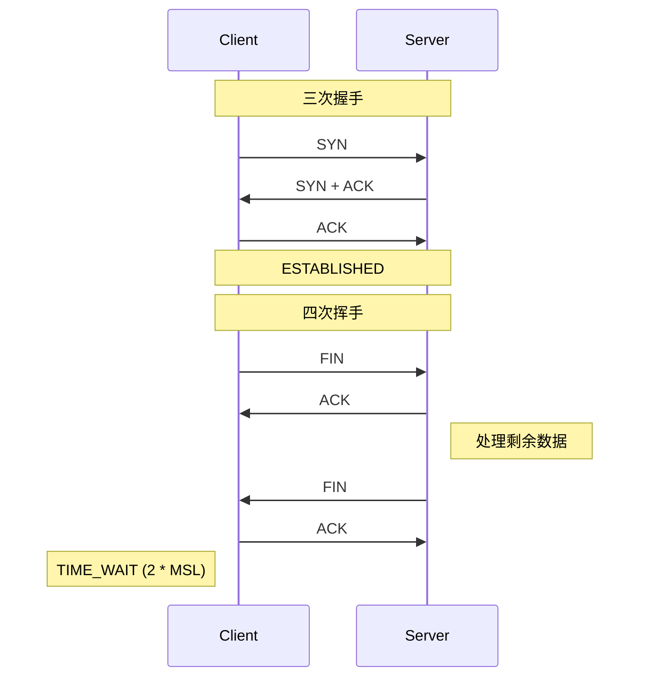

# TCP 网络编程

::: tip 记忆锚点
**握手 3 次**是"确认双方都能收发"最少次数；**挥手 4 次**因为**关闭是半双工的**——一方 FIN 只关自己方向，对方还能发。**TIME_WAIT 2MSL** 是为了旧包全部消散 + 让最后一个 ACK 有机会重传。**TCP 是字节流不是消息流** → 应用层必须自己定分包协议。
:::

::: tip 一句话结论
TCP 靠三次握手建连、字节流传输、epoll 撑高并发、拥塞控制保可靠。
:::

## 场景问题

> **打个比方（握手为什么是 3 次）**：建连就像打电话对暗号，目的是**双方都确认"我能发、也能收"**。A 喊"喂，听得到吗？"（证明 A 能发）；B 答"听得到，你那边呢？"（证明 B 能收、也能发）；A 再回"我也听得到"（证明 A 能收）——到这三句，双向链路才算都验证过。少一句（2 次），B 就没法确认 A 到底收没收到自己那句话，可能对着空气自说自话。**挥手为什么是 4 次**：因为关闭是**半双工**的，好比分手要各说各的"我说完了"——你这边说完不代表对方也讲完了（他还能继续发数据），所以两个方向各自 `FIN` 一次、各自 `ACK` 一次，凑成 4 次。**类比失效边界**：打电话是"你一句我一句"有天然停顿的，但 TCP 是**字节流、不保留消息边界**——你发的两句话可能被粘成一坨、也可能被拆散（粘包/拆包），所以应用层必须自己定一套分包协议（定长 / 分隔符 / 长度前缀），不能真把它当电话对话。

### 三次握手 / 四次挥手

```text
握手：                          挥手：
Client        Server           Active         Passive
  │──SYN────────►│              │───FIN───────►│  
  │             │              │              │  处理剩余数据
  │◄──SYN+ACK───│              │◄──ACK────────│  
  │              │              │              │  
  │──ACK────────►│              │◄──FIN────────│  
  │             │              │              │  
  │  ESTAB      │  ESTAB      │───ACK───────►│  
                                │              │  
                              TIME_WAIT       CLOSED
                              (2 * MSL)
```



### 状态机（重点几个）

- **SYN_SENT / SYN_RCVD**：握手中
- **ESTABLISHED**：正常传输
- **FIN_WAIT_1 / FIN_WAIT_2**：主动关闭方
- **CLOSE_WAIT**：**被动方收到 FIN 但还没关**——线上出现大量 `CLOSE_WAIT` 通常是 **应用忘了 `close(fd)`**
- **TIME_WAIT**：主动关闭方最后停留 `2 * MSL`（Linux 默认 2 分钟）

## 实现方案

### 关键 socket 选项

- `SO_REUSEADDR`：允许绑定 `TIME_WAIT` 状态的地址（重启服务有用）
- `SO_REUSEPORT`（Linux 3.9+）：**多个 socket 绑同一端口**，内核负载均衡分发到不同 worker → 干掉惊群
- `TCP_NODELAY`：关闭 **Nagle 算法**（Nagle 会攒小包 200ms 再发，交互式应用要关）
- `TCP_QUICKACK`：关闭延迟 ACK
- `SO_KEEPALIVE`：探活；默认 2 小时才发探测——太长，业务通常应用层心跳
- `TCP_CORK`：与 Nagle 相反，**攒满一个 MSS 才发**
- `SO_LINGER`：`close()` 时是否等待未发数据；`l_onoff=1, l_linger=0` 会发 RST 而非 FIN

### I/O 多路复用：select / poll / epoll

| 特性 | select | poll | **epoll (Linux)** |
| --- | --- | --- | --- |
| fd 上限 | 1024 (FD_SETSIZE) | 无 | 无 |
| 数据结构 | bitmap | 链表 | **红黑树 + 就绪链表** |
| 时间复杂度 | O(n) | O(n) | **O(1) 添加，O(k) 就绪** |
| 触发模式 | 水平 | 水平 | **水平 LT + 边沿 ET** |
| 内核↔用户拷贝 | 每次全量 | 每次全量 | **一次注册**，就绪时零拷贝 |

- **LT（水平触发）**：只要 fd 还有数据就一直通知（默认，容错友好）
- **ET（边沿触发）**：状态**变化时**才通知一次——必须一次性 `read` 到 `EAGAIN`，配非阻塞 fd
- **kqueue** (BSD/macOS) / **IOCP** (Windows) / **io_uring** (Linux 5.1+，异步真正的下一代)

### Reactor / Proactor 模式

- **Reactor**（同步 I/O + 事件通知，主流）：epoll_wait 拿到就绪 fd → 分发给 handler → handler 自己 read/write
  - **单 Reactor 单线程**：Redis 6 之前——简单，CPU 密集会卡死
  - **单 Reactor 多线程**：主线程 accept + read，worker 线程处理业务
  - **主从 Reactor**：主 Reactor 只管 accept，子 Reactor 池处理 I/O ← **Netty / Nginx / Redis 6 多线程 IO / Envoy** 都是这个
- **Proactor**（异步 I/O，内核完成 read/write 后通知）：Windows IOCP、Linux `io_uring`；应用注册 buffer，内核填好通知

### 主从 Reactor 抽象

```text
                    ┌──────────────┐
                    │ Main Reactor │  只做 accept()
                    │  epoll_wait  │
                    └──────┬───────┘
                           │ 分发新连接
          ┌────────────────┼────────────────┐
          ▼                ▼                ▼
   ┌───────────┐    ┌───────────┐    ┌───────────┐
   │Sub Reactor│    │Sub Reactor│    │Sub Reactor│  N = CPU 核数
   │epoll_wait │    │epoll_wait │    │epoll_wait │
   │ handler   │    │ handler   │    │ handler   │
   └───────────┘    └───────────┘    └───────────┘
          │                │                │
          └────────► Worker Pool ◄──────────┘
                (业务线程池，CPU 密集任务)
```

### 零拷贝 (Zero-Copy)

传统 `read+write`：**磁盘→内核缓冲→用户缓冲→内核 socket 缓冲→网卡**（4 次拷贝，2 次上下文切换）

- `sendfile()`：**内核内直接 disk→socket**，2 次拷贝，1 次系统调用
- `splice()`：pipe 中转，管道两端都在内核
- `mmap + write`：内存映射，避免 read 那次拷贝
- `SO_ZEROCOPY` (Linux 4.14+)：`send()` 直接引用用户 buffer
- **DPDK / eBPF XDP**：绕过内核协议栈，用户态直接玩网卡包（HFT / CDN 压榨延迟）

## 为什么这么做

### 拥塞控制（面试常问但少人答对）

- **慢启动**：cwnd 从 1 MSS 起，每 RTT 翻倍
- **拥塞避免**：cwnd ≥ ssthresh 后，每 RTT +1 MSS 线性增
- **快速重传**：收到 3 个重复 ACK → 立即重传，不等 RTO
- **快速恢复**：ssthresh = cwnd/2, cwnd = ssthresh + 3
- **算法演进**：Reno → NewReno → CUBIC (Linux 默认) → **BBR**（Google，基于带宽和 RTT 建模，长肥管道更好）

## 为什么别的选择不行

### TCP 编程五大坑

**1. 粘包 / 半包（TCP 是字节流）**：
- 应用层协议必须**自定义分包**：定长 / 分隔符 (`\r\n`) / **长度字段**（最常用：4 字节大端长度 + 包体）
- Netty 的 `LengthFieldBasedFrameDecoder` 就是干这个

**2. 大量 TIME_WAIT**：
- 短连接场景高并发时端口耗尽
- **不要开 `tcp_tw_recycle`**（Linux 4.12 已删，NAT 后翻车）；`tcp_tw_reuse` 相对安全（仅客户端）
- 治本：**长连接 + 连接池**（平台代理模块 12000 上限就是这么设计）

**3. 大量 CLOSE_WAIT**：
- **应用没 close(fd) bug**——被动方收到 FIN 后忘关自己的写端
- 排查：`ss -tan | grep CLOSE_WAIT`，找持有 fd 的进程

**4. 惊群 (Thundering Herd)**：
- 多进程 accept 同一 listen fd，一个连接来全被唤醒
- Linux 4.5+ `EPOLLEXCLUSIVE` + `SO_REUSEPORT` 组合已解决

**5. 半连接队列 SYN Flood**：
- `tcp_max_syn_backlog` 满 → 新 SYN 被丢
- 开 `tcp_syncookies=1`，用 hash 而非表存半连接

## 沉淀结论

### 生产级 TCP 服务的必备清单

- `SO_REUSEPORT` 分发到 N 个 worker（`N = CPU 核数`）
- `SO_KEEPALIVE` 关掉，用**应用层心跳** (Keep-Alive、Ping/Pong) 探活可控
- `TCP_NODELAY` 打开，交互式协议禁用 Nagle
- 分包用**长度前缀**协议（4 字节 magic + 4 字节 length + payload），一定要**校验 length 上限**防内存爆炸
- 连接池：**最小空闲 + 最大空闲 + 超时回收**
- 优雅关闭：`shutdown(WR) → 读残余数据 → close`；避免 RST 打断对方
- 指标必埋：**连接数、accept 队列长度、read/write 错误率、RTT、复用率**

### 记忆口诀

**连接管理**：三次握手 / 四次挥手 / TIME_WAIT 2MSL
**高并发**：epoll 红黑树 / ET 非阻塞 / 主从 Reactor
**可靠传输**：字节流分包 / 拥塞控制 / 应用层心跳
**避坑**：粘包长度前缀 / CLOSE_WAIT 忘 close / 惊群 REUSEPORT

## 自测：合上资料能说清楚吗？

为什么握手要 3 次而不是 2 次，挥手却要 4 次？

<details><summary>参考答案</summary>

**3 次**是确认双方收发能力的最少次数：2 次只能确认一个方向。**4 次**是因为**关闭半双工**——被动方收到 FIN 先回 **ACK**，处理完剩余数据后才发自己的 FIN，两步不能合并。

</details>

线上出现大量 `CLOSE_WAIT` 和大量 `TIME_WAIT`，分别说明什么、怎么治？

<details><summary>参考答案</summary>

**CLOSE_WAIT** 堆积＝**应用忘了 `close(fd)`**（被动方 bug），需查持有 fd 的进程。**TIME_WAIT** 堆积＝短连接高并发端口耗尽，治本靠**长连接+连接池**，客户端可开 `tcp_tw_reuse`，**别开** `tcp_tw_recycle`。

</details>

epoll 的 LT 和 ET 有什么区别，ET 使用时要注意什么？

<details><summary>参考答案</summary>

**LT（水平触发）**只要 fd 还有数据就一直通知，容错友好（默认）。**ET（边沿触发）**只在状态**变化时**通知一次，必须**一次性 read 到 `EAGAIN`**，且**配非阻塞 fd**，否则会漏数据或阻塞。

</details>

TCP 是字节流带来什么问题，应用层如何解决？

<details><summary>参考答案</summary>

**粘包/半包**：TCP 不保留消息边界，一次 read 可能读到半个或多个包。应用层需**自定义分包**：定长 / 分隔符 / **长度前缀**（最常用，4 字节长度+包体），并**校验 length 上限**防内存爆炸。

</details>

Reactor 和 Proactor 模式的核心区别是什么？

<details><summary>参考答案</summary>

**Reactor** 是**同步 I/O + 事件通知**：epoll 通知 fd 就绪后，**由应用自己 read/write**（Netty/Nginx）。**Proactor** 是**异步 I/O**：应用注册 buffer，**内核完成 read/write 后才通知**（Windows IOCP、Linux io_uring）。

</details>

## 内容来源

迁移自 guide/theme-tcp-net（综合整理）。原始参考：《TCP/IP 详解 卷一》、Linux Programming Interface、Beej Guide、Netty 源码（2026-07）。

> 相关专题：本篇聚焦 **TCP 协议本身**（握手挥手、拥塞/流控、粘包）；**epoll/IO 多路复用**详见 [LVS + epoll](./lvs-epoll.md)，**零拷贝**详见 [零拷贝](../common/os-zerocopy.md)。
