# 知识点依赖图

> 有向边表示「需要先掌握」。从底层基础出发，沿箭头方向学习。

```mermaid
graph TD
  %% ── 域着色 ──────────────────────────────────────────────
  classDef common   fill:#3b82f6,color:#fff,stroke:#1d4ed8
  classDef gameInfra fill:#f97316,color:#fff,stroke:#c2410c
  classDef gameBiz  fill:#22c55e,color:#fff,stroke:#15803d
  classDef aiLlm    fill:#a855f7,color:#fff,stroke:#7e22ce
  classDef algo     fill:#6b7280,color:#fff,stroke:#374151
  classDef internet fill:#06b6d4,color:#fff,stroke:#0e7490

  %% ── algo（基础算法，大多数人最先夯实）────────────────────
  DS[data-structures]:::algo
  SORT[sorting]:::algo
  BS[binary-search]:::algo
  TP[two-pointers-sliding-window]:::algo
  DP[dynamic-programming]:::algo
  GRAPH[graph]:::algo
  BT[backtracking]:::algo
  BA[backend-algorithms]:::algo
  GREEDY[greedy]:::algo
  BITM[bit-manipulation]:::algo
  MONO[monotonic-stack]:::algo
  STRM[string-matching]:::algo
  INTV[intervals]:::algo
  MATH[math-number-theory]:::algo
  UF[union-find]:::algo

  DS --> BS
  DS --> SORT
  DS --> DP
  DS --> GRAPH
  DS --> BT
  DS --> TP
  GRAPH --> BA
  DP --> BA
  DP --> GREEDY
  DS --> BITM
  TP --> MONO
  DS --> STRM
  SORT --> INTV
  DS --> MATH
  GRAPH --> UF

  %% ── common（通用后台基础）────────────────────────────────
  CONC[concurrency]:::common
  HTTP[http-tls-rpc]:::common
  REDIS[redis]:::common
  MYSQL[mysql-innodb]:::common
  MQ[message-queue]:::common
  GC[gc-stw]:::common
  DM[design-model]:::common
  DT[distributed-transaction]:::common
  ZERO[os-zerocopy]:::common
  CPP11[cpp11-gotchas]:::common
  CPP20[cpp20-gotchas]:::common
  GO[go-gotchas]:::common
  RUST[rust-gotchas]:::common
  OBS[observability]:::common
  TSAD[time-series-anomaly-detection]:::common

  DS --> CONC
  CONC --> GC
  CONC --> REDIS
  CONC --> MQ
  HTTP --> MYSQL
  HTTP --> DT
  REDIS --> DT
  MYSQL --> DT
  DM --> DT
  ZERO --> CONC
  CPP11 --> CPP20
  CPP11 --> CONC
  HTTP --> OBS
  OBS --> TSAD

  %% ── internet（互联网后台）────────────────────────────────
  TCP[tcp-net]:::internet
  LVS[lvs-epoll]:::internet
  SLIDE[sliding-window]:::internet
  DNS_A[dns-attack-tunnel]:::internet
  DNS_C[dns-clean-intercept]:::internet
  PHP[php-fpm-nginx]:::internet
  IOT[iot-mqtt]:::internet
  FE[frontend-engineering]:::internet
  ELIXIR[elixir-fp]:::internet

  HTTP --> TCP
  TCP --> LVS
  TCP --> IOT
  CONC --> LVS
  REDIS --> SLIDE
  DNS_C --> DNS_A

  %% ── game-infra（游戏基础架构）────────────────────────────
  RATE[rate-limit]:::gameInfra
  RATELC[ratelimit-circuitbreak]:::gameInfra
  KN[k8s-network]:::gameInfra
  MESH[self-mesh-k8s]:::gameInfra
  MESHDIFF[mesh-central-vs-decentral]:::gameInfra
  MESHIC[mesh-istio-cilium]:::gameInfra
  DKV[distributed-kv]:::gameInfra
  HASH[consistent-hash-impl]:::gameInfra
  RS[reservoir-sampling]:::gameInfra
  RAFT[raft-gossip]:::gameInfra
  LOCK[lockstep]:::gameInfra
  GW[access-gateway]:::gameInfra
  MSGBUS[message-bus]:::gameInfra
  SMIG[stateful-migration]:::gameInfra
  SREC[stateful-recovery]:::gameInfra
  TLB[token-leaky-bucket]:::gameInfra
  REL[release-strategy]:::gameInfra
  CNI[cni-plugins]:::gameInfra
  EBPF[ebpf]:::gameInfra
  CFG[config-hot-reload]:::gameInfra
  CPP_CO[cpp-coroutine]:::gameInfra
  LLVM[llvm-compile]:::gameInfra
  SAN[sanitizers]:::gameInfra
  SECKILL[seckill]:::gameInfra

  REDIS --> RATE
  CONC --> RATE
  RATE --> RATELC
  RATE --> TLB
  KN --> MESH
  MESH --> MESHDIFF
  MESHDIFF --> MESHIC
  HASH --> DKV
  RS --> HASH
  RAFT --> DKV
  RAFT --> MESH
  MQ --> MSGBUS
  CONC --> LOCK
  GW --> MESH
  DKV --> SMIG
  DKV --> SREC
  KN --> CNI
  CNI --> EBPF
  CONC --> CFG
  CPP11 --> CPP_CO
  CPP11 --> LLVM
  LLVM --> SAN
  REDIS --> SECKILL
  RATE --> SECKILL

  %% ── game-biz（游戏业务）──────────────────────────────────
  BP[business-proxy]:::gameBiz
  GACHA[gacha]:::gameBiz
  LB[leaderboard]:::gameBiz
  MAIL[mail]:::gameBiz
  MATCH[matchmaking]:::gameBiz
  ACT[activity-framework]:::gameBiz
  IDEM[idempotency-design]:::gameBiz
  RROOM[redis-room-recommend]:::gameBiz
  GVI[game-vs-internet]:::gameBiz
  AC[anti-cheat]:::gameBiz
  ECON[economy-progression]:::gameBiz

  HTTP --> BP
  DT --> BP
  REDIS --> LB
  REDIS --> RROOM
  REDIS --> MATCH
  MQ --> MAIL
  IDEM --> BP
  IDEM --> GACHA
  RATE --> ACT
  DM --> ACT
  CONC --> GVI
  IDEM --> AC
  BP --> AC
  GACHA --> ECON
  ACT --> ECON

  %% ── ai-llm（AI/大模型）──────────────────────────────────
  LLM[llm-fundamentals]:::aiLlm
  LLMOPT[llm-inference-optimization]:::aiLlm
  RAG[rag]:::aiLlm
  RAGC[rag-context-pruning]:::aiLlm
  RAGD[rag-data-cleaning]:::aiLlm
  RAGS[rag-storage-cleanup]:::aiLlm
  AGENT[agent-dev]:::aiLlm
  AIENG[ai-eng-practices]:::aiLlm
  SEC[llm-security]:::aiLlm
  EVAL[llm-evaluation]:::aiLlm
  COST[llm-cost-latency]:::aiLlm
  FT[fine-tuning]:::aiLlm

  DS --> LLM
  LLM --> LLMOPT
  LLM --> RAG
  RAG --> RAGC
  RAG --> RAGD
  RAG --> RAGS
  RAG --> AGENT
  REDIS --> AGENT
  RATE --> AGENT
  AGENT --> AIENG
  LLMOPT --> AIENG
  AGENT --> SEC
  RAG --> SEC
  RAG --> EVAL
  LLMOPT --> COST
  LLM --> FT
  LLMOPT --> FT

  %% ── click 跳转 ───────────────────────────────────────────
  click DS "../algo/data-structures"
  click SORT "../algo/sorting"
  click BS "../algo/binary-search"
  click TP "../algo/two-pointers-sliding-window"
  click DP "../algo/dynamic-programming"
  click GRAPH "../algo/graph"
  click BT "../algo/backtracking"
  click BA "../algo/backend-algorithms"
  click GREEDY "../algo/greedy"
  click BITM "../algo/bit-manipulation"
  click MONO "../algo/monotonic-stack"
  click STRM "../algo/string-matching"
  click INTV "../algo/intervals"
  click MATH "../algo/math-number-theory"
  click UF "../algo/union-find"

  click CONC "../common/concurrency"
  click HTTP "../common/http-tls-rpc"
  click REDIS "../common/redis"
  click MYSQL "../common/mysql-innodb"
  click MQ "../common/message-queue"
  click GC "../common/gc-stw"
  click DM "../common/design-model"
  click DT "../common/distributed-transaction"
  click ZERO "../common/os-zerocopy"
  click CPP11 "../common/cpp11-gotchas"
  click CPP20 "../common/cpp20-gotchas"
  click GO "../common/go-gotchas"
  click RUST "../common/rust-gotchas"
  click OBS "../common/observability"
  click TSAD "../common/time-series-anomaly-detection"

  click TCP "../internet/tcp-net"
  click LVS "../internet/lvs-epoll"
  click SLIDE "../internet/sliding-window"
  click DNS_A "../internet/dns-attack-tunnel"
  click DNS_C "../internet/dns-clean-intercept"
  click PHP "../internet/php-fpm-nginx"
  click IOT "../internet/iot-mqtt"
  click FE "../internet/frontend-engineering"
  click ELIXIR "../internet/elixir-fp"

  click RATE "../game-infra/rate-limit"
  click RATELC "../game-infra/ratelimit-circuitbreak"
  click KN "../game-infra/k8s-network"
  click MESH "../game-infra/self-mesh-k8s"
  click MESHDIFF "../game-infra/mesh-central-vs-decentral"
  click MESHIC "../game-infra/mesh-istio-cilium"
  click DKV "../game-infra/distributed-kv"
  click HASH "../game-infra/consistent-hash-impl"
  click RS "../game-infra/reservoir-sampling"
  click RAFT "../game-infra/raft-gossip"
  click LOCK "../game-infra/lockstep"
  click GW "../game-infra/access-gateway"
  click MSGBUS "../game-infra/message-bus"
  click SMIG "../game-infra/stateful-migration"
  click SREC "../game-infra/stateful-recovery"
  click TLB "../game-infra/token-leaky-bucket"
  click REL "../game-infra/release-strategy"
  click CNI "../game-infra/cni-plugins"
  click EBPF "../game-infra/ebpf"
  click CFG "../game-infra/config-hot-reload"
  click CPP_CO "../game-infra/cpp-coroutine"
  click LLVM "../game-infra/llvm-compile"
  click SAN "../game-infra/sanitizers"
  click SECKILL "../game-infra/seckill"

  click BP "../game-biz/business-proxy"
  click GACHA "../game-biz/gacha"
  click LB "../game-biz/leaderboard"
  click MAIL "../game-biz/mail"
  click MATCH "../game-biz/matchmaking"
  click ACT "../game-biz/activity-framework"
  click IDEM "../game-biz/idempotency-design"
  click RROOM "../game-biz/redis-room-recommend"
  click GVI "../game-biz/game-vs-internet"
  click AC "../game-biz/anti-cheat"
  click ECON "../game-biz/economy-progression"

  click LLM "../ai-llm/llm-fundamentals"
  click LLMOPT "../ai-llm/llm-inference-optimization"
  click RAG "../ai-llm/rag"
  click RAGC "../ai-llm/rag-context-pruning"
  click RAGD "../ai-llm/rag-data-cleaning"
  click RAGS "../ai-llm/rag-storage-cleanup"
  click AGENT "../ai-llm/agent-dev"
  click AIENG "../ai-llm/ai-eng-practices"
  click SEC "../ai-llm/llm-security"
  click EVAL "../ai-llm/llm-evaluation"
  click COST "../ai-llm/llm-cost-latency"
  click FT "../ai-llm/fine-tuning"
```

---

## 域说明

| 颜色 | 域 | 说明 |
|---|---|---|
| 🔵 蓝色 | `common` | 通用后台基础，所有路径的地基 |
| 🟠 橙色 | `game-infra` | 游戏基础架构，依赖 common |
| 🟢 绿色 | `game-biz` | 游戏业务实现，依赖 common + game-infra |
| 🟣 紫色 | `ai-llm` | AI/大模型工程，依赖 common + algo |
| ⚫ 灰色 | `algo` | 算法数据结构，大多数路径的起点 |
| 🔵 青色 | `internet` | 互联网/智能硬件后台，与 common 并行 |

## 关键前置专题

学任何方向前，这 4 个必须先掌握：

1. **`data-structures`** — 所有算法和系统设计的基础
2. **`concurrency`** — 后台开发的核心能力
3. **`http-tls-rpc`** — 网络通信的根基
4. **`redis`** — 游戏/互联网后台最高频组件
